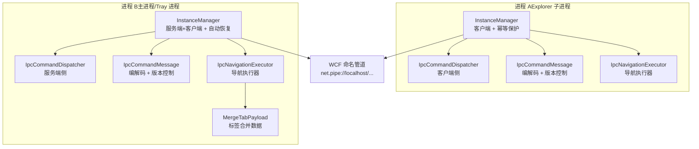
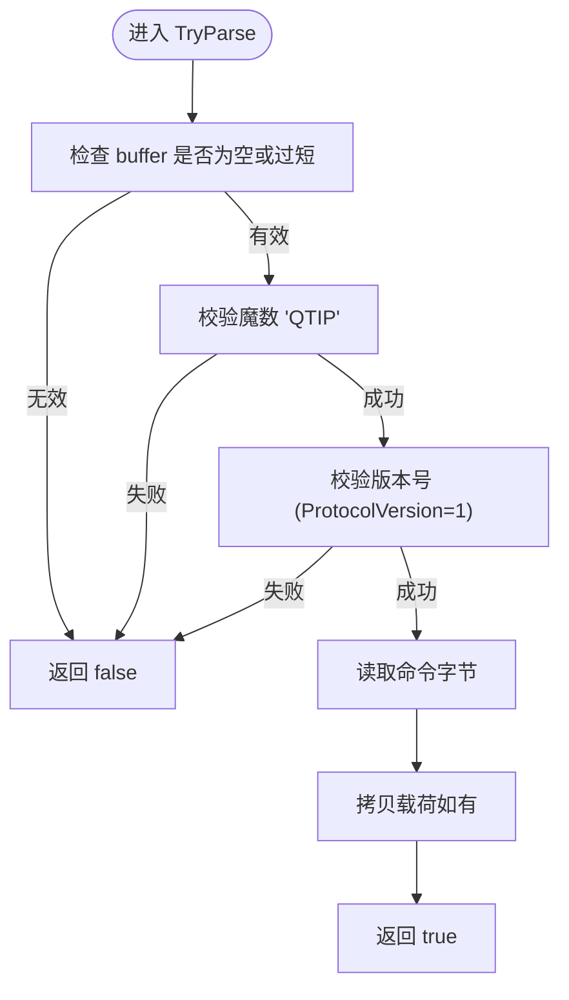
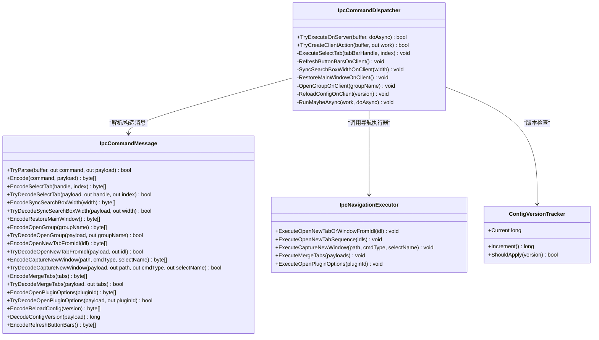
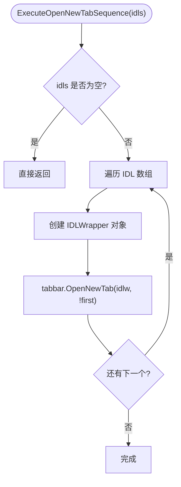
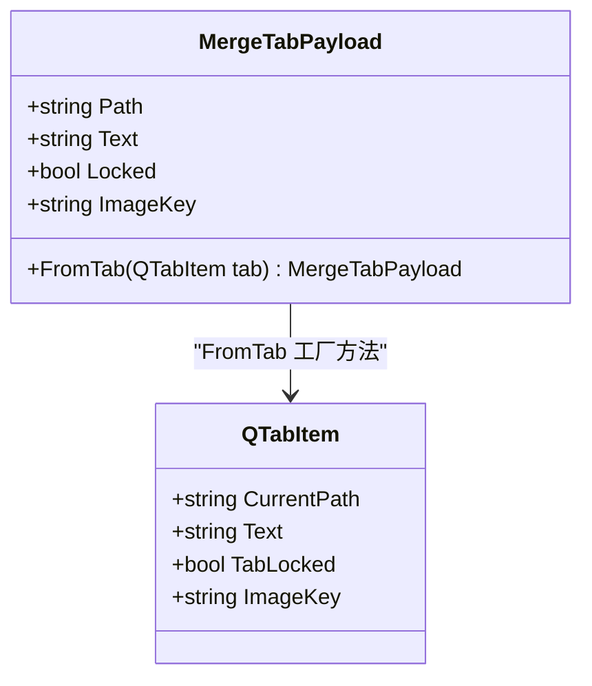
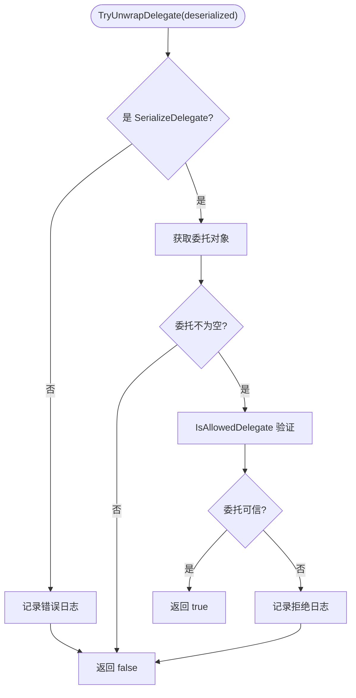
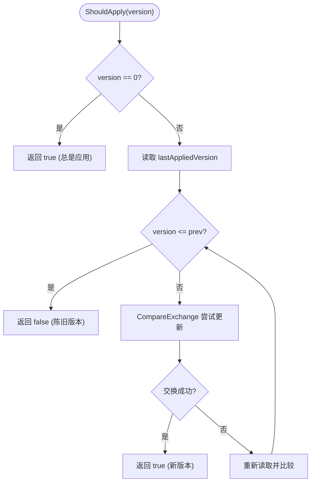
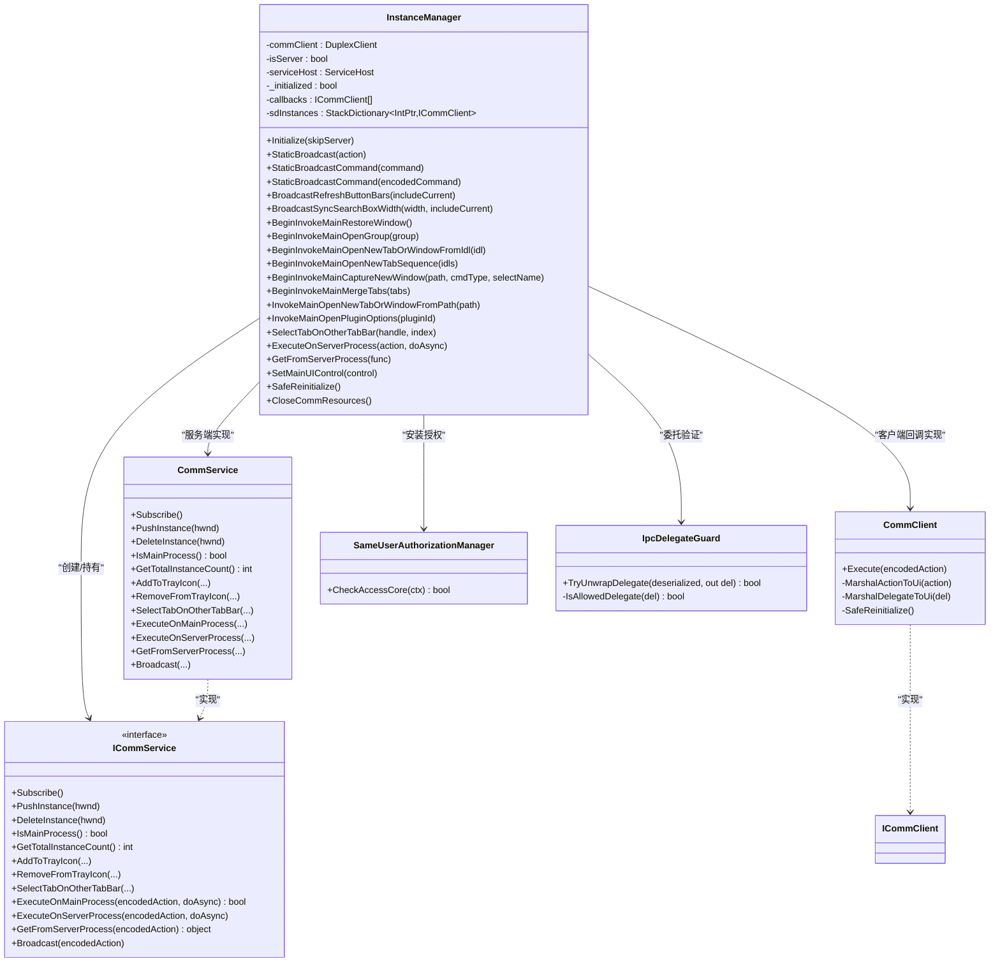
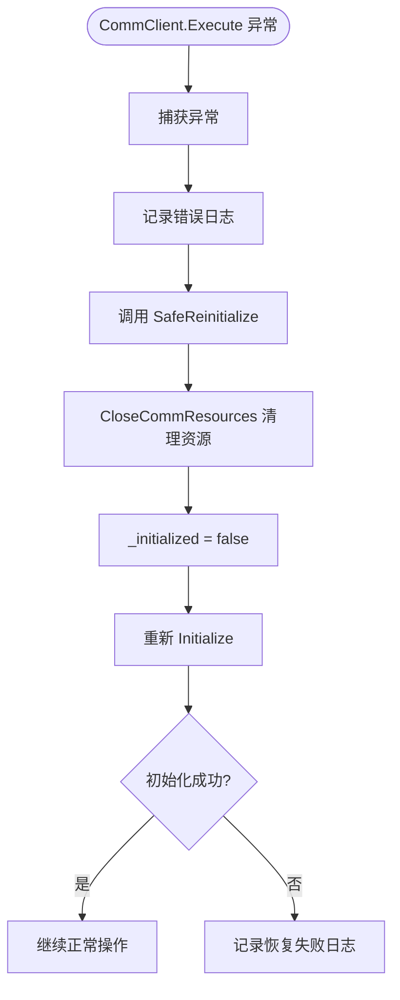
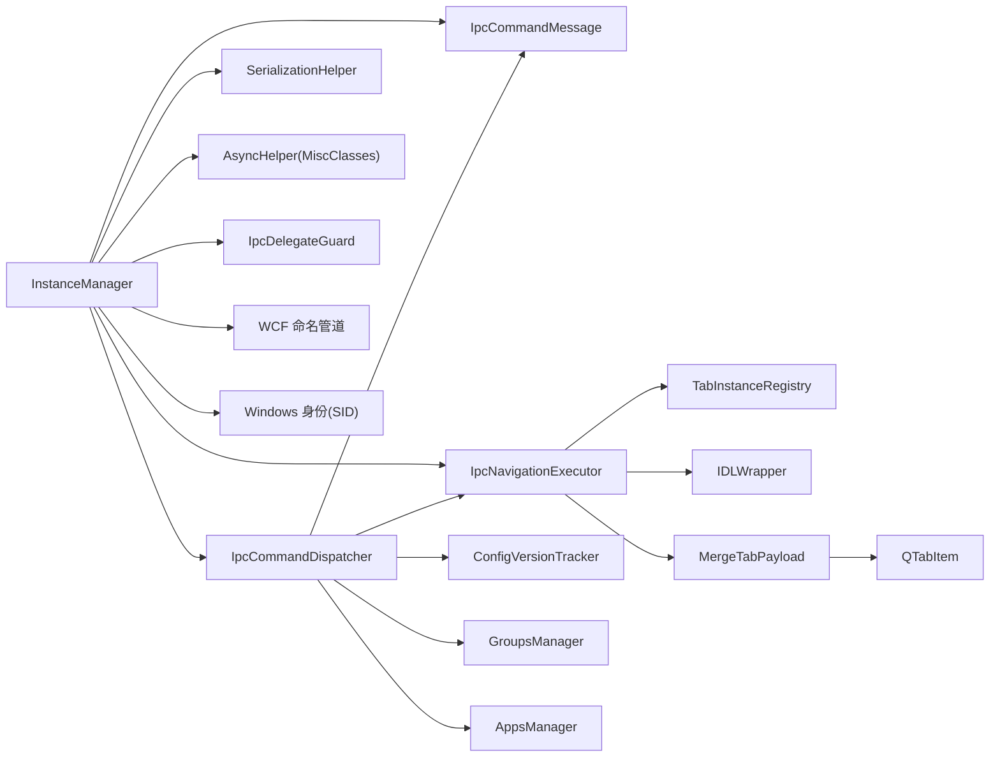

# 进程间通信

<cite>
**本文引用的文件**   
- [IpcCommandDispatcher.cs](file://QTTabBar/IpcCommandDispatcher.cs)
- [IpcCommandMessage.cs](file://QTTabBar/IpcCommandMessage.cs)
- [InstanceManager.cs](file://QTTabBar/InstanceManager.cs)
- [ConfigVersionTracker.cs](file://QTTabBar/ConfigVersionTracker.cs)
- [SerializationHelper.cs](file://QTTabBar/SerializationHelper.cs)
- [MiscClasses.cs](file://QTTabBar/MiscClasses.cs)
- [IpcDelegateGuard.cs](file://QTTabBar/IpcDelegateGuard.cs)
- [InitializationOrchestrator.cs](file://QTTabBar/InitializationOrchestrator.cs)
- [MergeTabPayload.cs](file://QTTabBar/MergeTabPayload.cs)
- [IpcNavigationExecutor.cs](file://QTTabBar/IpcNavigationExecutor.cs)
</cite>

## 更新摘要
**所做更改**   
- **大幅增强IPC命令类型**：新增7个核心命令（SyncSearchBoxWidth、RestoreMainWindow、OpenGroup、OpenNewTabFromIdl、CaptureNewWindow、MergeTabs、OpenPluginOptions）
- **完善载荷编码/解码机制**：为所有新命令提供完整的二进制编解码支持
- **增强导航执行器**：新增IpcNavigationExecutor处理复杂的跨进程导航操作
- **扩展合并标签功能**：支持多标签页的跨进程合并操作
- **改进插件选项管理**：新增插件配置对话框的跨进程打开功能
- **优化窗口恢复机制**：提供主窗口恢复和组管理的IPC支持

## 目录
1. [简介](#简介)
2. [项目结构](#项目结构)
3. [核心组件](#核心组件)
4. [架构总览](#架构总览)
5. [详细组件分析](#详细组件分析)
6. [依赖关系分析](#依赖关系分析)
7. [性能考虑](#性能考虑)
8. [故障排查指南](#故障排查指南)
9. [结论](#结论)
10. [附录](#附录)

## 简介
本文件面向 QTTabBar-Next 的进程间通信（IPC）机制，聚焦于基于 Windows 消息与 WCF 命名管道混合实现的跨进程调用。文档深入解析以下方面：
- 自定义消息类型定义与消息路由机制
- IpcCommandDispatcher 的设计模式：命令分发、回调处理与线程同步策略
- IpcCommandMessage 的数据序列化机制：协议头、载荷编码/解码与扩展点
- 实例管理器中的单例式服务宿主与客户端连接管理、进程间状态同步与资源协调
- UI 线程回调机制：确保跨进程调用的线程安全性
- 错误处理与重试策略：网络不稳定或进程崩溃场景下的恢复路径
- IPC 性能监控与调试工具使用方法：消息跟踪与性能分析技巧
- **大幅增强**：新增7个核心IPC命令类型，支持搜索框宽度同步、窗口恢复、组管理、IDL导航、窗口捕获、标签合并和插件选项
- **完整实现**：增强的载荷编码/解码机制，支持复杂对象的序列化和反序列化
- **新增**：IpcNavigationExecutor统一处理复杂的跨进程导航操作

## 项目结构
IPC 相关代码主要分布在以下文件中：
- InstanceManager：WCF 服务端/客户端、订阅与广播、UI 线程封送、授权检查、进程内/外执行入口，**新增多个IPC命令的广播和执行方法**
- IpcCommandDispatcher：命令分发器，将字节流解析为具体动作并调度到目标方法，**支持7个新增命令类型的分发**
- IpcCommandMessage：轻量级"QTIP"协议实现，负责编解码与命令枚举，**为所有新增命令提供完整的编解码支持**
- IpcNavigationExecutor：**新增**统一的导航执行器，处理复杂的跨进程导航操作
- MergeTabPayload：**新增**标签合并数据载体，支持多标签页的跨进程传输
- IpcDelegateGuard：安全验证器，为遗留委托传输提供白名单验证
- ConfigVersionTracker：配置版本跟踪器，提供单调递增版本管理和防重复机制
- SerializationHelper：二进制序列化辅助（用于遗留委托传输）
- MiscClasses：异步封装（如 AsyncHelper.BeginInvoke）



**图表来源**
- [InstanceManager.cs:574-667](file://QTTabBar/InstanceManager.cs#L574-L667)
- [IpcCommandDispatcher.cs:5-134](file://QTTabBar/IpcCommandDispatcher.cs#L5-L134)
- [IpcCommandMessage.cs:7-362](file://QTTabBar/IpcCommandMessage.cs#L7-L362)
- [IpcNavigationExecutor.cs:5-54](file://QTTabBar/IpcNavigationExecutor.cs#L5-L54)
- [MergeTabPayload.cs:4-31](file://QTTabBar/MergeTabPayload.cs#L4-L31)

## 核心组件
- 实例管理器（InstanceManager）
  - 作为 WCF 服务端（ServiceHost）和客户端（DuplexClient）的统一入口
  - 维护订阅列表、实例栈、托盘图标等全局状态
  - 提供静态广播、选择标签页、打开选项、查询主进程等 API
  - **大幅增强**：新增7个IPC命令的专用广播方法（BroadcastRefreshButtonBars、BroadcastSyncSearchBoxWidth、BeginInvokeMainRestoreWindow、BeginInvokeMainOpenGroup等）
  - **增强**：幂等初始化保护，防止重复初始化导致的资源冲突
  - **增强**：自动恢复机制，在异常时自动重建连接和资源
- 命令分发器（IpcCommandDispatcher）
  - 将"QTIP"消息解析为 IpcCommand 与 payload
  - 根据命令分派到具体 Action（如打开选项、重载配置/分组/应用、切换标签页、刷新按钮栏）
  - **大幅增强**：新增7个命令类型的处理逻辑（SyncSearchBoxWidth、RestoreMainWindow、OpenGroup、OpenNewTabFromIdl、CaptureNewWindow、MergeTabs、OpenPluginOptions）
  - 支持同步/异步执行，集成配置版本感知逻辑
- 消息协议（IpcCommandMessage）
  - 固定头部："QTIP" + 版本 + 命令
  - 提供 Encode/TryParse 以及 SelectTab/OpenOptions 等专用编解码
  - **大幅增强**：为所有新增命令提供完整的编解码方法（EncodeSyncSearchBoxWidth、EncodeRestoreMainWindow、EncodeOpenGroup、EncodeOpenNewTabFromIdl、EncodeCaptureNewWindow、EncodeMergeTabs、EncodeOpenPluginOptions）
  - **完整实现**：EncodeReloadConfig 和 DecodeConfigVersion 方法处理配置版本载荷
- **新增**：导航执行器（IpcNavigationExecutor）
  - **新增**：统一的跨进程导航操作执行器
  - **新增**：ExecuteOpenNewTabSequence 支持批量标签页打开
  - **新增**：ExecuteCaptureNewWindow 支持窗口捕获操作
  - **新增**：ExecuteMergeTabs 支持多标签页合并
  - **新增**：ExecuteOpenPluginOptions 支持插件选项打开
- **新增**：标签合并数据载体（MergeTabPayload）
  - **新增**：DataContract 标记的序列化类
  - **新增**：Path、Text、Locked、ImageKey 属性
  - **新增**：FromTab 工厂方法从 QTabItem 创建实例
- **新增**：委托安全验证器（IpcDelegateGuard）
  - TryUnwrapDelegate 方法验证反序列化的委托
  - IsAllowedDelegate 白名单验证，仅允许受信任程序集的委托
  - 防止恶意委托执行的攻击面
- **配置版本跟踪器（ConfigVersionTracker）**
  - 提供单调递增的配置版本计数器
  - 实现防重复机制，丢弃陈旧/重复的配置重载命令
  - 线程安全的版本操作接口，使用 Interlocked 保证原子性

**章节来源**
- [InstanceManager.cs:574-667](file://QTTabBar/InstanceManager.cs#L574-L667)
- [IpcCommandDispatcher.cs:5-134](file://QTTabBar/IpcCommandDispatcher.cs#L5-L134)
- [IpcCommandMessage.cs:7-362](file://QTTabBar/IpcCommandMessage.cs#L7-L362)
- [IpcNavigationExecutor.cs:5-54](file://QTTabBar/IpcNavigationExecutor.cs#L5-L54)
- [MergeTabPayload.cs:4-31](file://QTTabBar/MergeTabPayload.cs#L4-L31)
- [IpcDelegateGuard.cs:10-30](file://QTTabBar/IpcDelegateGuard.cs#L10-L30)
- [ConfigVersionTracker.cs:19-59](file://QTTabBar/ConfigVersionTracker.cs#L19-L59)

## 架构总览
下图展示了典型的双向通信流程：客户端通过 WCF 双工通道订阅服务端，服务端维护回调代理；当需要跨进程操作时，客户端使用"QTIP"消息进行命令驱动，服务端在本地或通过回调转发到目标进程。**大幅增强的IPC系统现在支持7个新的核心命令类型，每个都有完整的编解码支持和专门的执行逻辑**。

```mermaid
sequenceDiagram
participant Client as "客户端进程<br/>InstanceManager(客户端)"
participant Service as "服务端进程<br/>InstanceManager(服务端)"
participant Dispatcher as "IpcCommandDispatcher"
participant NavExec as "IpcNavigationExecutor"
participant VersionTracker as "ConfigVersionTracker"
participant DelegateGuard as "IpcDelegateGuard"
participant UI as "UI 线程/控件"
Client->>Service : "Subscribe()"
Service-->>Client : "已订阅"
Client->>Service : "PushInstance(hwnd)"
Note over Client,Service : "建立实例映射，便于后续定向调用"
Client->>Service : "ExecuteOnMainProcess(QTIP 消息, doAsync)"
alt 已在主进程
Service-->>Client : "true"
Client->>Client : "直接执行"
else 非主进程且存在实例
Service->>Dispatcher : "TryExecuteOnServer(encodedAction, doAsync)"
alt 服务端命令
Dispatcher-->>Service : "已处理"
else 客户端命令
Service->>Client : "callback.Execute(QTIP 消息)"
Client->>Client : "反序列化为 Action/Delegate"
alt 遗留委托传输
Client->>DelegateGuard : "TryUnwrapDelegate(deserialized)"
DelegateGuard-->>Client : "验证结果"
alt 委托可信
Client->>Client : "执行委托"
else 委托不可信
Client->>Client : "拒绝执行"
end
alt SyncSearchBoxWidth 命令
Client->>UI : "ApplySearchBoxWidth(width)"
UI-->>Client : "完成"
else RestoreMainWindow 命令
Client->>UI : "RestoreWindow()"
UI-->>Client : "完成"
else OpenGroup 命令
Client->>UI : "OpenGroup(groupName)"
UI-->>Client : "完成"
else OpenNewTabFromIdl 命令
Client->>NavExec : "ExecuteOpenNewTabOrWindowFromIdl(idl)"
NavExec-->>Client : "完成"
else CaptureNewWindow 命令
Client->>NavExec : "ExecuteCaptureNewWindow(path, cmdType, selectName)"
NavExec-->>Client : "完成"
else MergeTabs 命令
Client->>NavExec : "ExecuteMergeTabs(payloads)"
NavExec-->>Client : "完成"
else OpenPluginOptions 命令
Client->>NavExec : "ExecuteOpenPluginOptions(pluginId)"
NavExec-->>Client : "完成"
else ReloadConfig 命令
Client->>VersionTracker : "ShouldApply(version)"
VersionTracker-->>Client : "是否应用版本"
alt 版本有效
Client->>UI : "BeginInvoke(Action)"
UI-->>Client : "完成"
else 版本陈旧
Client->>Client : "丢弃重复命令"
end
else RefreshButtonBars 命令
Client->>UI : "BeginInvoke(RefreshButtons)"
UI-->>Client : "完成"
else 其他命令
Client->>UI : "BeginInvoke(Action)"
UI-->>Client : "完成"
end
end
Service-->>Client : "false"
end
Note over Client,Service : "异常时触发 SafeReinitialize 自动恢复"
```

**图表来源**
- [InstanceManager.cs:143-174](file://QTTabBar/InstanceManager.cs#L143-L174)
- [InstanceManager.cs:271-304](file://QTTabBar/InstanceManager.cs#L271-304)
- [IpcCommandDispatcher.cs:5-134](file://QTTabBar/IpcCommandDispatcher.cs#L5-L134)
- [IpcNavigationExecutor.cs:5-54](file://QTTabBar/IpcNavigationExecutor.cs#L5-L54)
- [IpcDelegateGuard.cs:11-30](file://QTTabBar/IpcDelegateGuard.cs#L11-L30)
- [ConfigVersionTracker.cs:45-58](file://QTTabBar/ConfigVersionTracker.cs#L45-L58)

## 详细组件分析

### 组件一：IpcCommandMessage（协议与编解码）
- 协议设计
  - 固定魔数"QTIP"，防止误入旧 BinaryFormatter 路径
  - 版本字段保证向前兼容：ProtocolVersion = 1，所有消息必须包含此版本
  - 命令字段为轻量枚举，避免反射/反序列化风险
  - **大幅增强**：新增7个命令类型（SyncSearchBoxWidth=7、RestoreMainWindow=8、OpenGroup=9、OpenNewTabFromIdl=10、CaptureNewWindow=11、MergeTabs=12、OpenPluginOptions=14）
- 编解码要点
  - TryParse：校验长度、魔数、版本号，提取命令与载荷
  - Encode：组装头部与载荷
  - 专用编解码：SelectTab（句柄+索引）、OpenOptions（无载荷）
  - **大幅增强**：新增7个编解码方法（EncodeSyncSearchBoxWidth、EncodeRestoreMainWindow、EncodeOpenGroup、EncodeOpenNewTabFromIdl、EncodeCaptureNewWindow、EncodeMergeTabs、EncodeOpenPluginOptions）
  - **完整实现**：EncodeReloadConfig（带8字节配置版本载荷）、DecodeConfigVersion（版本解析）
  - **新增**：EncodeRefreshButtonBars 方法支持按钮栏刷新命令
- 复杂度
  - 时间 O(n)，空间 O(n)，n 为载荷长度



**图表来源**
- [IpcCommandMessage.cs:32-52](file://QTTabBar/IpcCommandMessage.cs#L32-L52)

**章节来源**
- [IpcCommandMessage.cs:7-22](file://QTTabBar/IpcCommandMessage.cs#L7-L22)
- [IpcCommandMessage.cs:32-52](file://QTTabBar/IpcCommandMessage.cs#L32-L52)
- [IpcCommandMessage.cs:69-362](file://QTTabBar/IpcCommandMessage.cs#L69-L362)

### 组件二：IpcCommandDispatcher（命令分发器）
- 职责
  - 服务端侧：TryExecuteOnServer 解析并执行服务端命令（如打开选项）
  - 客户端侧：TryCreateClientAction 解析并构造客户端 Action（如切换标签页、带版本的重载配置、重载分组/应用、刷新按钮栏）
  - **大幅增强**：新增7个命令类型的处理逻辑（SyncSearchBoxWidth、RestoreMainWindow、OpenGroup、OpenNewTabFromIdl、CaptureNewWindow、MergeTabs、OpenPluginOptions）
  - 集成配置版本感知的重载逻辑，通过 ConfigVersionTracker 判断是否应用新版本
- 线程模型
  - RunMaybeAsync：根据 doAsync 决定立即执行或异步派发（AsyncHelper.BeginInvoke）
- 安全与健壮性
  - 对未知命令记录错误日志并安全返回
  - 对无效载荷记录错误日志并安全返回
  - 集成配置版本冲突处理和日志记录
  - **大幅增强**：新增7个命令的处理方法和错误日志记录



**图表来源**
- [IpcCommandDispatcher.cs:5-134](file://QTTabBar/IpcCommandDispatcher.cs#L5-L134)
- [IpcCommandMessage.cs:7-362](file://QTTabBar/IpcCommandMessage.cs#L7-L362)
- [IpcNavigationExecutor.cs:5-54](file://QTTabBar/IpcNavigationExecutor.cs#L5-L54)
- [ConfigVersionTracker.cs:19-59](file://QTTabBar/ConfigVersionTracker.cs#L19-L59)

**章节来源**
- [IpcCommandDispatcher.cs:5-134](file://QTTabBar/IpcCommandDispatcher.cs#L5-L134)
- [IpcCommandDispatcher.cs:136-182](file://QTTabBar/IpcCommandDispatcher.cs#L136-L182)
- [IpcCommandMessage.cs:7-362](file://QTTabBar/IpcCommandMessage.cs#L7-L362)
- [IpcNavigationExecutor.cs:5-54](file://QTTabBar/IpcNavigationExecutor.cs#L5-L54)
- [ConfigVersionTracker.cs:19-59](file://QTTabBar/ConfigVersionTracker.cs#L19-L59)

### 组件三：IpcNavigationExecutor（导航执行器）
- **新增**：统一的跨进程导航操作执行器
  - ExecuteOpenNewTabOrWindowFromIdl：从IDL打开新标签页或窗口
  - ExecuteOpenNewTabSequence：批量打开多个标签页
  - ExecuteCaptureNewWindow：捕获新窗口操作
  - ExecuteMergeTabs：合并多个标签页
  - ExecuteOpenPluginOptions：打开插件选项对话框
- **新增**：线程安全保证
  - 所有方法都通过 TabInstanceRegistry.LocalInvokeMain 确保在主线程执行
  - 支持异步和同步执行模式
- **新增**：错误处理
  - 对空参数进行安全检查
  - 使用 try-catch 包裹关键操作



**图表来源**
- [IpcNavigationExecutor.cs:17-33](file://QTTabBar/IpcNavigationExecutor.cs#L17-L33)

**章节来源**
- [IpcNavigationExecutor.cs:5-54](file://QTTabBar/IpcNavigationExecutor.cs#L5-L54)

### 组件四：MergeTabPayload（标签合并数据载体）
- **新增**：DataContract 标记的序列化类
  - Path：标签页路径
  - Text：标签页文本
  - Locked：锁定状态
  - ImageKey：图像键
- **新增**：工厂方法
  - FromTab：从 QTabItem 创建 MergeTabPayload 实例
- **用途**：支持多标签页的跨进程合并操作



**图表来源**
- [MergeTabPayload.cs:4-31](file://QTTabBar/MergeTabPayload.cs#L4-L31)

**章节来源**
- [MergeTabPayload.cs:4-31](file://QTTabBar/MergeTabPayload.cs#L4-L31)

### 组件五：IpcDelegateGuard（委托安全验证器）
- 安全验证机制
  - TryUnwrapDelegate：验证反序列化的 SerializeDelegate 包装对象
  - IsAllowedDelegate：白名单验证，仅允许受信任程序集的委托方法
  - 支持的程序集：QTTabBar、QTPluginLib、BandObjectLib，以及 DEBUG 模式下的 QTTtabBarTests
- 安全防护
  - 防止恶意委托执行攻击
  - 详细的错误日志记录，包含委托方法的详细信息
  - 优雅降级，拒绝不可信委托而不影响系统稳定性
- 集成点
  - 在 InstanceManager.ByteToDel 方法中集成，拦截所有遗留委托反序列化



**图表来源**
- [IpcDelegateGuard.cs:11-30](file://QTTabBar/IpcDelegateGuard.cs#L11-L30)

**章节来源**
- [IpcDelegateGuard.cs:10-30](file://QTTabBar/IpcDelegateGuard.cs#L10-L30)
- [IpcDelegateGuard.cs:32-54](file://QTTabBar/IpcDelegateGuard.cs#L32-L54)

### 组件六：ConfigVersionTracker（配置版本跟踪器）
- 单调递增的版本计数器
  - currentVersion：当前配置版本，通过 Interlocked.Increment 原子递增
  - lastAppliedVersion：最后应用的版本，用于防重复机制
- 线程安全的版本操作
  - Current：获取当前版本（Interlocked.Read）
  - Increment：原子递增并返回新版本号，使用时间戳确保跨进程单调性
  - ShouldApply：判断是否应该应用指定版本的配置重载
- 防重复机制
  - 版本0表示"未指定"（遗留发送者），总是应用
  - 非零版本必须严格大于最后应用的版本才应用
  - 使用 CompareExchange 实现乐观并发控制



**图表来源**
- [ConfigVersionTracker.cs:45-58](file://QTTabBar/ConfigVersionTracker.cs#L45-L58)

**章节来源**
- [ConfigVersionTracker.cs:19-59](file://QTTabBar/ConfigVersionTracker.cs#L19-L59)

### 组件七：InstanceManager（服务宿主/客户端、订阅/广播、线程封送）
- 角色
  - 服务端：ServiceHost 暴露 ICommService，维护回调列表与实例栈
  - 客户端：DuplexClient 订阅并注册自身实例句柄
- 关键能力
  - Subscribe/PushInstance/DeleteInstance：生命周期管理
  - ExecuteOnMainProcess/ExecuteOnServerProcess：跨进程执行
  - Broadcast：向所有其他实例广播
  - AddToTrayIcon/RemoveFromTrayIcon：托盘集成
  - SelectTabOnOtherTabBar：跨实例切换标签页
  - **大幅增强**：新增7个IPC命令的专用广播方法
    - BroadcastRefreshButtonBars：刷新按钮栏
    - BroadcastSyncSearchBoxWidth：同步搜索框宽度
    - BeginInvokeMainRestoreWindow：恢复主窗口
    - BeginInvokeMainOpenGroup：打开组
    - BeginInvokeMainOpenNewTabOrWindowFromIdl：从IDL打开新标签页
    - BeginInvokeMainOpenNewTabSequence：批量打开标签页
    - BeginInvokeMainCaptureNewWindow：捕获新窗口
    - BeginInvokeMainMergeTabs：合并标签页
    - InvokeMainOpenNewTabOrWindowFromPath：从路径打开
    - InvokeMainOpenPluginOptions：打开插件选项
- 幂等初始化保护
  - _initialized 字段防止重复初始化
  - Initialize 方法检查初始化状态，避免重复创建资源
- 自动恢复机制
  - SafeReinitialize 方法提供健壮的资源和通道清理与重建
  - CloseCommResources 辅助方法确保资源正确释放
  - GetChannel 方法改进状态检查，支持自动恢复
- 委托安全集成
  - ByteToDel 方法集成 IpcDelegateGuard.TryUnwrapDelegate 验证
  - 拒绝不可信的委托执行
- 线程与并发
  - CommClient.Execute：将 Action/Delegate 封送到 UI 线程（Control.BeginInvoke）
  - ConcurrencyMode.Reentrant：允许重入回调
  - UseSynchronizationContext=false：避免默认同步上下文干扰
- 授权与安全
  - SameUserAuthorizationManager：仅允许相同 Windows 用户访问
  - NetNamedPipeBinding(Transport)：启用传输安全（携带 Windows 身份）
- 兼容性
  - 保留 DelToByte/ByteToDel 以兼容遗留委托传输
  - 新增 StaticBroadcastCommand 使用"QTIP"消息



**图表来源**
- [InstanceManager.cs:574-667](file://QTTabBar/InstanceManager.cs#L574-L667)
- [InstanceManager.cs:554-572](file://QTTabBar/InstanceManager.cs#L554-L572)
- [IpcDelegateGuard.cs:10-30](file://QTTabBar/IpcDelegateGuard.cs#L10-L30)

**章节来源**
- [InstanceManager.cs:554-749](file://QTTabBar/InstanceManager.cs#L554-L749)
- [IpcDelegateGuard.cs:10-30](file://QTTabBar/IpcDelegateGuard.cs#L10-L30)

### 组件八：UI 线程回调与线程同步
- 封送策略
  - CommClient.MarshalActionToUi/MarshalDelegateToUi：若 mainUIControl 已创建且需要封送，则 BeginInvoke 到 UI 线程执行
  - 未注册 mainUIControl 时回退到当前线程执行（带日志）
- 异步执行
  - 服务端 ExecuteOnMainProcess/ExecuteOnServerProcess/Broadcast 内部大量使用 AsyncHelper.BeginInvoke 避免阻塞
- 并发控制
  - CallbackBehavior.UseSynchronizationContext=false：避免 WPF/SyncContext 干扰
  - ConcurrencyMode.Reentrant：允许回调重入

**章节来源**
- [InstanceManager.cs:306-338](file://QTTabBar/InstanceManager.cs#L306-L338)
- [InstanceManager.cs:152-174](file://QTTabBar/InstanceManager.cs#L152-L174)
- [InstanceManager.cs:216-239](file://QTTabBar/InstanceManager.cs#L216-L239)
- [MiscClasses.cs:402-417](file://QTTabBar/MiscClasses.cs#L402-L417)

### 组件九：数据序列化与反序列化
- "QTIP"消息
  - 纯字节数组，不含类名/程序集信息，避免反序列化攻击面
  - 适用于小载荷（如 SelectTab 的句柄+索引、配置版本的8字节long、按钮栏刷新命令）
  - **大幅增强**：支持复杂对象的序列化（如 MergeTabPayload 数组）
- 遗留委托传输
  - DelToByte/ByteToDel 使用 BinaryFormatter 序列化 SerializeDelegate
  - 通过 IpcDelegateGuard 进行白名单验证，仅允许受信任程序集的委托
  - 受 SameUserAuthorizationManager 与 Transport 保护，但仍建议迁移至"QTIP"
- 绑定与配额
  - MaxIpcMessageBytes=4MB，ReaderQuotas/MaxBufferSize/MaxReceivedMessageSize 均设为该值，满足大对象传输需求

**章节来源**
- [IpcCommandMessage.cs:32-52](file://QTTabBar/IpcCommandMessage.cs#L32-L52)
- [SerializationHelper.cs:29-61](file://QTTabBar/SerializationHelper.cs#L29-L61)
- [IpcDelegateGuard.cs:10-30](file://QTTabBar/IpcDelegateGuard.cs#L10-L30)
- [InstanceManager.cs:407-417](file://QTTabBar/InstanceManager.cs#L407-L417)
- [InstanceManager.cs:424-433](file://QTTabBar/InstanceManager.cs#L424-L433)

### 组件十：错误处理与恢复策略
- 异常捕获
  - CommClient.Execute 捕获 NullReferenceException/ObjectDisposedException/通用 Exception，记录上下文并尝试 SafeReinitialize
  - 服务端 ExecuteOnServerProcess/Broadcast 捕获异常并记录日志
- 恢复路径
  - SafeReinitialize 调用 CloseCommResources 清理资源后重新 Initialize
  - GetChannel 在通道未打开时自动尝试初始化
  - CloseCommResources 确保 ServiceHost 和 commClient 的正确关闭和重置
- 授权失败
  - SameUserAuthorizationManager 拒绝不同用户的调用并记录日志
- 委托安全验证失败
  - IpcDelegateGuard 拒绝不可信委托并记录详细错误日志
- 配置版本冲突处理
  - 客户端丢弃陈旧/重复的配置重载命令，记录适当的日志信息
- **大幅增强**：新增命令的错误处理
  - 所有新增命令都有完善的错误日志记录
  - 参数验证失败时记录详细的错误信息
  - 导航执行器中的异常被适当捕获和处理



**图表来源**
- [InstanceManager.cs:292-304](file://QTTabBar/InstanceManager.cs#L292-L304)
- [InstanceManager.cs:554-564](file://QTTabBar/InstanceManager.cs#L554-L564)
- [InstanceManager.cs:566-572](file://QTTabBar/InstanceManager.cs#L566-L572)

**章节来源**
- [InstanceManager.cs:292-304](file://QTTabBar/InstanceManager.cs#L292-L304)
- [InstanceManager.cs:352-359](file://QTTabBar/InstanceManager.cs#L352-L359)
- [InstanceManager.cs:554-572](file://QTTabBar/InstanceManager.cs#L554-L572)
- [IpcCommandDispatcher.cs:38-132](file://QTTabBar/IpcCommandDispatcher.cs#L38-L132)
- [IpcDelegateGuard.cs:15-26](file://QTTabBar/IpcDelegateGuard.cs#L15-L26)

## 依赖关系分析
- InstanceManager 依赖
  - IpcCommandDispatcher：服务端/客户端命令分发
  - IpcCommandMessage：消息编解码
  - SerializationHelper：遗留委托序列化
  - AsyncHelper（位于 MiscClasses）：异步派发
  - IpcDelegateGuard：委托安全验证
  - **新增**：IpcNavigationExecutor：导航操作执行
- IpcCommandDispatcher 依赖
  - IpcCommandMessage：消息解析和构造
  - IpcNavigationExecutor：调用导航执行器
  - ConfigVersionTracker：版本检查
  - **新增**：GroupsManager、AppsManager：组和应用管理
- **新增**：IpcNavigationExecutor 依赖
  - TabInstanceRegistry：标签页实例管理
  - IDLWrapper：IDL包装器
  - **新增**：MergeTabPayload：标签合并数据载体
- **新增**：MergeTabPayload 依赖
  - QTabItem：标签页对象
- 外部依赖
  - WCF（System.ServiceModel）：命名管道双工通信
  - Windows 身份：SameUserAuthorizationManager 比较 SID



**图表来源**
- [InstanceManager.cs:574-667](file://QTTabBar/InstanceManager.cs#L574-L667)
- [IpcCommandDispatcher.cs:5-134](file://QTTabBar/IpcCommandDispatcher.cs#L5-L134)
- [IpcNavigationExecutor.cs:5-54](file://QTTabBar/IpcNavigationExecutor.cs#L5-L54)
- [MergeTabPayload.cs:4-31](file://QTTabBar/MergeTabPayload.cs#L4-L31)

**章节来源**
- [InstanceManager.cs:574-667](file://QTTabBar/InstanceManager.cs#L574-L667)
- [IpcCommandDispatcher.cs:5-134](file://QTTabBar/IpcCommandDispatcher.cs#L5-L134)
- [IpcNavigationExecutor.cs:5-54](file://QTTabBar/IpcNavigationExecutor.cs#L5-L54)
- [MergeTabPayload.cs:4-31](file://QTTabBar/MergeTabPayload.cs#L4-L31)

## 性能考虑
- 异步优先
  - 服务端 ExecuteOnMainProcess/ExecuteOnServerProcess/Broadcast 均采用异步派发，降低阻塞风险
- 消息大小
  - 最大消息 4MB，适合承载较大载荷；但应优先使用"QTIP"小载荷，减少序列化开销
  - 配置版本载荷仅8字节，按钮栏刷新命令无载荷，对性能影响极小
  - **大幅增强**：新增命令的载荷优化
    - SyncSearchBoxWidth：仅4字节整数
    - RestoreMainWindow：无载荷
    - OpenGroup：UTF8字符串，带长度前缀
    - OpenNewTabFromIdl：可变长度字节数组
    - CaptureNewWindow：复合数据结构
    - MergeTabs：JSON序列化的数组
    - OpenPluginOptions：UTF8字符串
- 线程模型
  - Reentrant 回调配合 UseSynchronizationContext=false，避免死锁与额外上下文切换
- 版本检查优化
  - ConfigVersionTracker.ShouldApply 使用乐观并发控制，避免不必要的锁竞争
  - 陈旧版本快速拒绝，减少不必要的配置重载操作
- 幂等初始化优化
  - _initialized 字段避免重复初始化开销
  - SafeReinitialize 仅在异常时触发，不影响正常路径性能
- 委托安全验证优化
  - IpcDelegateGuard 的快速路径检查，避免不必要的反射操作
  - 白名单验证使用字符串比较，性能开销较小
- **大幅增强**：新增命令的性能优化
  - IpcNavigationExecutor 使用 LocalInvokeMain 确保线程安全
  - MergeTabPayload 使用 DataContractJsonSerializer 高效序列化
  - 所有新增命令都有适当的错误处理和日志记录

## 故障排查指南
- 常见问题定位
  - 通道未打开：检查 Initialize 是否成功，GetChannel 是否触发重新初始化
  - 授权失败：确认调用方与服务端运行在同一 Windows 用户下
  - 反序列化异常：检查 BinaryFormatter 白名单（PreMergeToMergedDeserializationBinder）与载荷格式
  - UI 线程问题：确认 mainUIControl 已注册且句柄已创建
  - 配置版本问题：检查 ConfigVersionTracker 的版本递增和 ShouldApply 逻辑
  - 资源泄漏：验证 CloseCommResources 是否正确释放 ServiceHost 和 commClient
  - 委托安全问题：检查 IpcDelegateGuard 的白名单配置和错误日志
- **大幅增强**：新增命令的故障排查
  - 检查 IpcCommandDispatcher 中新增命令的错误日志
  - 验证 IpcNavigationExecutor 的执行状态
  - 检查 MergeTabPayload 的序列化/反序列化过程
  - 确认所有新增命令的参数验证逻辑
- 日志与诊断
  - 关注 MakeErrorLog 输出，包含异常堆栈与上下文（如委托名称、方法名）
  - 观察 Log 输出（QTUtility2.log）判断执行路径
  - 检查配置重载日志：检查版本检查和应用决策的日志输出
  - 关注恢复日志：关注 SafeReinitialize 和 CloseCommResources 的日志输出
  - 检查委托安全日志：检查 IpcDelegateGuard 的拒绝日志和委托详细信息
  - **大幅增强**：新增命令的日志记录
    - 检查各新增命令的 TryDecode* 方法的错误日志
    - 关注 IpcNavigationExecutor 的执行日志
    - 验证 MergeTabPayload 的序列化日志
- 恢复步骤
  - 遇到 ObjectDisposed/NullReference 后，系统会尝试 SafeReinitialize；必要时手动重启 Explorer 或进程
  - 检查配置同步问题：检查各进程的配置版本一致性，必要时重启相关进程
  - 检查资源泄漏：验证 CloseCommResources 是否正确释放 ServiceHost 和 commClient
  - 检查委托安全问题：检查反序列化的委托是否在白名单中，必要时调整 IpcDelegateGuard 配置
  - **大幅增强**：新增命令的恢复策略
    - 对于导航操作失败，检查 TabInstanceRegistry 的状态
    - 对于标签合并失败，验证 MergeTabPayload 的数据完整性
    - 对于插件选项打开失败，检查插件ID的有效性

**章节来源**
- [InstanceManager.cs:292-304](file://QTTabBar/InstanceManager.cs#L292-L304)
- [InstanceManager.cs:352-359](file://QTTabBar/InstanceManager.cs#L352-L359)
- [SerializationHelper.cs:42-49](file://QTTabBar/SerializationHelper.cs#L42-L49)
- [InstanceManager.cs:306-338](file://QTTabBar/InstanceManager.cs#L306-L338)
- [ConfigVersionTracker.cs:45-58](file://QTTabBar/ConfigVersionTracker.cs#L45-L58)
- [InstanceManager.cs:554-572](file://QTTabBar/InstanceManager.cs#L554-L572)
- [IpcDelegateGuard.cs:15-26](file://QTTabBar/IpcDelegateGuard.cs#L15-L26)
- [IpcCommandDispatcher.cs:38-132](file://QTTabBar/IpcCommandDispatcher.cs#L38-L132)
- [IpcNavigationExecutor.cs:5-54](file://QTTabBar/IpcNavigationExecutor.cs#L5-L54)

## 结论
QTTabBar-Next 的 IPC 采用"WCF 命名管道 + 轻量'QTIP'命令协议"的组合方案，既保留了历史委托传输的兼容性，又通过强类型命令与严格的消息头校验提升了安全性与可维护性。**本次大幅增强的IPC系统新增了7个核心命令类型，提供了完整的载荷编码/解码机制，增强了进程间通信的可靠性和功能**。InstanceManager 统一了服务端/客户端的生命周期与线程封送，IpcCommandDispatcher 提供了清晰的分发边界，IpcCommandMessage 定义了可扩展的协议骨架，IpcNavigationExecutor 提供了统一的导航执行，MergeTabPayload 支持复杂数据的跨进程传输，ConfigVersionTracker 实现了可靠的版本控制，IpcDelegateGuard 提供了委托安全验证。建议在后续迭代中继续推进"QTIP"化，逐步淘汰 BinaryFormatter 委托传输，进一步提升安全与性能。

## 附录

### 常用 API 速查
- 静态广播（新协议）
  - InstanceManager.StaticBroadcastCommand(IpcCommand.ReloadConfig/Groups/Apps)
  - **大幅增强**：新增7个IPC命令的专用广播方法
    - InstanceManager.BroadcastRefreshButtonBars(includeCurrent)：刷新按钮栏
    - InstanceManager.BroadcastSyncSearchBoxWidth(width, includeCurrent)：同步搜索框宽度
    - InstanceManager.BeginInvokeMainRestoreWindow()：恢复主窗口
    - InstanceManager.BeginInvokeMainOpenGroup(group)：打开组
    - InstanceManager.BeginInvokeMainOpenNewTabOrWindowFromIdl(idl)：从IDL打开
    - InstanceManager.BeginInvokeMainOpenNewTabSequence(idls)：批量打开标签页
    - InstanceManager.BeginInvokeMainCaptureNewWindow(path, cmdType, selectName)：捕获新窗口
    - InstanceManager.BeginInvokeMainMergeTabs(tabs)：合并标签页
    - InstanceManager.InvokeMainOpenNewTabOrWindowFromPath(path)：从路径打开
    - InstanceManager.InvokeMainOpenPluginOptions(pluginId)：打开插件选项
- 选择标签页（跨实例）
  - InstanceManager.SelectTabOnOtherTabBar(tabBarHandle, index)
- 打开选项（服务端）
  - InstanceManager.ExecuteOnServerProcessOpenOptions()
- 获取服务器结果
  - InstanceManager.GetFromServerProcess<T>(Func<T>)
- 配置版本管理
  - ConfigVersionTracker.Current：获取当前配置版本
  - ConfigVersionTracker.Increment()：原子递增配置版本
  - ConfigVersionTracker.ShouldApply(version)：判断是否应用指定版本
- 配置版本编解码
  - IpcCommandMessage.EncodeReloadConfig(version)：生成带版本的重载命令
  - IpcCommandMessage.DecodeConfigVersion(payload)：从载荷中提取版本
- 委托安全验证
  - IpcDelegateGuard.TryUnwrapDelegate(deserialized, out del)：验证反序列化的委托
  - IpcDelegateGuard.IsAllowedDelegate(del)：检查委托是否在白名单中
- **大幅增强**：新增命令的编解码方法
  - IpcCommandMessage.EncodeSyncSearchBoxWidth(width)：同步搜索框宽度
  - IpcCommandMessage.TryDecodeSyncSearchBoxWidth(payload, out width)：解码搜索框宽度
  - IpcCommandMessage.EncodeRestoreMainWindow()：恢复主窗口
  - IpcCommandMessage.EncodeOpenGroup(groupName)：打开组
  - IpcCommandMessage.TryDecodeOpenGroup(payload, out groupName)：解码组名
  - IpcCommandMessage.EncodeOpenNewTabFromIdl(idl)：从IDL打开
  - IpcCommandMessage.EncodeOpenNewTabSequence(idls)：批量打开
  - IpcCommandMessage.TryDecodeOpenNewTabFromIdl(payload, out idl)：解码单个IDL
  - IpcCommandMessage.TryDecodeOpenNewTabSequence(payload, out idls)：解码IDL序列
  - IpcCommandMessage.EncodeCaptureNewWindow(path, cmdType, selectName)：捕获新窗口
  - IpcCommandMessage.TryDecodeCaptureNewWindow(payload, out path, out cmdType, out selectName)：解码捕获参数
  - IpcCommandMessage.EncodeMergeTabs(tabs)：合并标签页
  - IpcCommandMessage.TryDecodeMergeTabs(payload, out tabs)：解码标签合并数据
  - IpcCommandMessage.EncodeOpenPluginOptions(pluginId)：打开插件选项
  - IpcCommandMessage.TryDecodeOpenPluginOptions(payload, out pluginId)：解码插件ID
- 导航执行器
  - IpcNavigationExecutor.ExecuteOpenNewTabOrWindowFromIdl(idl)：从IDL打开
  - IpcNavigationExecutor.ExecuteOpenNewTabSequence(idls)：批量打开
  - IpcNavigationExecutor.ExecuteCaptureNewWindow(path, cmdType, selectName)：捕获新窗口
  - IpcNavigationExecutor.ExecuteMergeTabs(payloads)：合并标签页
  - IpcNavigationExecutor.ExecuteOpenPluginOptions(pluginId)：打开插件选项
- 标签合并数据载体
  - MergeTabPayload.FromTab(QTabItem tab)：从标签项创建数据载体
- 实例管理增强功能
  - InstanceManager.Initialize(bool skipServer)：幂等初始化
  - InstanceManager.SafeReinitialize()：安全重新初始化
  - InstanceManager.CloseCommResources()：关闭通信资源

**章节来源**
- [InstanceManager.cs:574-667](file://QTTabBar/InstanceManager.cs#L574-L667)
- [IpcCommandDispatcher.cs:5-134](file://QTTabBar/IpcCommandDispatcher.cs#L5-L134)
- [IpcCommandMessage.cs:7-362](file://QTTabBar/IpcCommandMessage.cs#L7-L362)
- [IpcNavigationExecutor.cs:5-54](file://QTTabBar/IpcNavigationExecutor.cs#L5-L54)
- [MergeTabPayload.cs:4-31](file://QTTabBar/MergeTabPayload.cs#L4-L31)
- [ConfigVersionTracker.cs:28-58](file://QTTabBar/ConfigVersionTracker.cs#L28-L58)
- [IpcDelegateGuard.cs:10-30](file://QTTabBar/IpcDelegateGuard.cs#L10-L30)
- [InstanceManager.cs:554-572](file://QTTabBar/InstanceManager.cs#L554-L572)