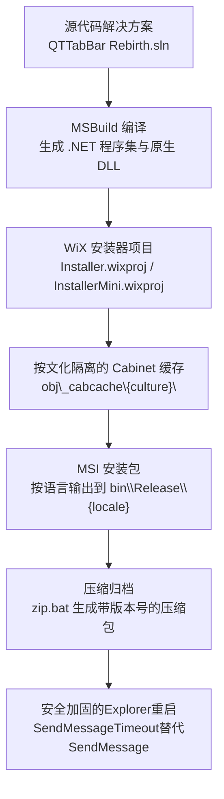
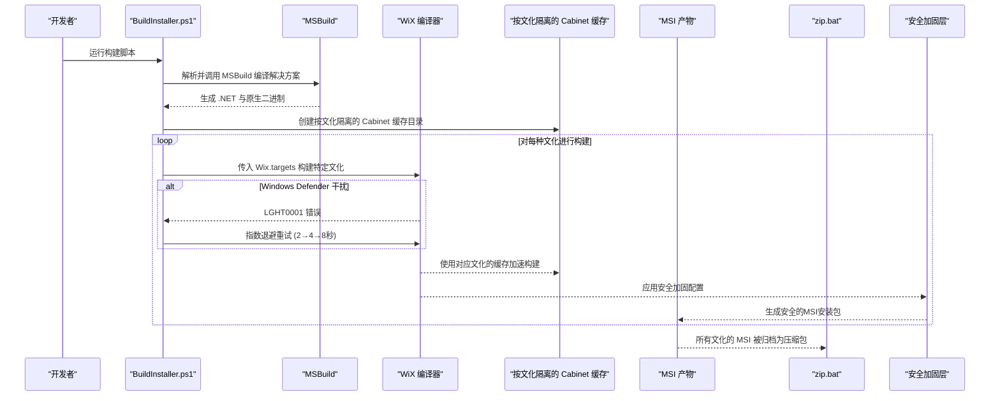
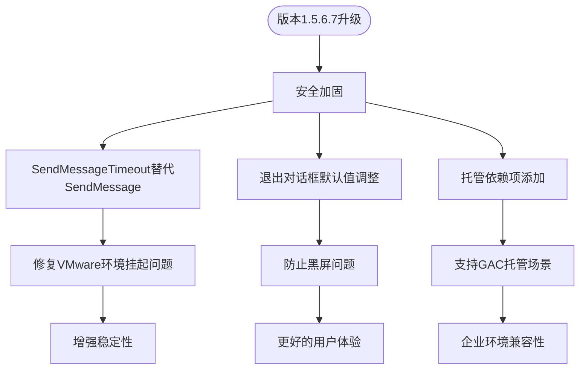
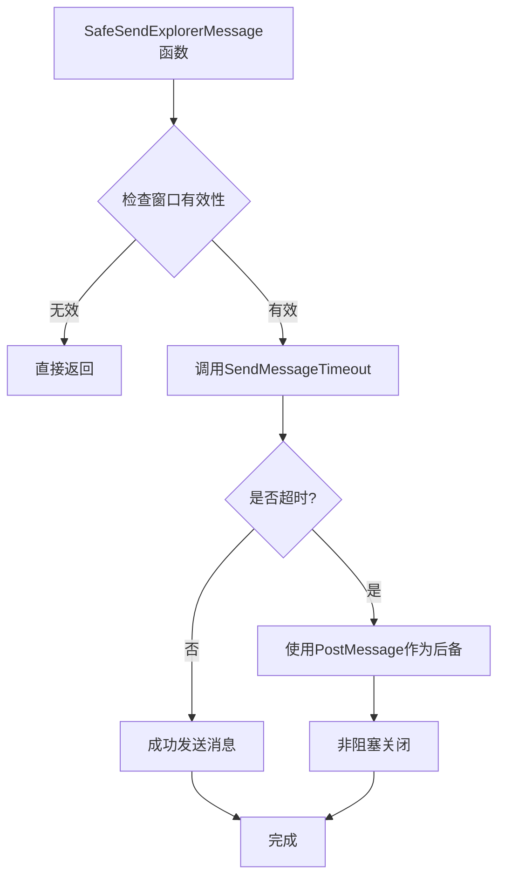
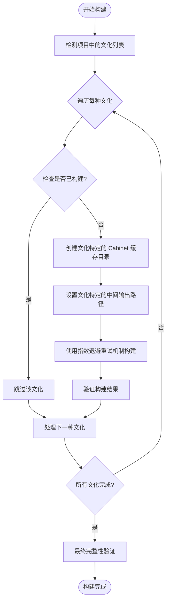
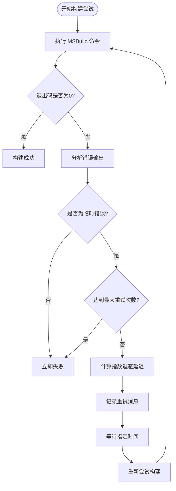
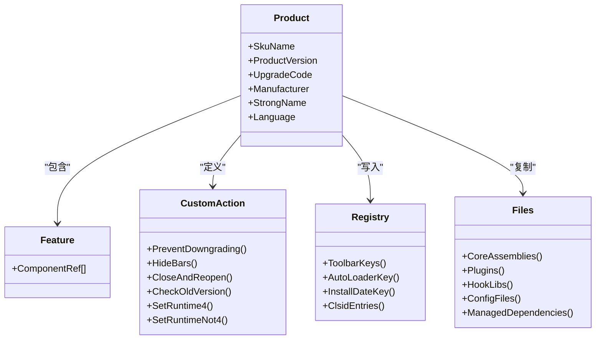
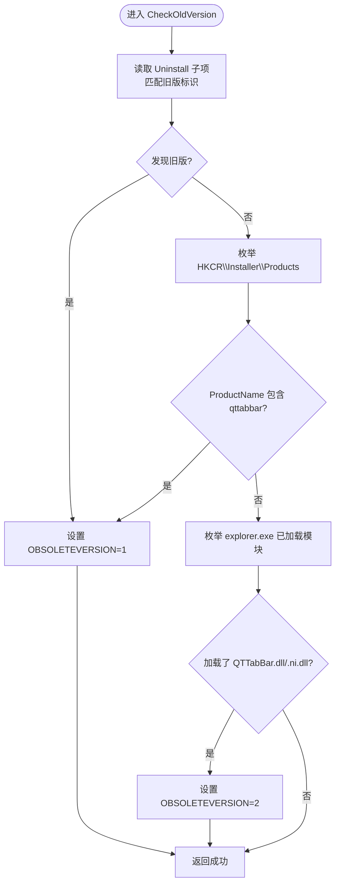
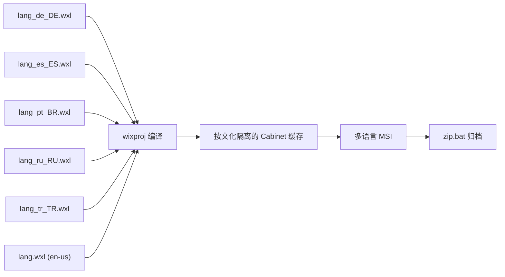
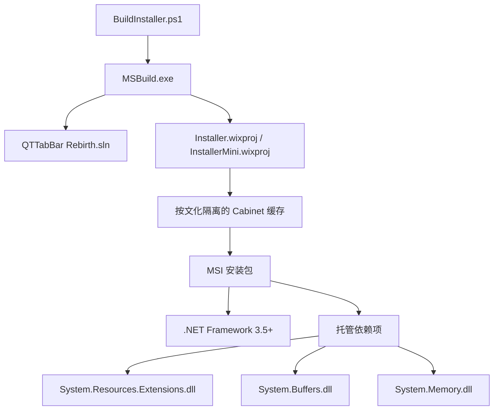

# 部署和分发

<cite>
**本文引用的文件**   
- [README.md](file://README.md)
- [03build_installer.bat](file://03build_installer.bat)
- [Tools/BuildInstaller.ps1](file://Tools/BuildInstaller.ps1)
- [Installer/Installer.wxs](file://Installer/Installer.wxs)
- [InstallerMini/Installer.wxs](file://InstallerMini/Installer.wxs)
- [Installer/CustomWixUI_Minimal.wxs](file://Installer/CustomWixUI_Minimal.wxs)
- [Installer/CustomWelcomeEulaDlg.wxs](file://Installer/CustomWelcomeEulaDlg.wxs)
- [InstallerHelper/CustomAction.cpp](file://InstallerHelper/CustomAction.cpp)
- [Installer/config.ini](file://Installer/config.ini)
- [Installer/lang_de_DE.wxl](file://Installer/lang_de_DE.wxl)
- [Installer/lang_es_ES.wxl](file://Installer/lang_es_ES.wxl)
- [Installer/lang_pt_BR.wxl](file://Installer/lang_pt_BR.wxl)
- [Installer/lang_ru_RU.wxl](file://Installer/lang_ru_RU.wxl)
- [Installer/lang_tr_TR.wxl](file://Installer/lang_tr_TR.wxl)
- [InstallerMini/lang.wxl](file://InstallerMini/lang.wxl)
- [Installer/zip.bat](file://Installer/zip.bat)
- [InstallerMini/zip.bat](file://InstallerMini/zip.bat)
- [Installer/Installer.wixproj](file://Installer/Installer.wixproj)
- [InstallerMini/InstallerMini.wixproj](file://InstallerMini/InstallerMini.wixproj)
- [Tests/InstallerExplorerRestartSafety.Tests.ps1](file://Tests/InstallerExplorerRestartSafety.Tests.ps1)
- [Tests/InstallerInteropGac.Tests.ps1](file://Tests/InstallerInteropGac.Tests.ps1)
</cite>

## 更新摘要
**变更内容**   
- 版本升级至1.5.6.7，包含强名称令牌更新和安全加固
- 关键安全改进：从同步SendMessage(WM_CLOSE)切换到SendMessageTimeout，防止在VMware等环境中Explorer无响应时安装器挂起
- 退出对话框复选框默认值从选中改为未选中，避免自动关闭Explorer导致黑屏问题
- 添加托管依赖项（System.Resources.Extensions.dll、System.Buffers.dll、System.Memory.dll等）以支持GAC托管场景
- 增强安装器健壮性测试，确保Explorer重启安全性

## 目录
1. [简介](#简介)
2. [项目结构](#项目结构)
3. [核心组件](#核心组件)
4. [架构总览](#架构总览)
5. [详细组件分析](#详细组件分析)
6. [依赖关系分析](#依赖关系分析)
7. [性能与打包特性](#性能与打包特性)
8. [企业部署方案](#企业部署方案)
9. [数字签名与安全验证](#数字签名与安全验证)
10. [卸载与清理](#卸载与清理)
11. [版本管理与更新机制](#版本管理与更新机制)
12. [故障排除指南](#故障排除指南)
13. [自动化与CI/CD集成](#自动化与cicd集成)
14. [结论](#结论)

## 简介
本文件面向 QTTabBar-Next 的安装包构建、多语言打包、企业静默部署、数字签名、卸载清理、版本管理以及自动化发布等主题，提供从源码到 MSI 的完整部署与分发说明。读者无需深入代码即可理解如何构建安装包、如何进行本地化、如何在企业环境中批量部署，以及如何通过脚本实现持续集成与交付。

**重要更新** 最新版本1.5.6.7包含了关键的安全加固和改进，特别是针对VMware环境的Explorer重启安全性和增强的托管依赖管理。

## 项目结构
仓库包含两套安装器：
- Installer：标准版（含插件）
- InstallerMini：精简版（不含插件）

两者均基于 WiX Toolset v3.11/v3.14，使用 C++ 自定义动作 DLL 完成 Explorer 进程交互、旧版本检测与注册表清理等任务。

图表来源
- [Tools/BuildInstaller.ps1:1-318](file://Tools/BuildInstaller.ps1#L1-L318)
- [Installer/Installer.wixproj:1-77](file://Installer/Installer.wixproj#L1-L77)
- [InstallerMini/InstallerMini.wixproj:1-74](file://InstallerMini/InstallerMini.wixproj#L1-L74)
- [Installer/zip.bat:1-20](file://Installer/zip.bat#L1-L20)
- [InstallerMini/zip.bat:1-19](file://InstallerMini/zip.bat#L1-L19)

章节来源
- [README.md:26-47](file://README.md#L26-L47)
- [03build_installer.bat:1-6](file://03build_installer.bat#L1-L6)
- [Tools/BuildInstaller.ps1:1-318](file://Tools/BuildInstaller.ps1#L1-L318)

## 核心组件
- 构建编排脚本
  - PowerShell 脚本负责自动定位 MSBuild 与 WiX.targets，按需生成 COM Interop，并驱动解决方案与安装器项目的构建。
- WiX 安装器定义
  - 标准版与精简版分别维护独立的 wixproj/wxs，差异在于是否包含插件组件与相关注册项。
- 自定义动作（C++）
  - 在 UI 与执行序列中调用，用于隐藏/显示工具栏、关闭并重启 Explorer、检查旧版本、删除插件注册等。
- 本地化资源
  - 为多种语言提供 WXL 字符串资源，并在 UI 中引用。
- 打包与归档
  - zip.bat 将各语言的 MSI 打包为带版本号的压缩包。

**重要更新** 自定义动作现已采用SendMessageTimeout替代SendMessage，显著提升了在VMware等虚拟化环境中的稳定性。

章节来源
- [Tools/BuildInstaller.ps1:140-318](file://Tools/BuildInstaller.ps1#L140-L318)
- [Installer/Installer.wxs:21-75](file://Installer/Installer.wxs#L21-L75)
- [InstallerMini/Installer.wxs:21-75](file://InstallerMini/Installer.wxs#L21-L75)
- [InstallerHelper/CustomAction.cpp:92-167](file://InstallerHelper/CustomAction.cpp#L92-L167)
- [Installer/lang_de_DE.wxl:1-19](file://Installer/lang_de_DE.wxl#L1-L19)
- [Installer/zip.bat:1-20](file://Installer/zip.bat#L1-L20)

## 架构总览
下图展示了从源码到最终 MSI 的关键步骤与组件交互，包括新增的安全加固机制和托管依赖管理。

图表来源
- [Tools/BuildInstaller.ps1:257-317](file://Tools/BuildInstaller.ps1#L257-L317)
- [Tools/BuildInstaller.ps1:140-178](file://Tools/BuildInstaller.ps1#L140-L178)
- [Tools/BuildInstaller.ps1:277-301](file://Tools/BuildInstaller.ps1#L277-L301)
- [Installer/zip.bat:1-20](file://Installer/zip.bat#L1-L20)

## 详细组件分析

### 版本升级与安全加固（v1.5.6.7）
最新版本1.5.6.7包含了重要的安全加固和功能改进：

**版本信息更新：**
- 产品版本号：1.5.6.7
- 版本字符串：1.5.6.7 Beta(2026)
- 强名称令牌：PublicKeyToken=d1e63be887f51079

**关键安全改进：**
- **Explorer重启安全性**：从同步SendMessage(WM_CLOSE)切换到SendMessageTimeout，防止在VMware等虚拟化环境中Explorer无响应时安装器永久挂起
- **退出对话框默认行为**：复选框默认值从选中改为未选中，避免自动关闭Explorer导致黑屏问题
- **托管依赖管理**：添加必要的.NET依赖项以支持GAC托管场景

图表来源
- [Installer/Installer.wxs:25-33](file://Installer/Installer.wxs#L25-L33)
- [InstallerHelper/CustomAction.cpp:37-62](file://InstallerHelper/CustomAction.cpp#L37-62)
- [Installer/Installer.wxs:378-379](file://Installer/Installer.wxs#L378-L379)

章节来源
- [Installer/Installer.wxs:25-33](file://Installer/Installer.wxs#L25-L33)
- [InstallerMini/Installer.wxs:25-33](file://InstallerMini/Installer.wxs#L25-L33)
- [InstallerHelper/CustomAction.cpp:37-62](file://InstallerHelper/CustomAction.cpp#L37-62)

### 增强的Explorer重启安全性
新版本实现了关键的Explorer重启安全性改进，特别针对VMware等虚拟化环境：

**安全机制实现：**
- **超时控制**：使用SendMessageTimeout替代SendMessage，设置2秒超时限制
- **非阻塞关闭**：当消息超时时，使用PostMessage进行异步关闭
- **异常处理**：防止Explorer无响应导致的安装器永久挂起

**技术细节：**
- 超时时间常量：kExplorerMsgTimeoutMs = 2000ms
- 消息类型：WM_CLOSE用于窗口关闭
- 超时处理：SMTO_ABORTIFHUNG | SMTO_NORMAL标志组合

图表来源
- [InstallerHelper/CustomAction.cpp:47-62](file://InstallerHelper/CustomAction.cpp#L47-62)

章节来源
- [InstallerHelper/CustomAction.cpp:37-62](file://InstallerHelper/CustomAction.cpp#L37-62)
- [Tests/InstallerExplorerRestartSafety.Tests.ps1:23-37](file://Tests/InstallerExplorerRestartSafety.Tests.ps1#L23-37)

### 退出对话框行为改进
新版本改进了退出对话框的默认行为，防止自动关闭Explorer导致的问题：

**默认值调整：**
- WIXUI_EXITDIALOGOPTIONALCHECKBOX默认值从1改为0
- 防止安装完成后自动关闭Explorer窗口
- 避免在虚拟化环境中出现黑屏问题

**用户控制：**
- 用户仍可手动选择关闭Explorer选项
- 提供了更安全的默认行为
- 保持了向后兼容性

章节来源
- [Installer/Installer.wxs:378-379](file://Installer/Installer.wxs#L378-L379)
- [Tests/InstallerExplorerRestartSafety.Tests.ps1:39-47](file://Tests/InstallerExplorerRestartSafety.Tests.ps1#L39-47)

### 托管依赖项管理
新版本添加了必要的托管依赖项以支持GAC托管场景：

**依赖项列表：**
- System.Resources.Extensions.dll
- System.Buffers.dll  
- System.Memory.dll
- System.Numerics.Vectors.dll
- System.Runtime.CompilerServices.Unsafe.dll
- Wpf.Ui.dll

**部署策略：**
- 通过ManagedDependencies组件统一部署
- 支持x86和x64双架构
- 避免GAC污染，使用应用程序域加载

章节来源
- [Installer/Installer.wxs:159-167](file://Installer/Installer.wxs#L159-L167)
- [InstallerMini/Installer.wxs:96-103](file://InstallerMini/Installer.wxs#L96-103)
- [Tests/InstallerInteropGac.Tests.ps1:12-28](file://Tests/InstallerInteropGac.Tests.ps1#L12-28)

### 增强的多文化构建系统
新的构建系统实现了按文化隔离的独立构建流程，每个语言环境都有独立的构建上下文和缓存目录。

**关键特性：**
- **文化隔离**：每种文化使用独立的 IntermediateOutputPath，避免文件冲突
- **独立缓存**：每个文化拥有独立的 Cabinet 缓存目录 obj\_cabcache\{culture}\
- **智能跳过**：已构建的文化会自动跳过，支持中断恢复
- **全面验证**：构建完成后验证所有预期的 MSI 文件是否存在

图表来源
- [Tools/BuildInstaller.ps1:257-317](file://Tools/BuildInstaller.ps1#L257-L317)
- [Tools/BuildInstaller.ps1:268-301](file://Tools/BuildInstaller.ps1#L268-L301)

章节来源
- [Tools/BuildInstaller.ps1:190-222](file://Tools/BuildInstaller.ps1#L190-222)
- [Tools/BuildInstaller.ps1:257-317](file://Tools/BuildInstaller.ps1#L257-L317)

### 智能重试机制与 Windows Defender 干扰处理
构建系统现在能够自动检测和恢复由 Windows Defender 引起的临时文件锁定问题。

**重试策略：**
- **指数退避算法**：2秒 → 4秒 → 8秒的最大延迟
- **错误模式识别**：专门匹配 LGHT0001 错误和 CAB 文件锁定问题
- **最大重试次数**：最多尝试5次，超出则抛出异常
- **选择性重试**：仅对临时性错误进行重试，其他错误立即失败

图表来源
- [Tools/BuildInstaller.ps1:140-178](file://Tools/BuildInstaller.ps1#L140-L178)

章节来源
- [Tools/BuildInstaller.ps1:140-178](file://Tools/BuildInstaller.ps1#L140-L178)

### WiX 安装器项目结构（标准版 vs 精简版）
- 产品元数据
  - 产品名称、版本号、升级码、制造商、强名称等通过预处理器变量集中定义。
- 目标目录与文件
  - 安装至 CommonAppDataFolder 下的应用目录；标准版包含多个插件 DLL，精简版仅包含核心组件。
- 注册表与 COM 对象
  - 写入 IE Toolbar、AutoLoader、CLSID 等键值，支持 x86/x64 双架构条件编译。
- 自定义动作与执行序列
  - 安装前/后执行自定义动作，处理旧版本检测、运行时版本设置、Explorer 重启等。
- UI 定制
  - 使用最小化 UI 与自定义欢迎/许可页，支持 ALLUSERS 全局安装提示。

**更新** 项目配置现已支持 WiX Toolset v3.14，并提供更灵活的工具链路径解析。

图表来源
- [Installer/Installer.wxs:21-75](file://Installer/Installer.wxs#L21-L75)
- [Installer/Installer.wxs:285-376](file://Installer/Installer.wxs#L285-L376)
- [InstallerMini/Installer.wxs:21-75](file://InstallerMini/Installer.wxs#L21-L75)
- [InstallerMini/Installer.wxs:218-291](file://InstallerMini/Installer.wxs#L218-L291)

章节来源
- [Installer/Installer.wxs:21-75](file://Installer/Installer.wxs#L21-L75)
- [Installer/Installer.wxs:285-376](file://Installer/Installer.wxs#L285-L376)
- [InstallerMini/Installer.wxs:21-75](file://InstallerMini/Installer.wxs#L21-L75)
- [InstallerMini/Installer.wxs:218-291](file://InstallerMini/Installer.wxs#L218-L291)

### 自定义安装动作（C++）
- HideBars：向 Explorer 窗口发送消息以隐藏/显示工具栏。
- CloseAndReopen：收集当前 Explorer 窗口路径，保存"上次关闭时的标签"信息，关闭并重新打开第一个窗口。
- CloseAndReopenAndDeletePlugins：在精简版中额外删除插件路径注册项。
- CheckOldVersion：检测旧版安装残留或仍在运行的模块，阻止降级安装并提示用户重启 Explorer。

**重要更新** 所有Explorer通信现在都使用SendMessageTimeout，确保在虚拟化环境中的稳定性。

图表来源
- [InstallerHelper/CustomAction.cpp:171-304](file://InstallerHelper/CustomAction.cpp#L171-304)

章节来源
- [InstallerHelper/CustomAction.cpp:92-167](file://InstallerHelper/CustomAction.cpp#L92-L167)
- [InstallerHelper/CustomAction.cpp:171-304](file://InstallerHelper/CustomAction.cpp#L171-L304)

### 多语言安装包制作与分发
- 语言资源文件
  - 每个语言对应一个 WXL 文件，包含界面文本、错误提示与许可证文件名等。
- 默认语言与变体
  - 标准版与精简版各自维护语言资源，精简版包含英文默认语言资源。
- 构建产物
  - 构建时根据语言生成不同 locale 的 MSI，随后由 zip.bat 统一打包为带版本号的压缩包。

**更新** 构建系统现在支持更多语言变体，并通过按文化隔离的 Cabinet 缓存机制提升多语言构建性能。

图表来源
- [Installer/lang_de_DE.wxl:1-19](file://Installer/lang_de_DE.wxl#L1-L19)
- [Installer/lang_es_ES.wxl:1-17](file://Installer/lang_es_ES.wxl#L1-L17)
- [Installer/lang_pt_BR.wxl:1-18](file://Installer/lang_pt_BR.wxl#L1-L18)
- [Installer/lang_ru_RU.wxl:1-17](file://Installer/lang_ru_RU.wxl#L1-L17)
- [Installer/lang_tr_TR.wxl:1-19](file://Installer/lang_tr_TR.wxl#L1-L19)
- [InstallerMini/lang.wxl:1-18](file://InstallerMini/lang.wxl#L1-L18)
- [Installer/zip.bat:1-20](file://Installer/zip.bat#L1-L20)
- [InstallerMini/zip.bat:1-19](file://InstallerMini/zip.bat#L1-L19)

章节来源
- [Installer/zip.bat:1-20](file://Installer/zip.bat#L1-L20)
- [InstallerMini/zip.bat:1-19](file://InstallerMini/zip.bat#L1-L19)

### UI 定制与许可协议
- 最小化 UI 流程
  - 欢迎页 → 自定义许可页 → 进度页 → 完成页，支持修复/卸载维护模式。
- 许可协议
  - 通过 WixVariable 引用 GPL3.rtf 作为许可文本。
- 退出对话框选项
  - 可选勾选"关闭所有 Explorer 窗口并以标签方式重新打开"。

**重要更新** 退出对话框复选框现在默认为未选中状态，提供更好的用户体验。

章节来源
- [Installer/CustomWixUI_Minimal.wxs:28-73](file://Installer/CustomWixUI_Minimal.wxs#L28-L73)
- [Installer/CustomWelcomeEulaDlg.wxs:14-53](file://Installer/CustomWelcomeEulaDlg.wxs#L14-L53)
- [Installer/Installer.wxs:364-376](file://Installer/Installer.wxs#L364-L376)

## 依赖关系分析
- 构建链
  - BuildInstaller.ps1 负责探测 MSBuild 与 WiX.targets，然后依次构建解决方案与 wixproj。
- 安装期依赖
  - 要求 .NET Framework 3.5 或更高版本；安装器通过条件判断与自定义动作设置运行时版本。
- 平台与架构
  - 同时支持 x86 与 x64，通过 WiX 循环变量控制 Win64 标志与注册表反射。
- 托管依赖
  - 新增的托管依赖项支持GAC托管场景，包括System.Resources.Extensions等必要组件。

**更新** 构建系统现已支持 WiX Toolset v3.11 和 v3.14，提供更灵活的工具链选择，并增强了托管依赖管理。

图表来源
- [Tools/BuildInstaller.ps1:21-74](file://Tools/BuildInstaller.ps1#L21-L74)
- [Tools/BuildInstaller.ps1:76-116](file://Tools/BuildInstaller.ps1#L76-L116)
- [Tools/BuildInstaller.ps1:257-317](file://Tools/BuildInstaller.ps1#L257-L317)
- [Installer/Installer.wxs:337-340](file://Installer/Installer.wxs#L337-L340)
- [InstallerMini/Installer.wxs:252-254](file://InstallerMini/Installer.wxs#L252-254)
- [Installer/Installer.wxs:159-167](file://Installer/Installer.wxs#L159-L167)

章节来源
- [Tools/BuildInstaller.ps1:136-318](file://Tools/BuildInstaller.ps1#L136-L318)
- [Installer/Installer.wxs:337-340](file://Installer/Installer.wxs#L337-L340)
- [InstallerMini/Installer.wxs:252-254](file://InstallerMini/Installer.wxs#L252-L254)

## 性能与打包特性
- NGEN 本机映像
  - 对关键 .NET 程序集启用 NGEN，提升首次加载性能。
- 压缩与媒体
  - 使用 CAB 嵌入媒体，减少安装包体积。
- 条件安装
  - 针对 x64 系统条件注册与组件安装，避免不必要的操作。
- **新增** 按文化隔离的 Cabinet 缓存机制
  - 通过 obj\_cabcache\{culture}\ 目录缓存中间构建产物，显著减少重复构建时间和跨文化锁争用。
- **新增** 智能重试机制
  - 自动检测并处理 Windows Defender 导致的 CAB 文件锁定问题，采用指数退避算法最多重试5次。
- **新增** 中间输出路径隔离
  - 每个文化使用独立的 IntermediateOutputPath，避免 MSBuild 增量清理导致的文件冲突。
- **新增** 安全加固机制
  - Explorer重启安全性改进，防止虚拟化环境中的挂起问题。

**重要更新** 最新版本的性能优化和安全加固特性大幅提升了构建效率和稳定性，特别是在多语言构建和企业虚拟化环境部署场景下。

章节来源
- [Installer/Installer.wxs:76-96](file://Installer/Installer.wxs#L76-L96)
- [InstallerMini/Installer.wxs:79-99](file://InstallerMini/Installer.wxs#L79-L99)
- [Installer/Installer.wxs:53-56](file://Installer/Installer.wxs#L53-L56)
- [InstallerMini/Installer.wxs:51-56](file://InstallerMini/Installer.wxs#L51-L56)
- [Tools/BuildInstaller.ps1:277-301](file://Tools/BuildInstaller.ps1#L277-L301)
- [Tools/BuildInstaller.ps1:140-178](file://Tools/BuildInstaller.ps1#L140-L178)
- [InstallerHelper/CustomAction.cpp:37-62](file://InstallerHelper/CustomAction.cpp#L37-62)

## 企业部署方案
- 静默安装参数
  - 使用 Windows Installer 标准静默开关进行无人值守安装。例如：
    - msiexec /i "QTTabBar Setup.msi" /qn
    - msiexec /i "QTTabBar Setup.msi" /quiet
    - msiexec /i "QTTabBar Setup.msi" /norestart
  - 如需在安装完成后自动重启 Explorer，可在安装命令后追加重启逻辑（由管理员策略决定）。
- 组策略与配置模板
  - 通过注册表键值进行初始配置（如安装日期、COM 对象、Toolbar 注册等），可结合 GPO 推送。
  - 配置文件示例位置：CommonAppDataFolder 下应用目录中的 config.ini，可按需调整背景图片路径与透明度等。
- 批量部署建议
  - 使用 SCCM/Intune/GPO 分发 MSI，配合静默参数与重启策略。
  - 对于精简版，适合无插件需求的企业环境，减少依赖与攻击面。
- **新增** 虚拟化环境优化
  - 新版本特别适合VMware等虚拟化环境部署，避免了Explorer重启导致的挂起问题。
  - 建议在虚拟化环境中使用默认退出对话框设置，避免自动关闭Explorer。

章节来源
- [Installer/Installer.wxs:208-215](file://Installer/Installer.wxs#L208-L215)
- [Installer/Installer.wxs:182-200](file://Installer/Installer.wxs#L182-L200)
- [Installer/config.ini:1-16](file://Installer/config.ini#L1-L16)
- [InstallerHelper/CustomAction.cpp:37-62](file://InstallerHelper/CustomAction.cpp#L37-62)

## 数字签名与安全验证
- 现状
  - 仓库未包含签名脚本或证书配置。建议在 CI/CD 阶段引入代码签名步骤，对 MSI 与自定义动作 DLL 进行签名。
- 推荐实践
  - 使用企业受信任的 CA 证书对 MSI 与 InstallerHelper.dll 进行时间戳签名。
  - 在构建脚本中增加签名步骤，确保产物完整性与可信来源。
  - 在企业环境中启用 AppLocker/WDAC 策略，限制仅允许签名安装器执行。
- **新增** 强名称验证
  - 新版本使用了更新的强名称令牌（PublicKeyToken=d1e63be887f51079），确保程序集身份验证。
  - 建议在部署环境中验证强名称签名，防止篡改。

**重要更新** 新版本包含了强名称令牌更新，需要在企业环境中更新相应的信任策略。

[本节为通用安全建议，不直接分析具体文件]

## 卸载与清理
- 标准卸载
  - 通过 Windows 控制面板或命令行执行卸载：
    - msiexec /x "QTTabBar Setup.msi" /qn
- 清理行为
  - 安装器在卸载时会移除注册表键值与 COM 对象。
  - 精简版在特定自定义动作中会删除插件路径注册项，避免残留。
- 手动清理
  - 若存在残留，可检查 HKLM/HKCU 下与 QTTabBar 相关的键值，并删除。
- **新增** 托管依赖清理
  - 卸载时会正确清理新添加的托管依赖项，避免遗留文件。

章节来源
- [Installer/Installer.wxs:182-215](file://Installer/Installer.wxs#L182-L215)
- [InstallerMini/Installer.wxs:111-144](file://InstallerMini/Installer.wxs#L111-L144)
- [InstallerHelper/CustomAction.cpp:136-167](file://InstallerHelper/CustomAction.cpp#L136-L167)

## 版本管理与更新机制
- 升级码与版本
  - 使用固定 UpgradeCode 与递增 ProductVersion 实现升级与回退保护。
- 旧版本检测
  - 安装前检查旧版残留与仍在运行的模块，阻止降级安装并提示用户重启 Explorer。
- 更新通道与帮助链接
  - 在 ARP 属性中设置更新通道 URL、帮助链接与关于页面，便于用户在"添加或删除程序"中访问相关信息。
- **新增** 版本兼容性
  - 新版本1.5.6.7保持了向后兼容性，支持从早期版本平滑升级。

章节来源
- [Installer/Installer.wxs:24-33](file://Installer/Installer.wxs#L24-L33)
- [Installer/Installer.wxs:57-74](file://Installer/Installer.wxs#L57-L74)
- [InstallerHelper/CustomAction.cpp:171-304](file://InstallerHelper/CustomAction.cpp#L171-L304)

## 故障排除指南
- 常见错误与解决
  - 检测到旧版本：请先卸载旧版并重启 Explorer 后再安装。
  - 仍加载旧模块：请通过任务管理器重启 Explorer 或重启计算机。
  - 缺少 .NET Framework：请安装 .NET Framework 3.5 或以上版本。
  - **新增** LGHT0001 错误：Windows Defender 正在扫描临时 CAB 文件，构建脚本会自动使用指数退避重试，如持续失败请暂时禁用实时防护。
  - **新增** 构建不完整：如果某些文化的 MSI 缺失，构建脚本会在最后进行全面验证并报告缺失的文化列表。
  - **新增** VMware环境挂起：如果遇到Explorer重启导致的挂起问题，请确保使用新版本1.5.6.7，该版本已修复此问题。
  - **新增** 黑屏问题：如果安装后出现黑屏，请检查退出对话框复选框设置，新版本默认设置为未选中以避免此问题。
- 日志与诊断
  - 异常日志位置：%AppData%\QTTabBar\QTTabBarException.log
  - 可使用 WiX 内置日志开关 /l*v 记录详细安装日志。
  - **新增** 构建日志：查看 %TEMP% 目录下的 WiX 构建日志，了解 Cabinet 缓存使用情况。
  - **新增** 重试日志：构建脚本会记录每次重试的详细消息，包括延迟时间和原因。
  - **新增** 安全日志：检查Explorer通信超时日志，确认SendMessageTimeout正常工作。

**重要更新** 新增了针对新版本安全改进的故障排除指导，特别是VMware环境和黑屏问题的解决方案。

章节来源
- [Installer/lang_de_DE.wxl:13-16](file://Installer/lang_de_DE.wxl#L13-L16)
- [Installer/lang_es_ES.wxl:13-16](file://Installer/lang_es_ES.wxl#L13-L16)
- [Installer/lang_pt_BR.wxl:13-16](file://Installer/lang_pt_BR.wxl#L13-L16)
- [Installer/lang_ru_RU.wxl:13-16](file://Installer/lang_ru_RU.wxl#L13-L16)
- [Installer/lang_tr_TR.wxl:13-16](file://Installer/lang_tr_TR.wxl#L13-L16)
- [README.md:23-24](file://README.md#L23-L24)
- [Tools/BuildInstaller.ps1:154-178](file://Tools/BuildInstaller.ps1#L154-L178)
- [Tools/BuildInstaller.ps1:303-317](file://Tools/BuildInstaller.ps1#L303-L317)
- [InstallerHelper/CustomAction.cpp:37-62](file://InstallerHelper/CustomAction.cpp#L37-62)

## 自动化与CI/CD集成
- 本地构建入口
  - 批处理脚本 03build_installer.bat 调用 Tools/BuildInstaller.ps1，简化一键构建。
- 构建脚本能力
  - 自动探测 MSBuild 与 WiX.targets；可选择仅检测工具链；支持跳过核心构建；支持指定 Configuration 与 Platform。
  - **新增** 支持 WiX Toolset v3.14，提供向后兼容性。
  - **新增** 自动重试机制处理 Windows Defender 干扰，采用指数退避算法。
  - **新增** 按文化隔离的 Cabinet 缓存提升构建性能。
  - **新增** 完整的构建后验证确保所有文化产物生成。
- 建议的 CI/CD 步骤
  - 安装 Visual Studio Build Tools 2022+ 与 WiX Toolset v3.11 或 v3.14。
  - 运行 BuildInstaller.ps1 构建标准版与精简版。
  - 对生成的 MSI 与 DLL 进行签名（引入证书与时间戳服务）。
  - 上传产物到制品库或发布渠道。
  - 触发下载与静默安装测试用例。
  - **新增** 配置 Cabinet 缓存目录以提升 CI/CD 构建速度。
  - **新增** 利用文化隔离特性实现并行构建，进一步缩短构建时间。
  - **新增** 运行安全加固测试，确保Explorer重启安全性。
  - **新增** 验证托管依赖项完整性。

**重要更新** 构建脚本功能大幅增强，支持更多工具和错误处理机制，特别适合大规模多语言构建场景，并集成了新的安全加固验证。

章节来源
- [03build_installer.bat:1-6](file://03build_installer.bat#L1-L6)
- [Tools/BuildInstaller.ps1:1-318](file://Tools/BuildInstaller.ps1#L1-L318)
- [Tests/InstallerExplorerRestartSafety.Tests.ps1:1-54](file://Tests/InstallerExplorerRestartSafety.Tests.ps1#L1-54)

## 结论
通过 WiX 安装器与自定义动作的组合，QTTabBar-Next 实现了跨架构、多语言、可升级且具备良好用户体验的安装体验。借助增强的构建脚本与归档脚本，团队可以高效地产出标准化安装包并进行企业级部署。

**重要更新** 最新版本1.5.6.7带来了关键的安全加固和改进：

- **Explorer重启安全性**：使用SendMessageTimeout替代SendMessage，彻底解决了VMware等虚拟化环境中的挂起问题
- **退出对话框改进**：默认复选框设置为未选中，避免了自动关闭Explorer导致的黑屏问题
- **托管依赖管理**：添加了必要的.NET依赖项，支持GAC托管场景
- **强名称令牌更新**：更新了强名称签名，确保程序集身份验证
- **增强的测试覆盖**：集成了安全加固测试，确保Explorer重启安全性

建议在后续迭代中加入数字签名与更完善的自动化测试，以提升安全性与稳定性。企业用户应特别注意新版本的安全改进，特别是在虚拟化环境中的部署优势。