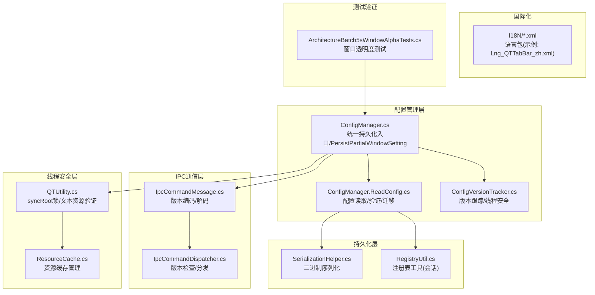
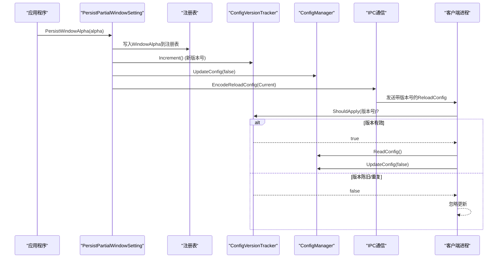
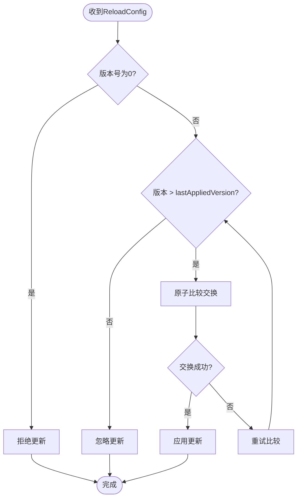
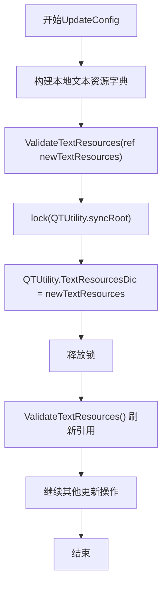
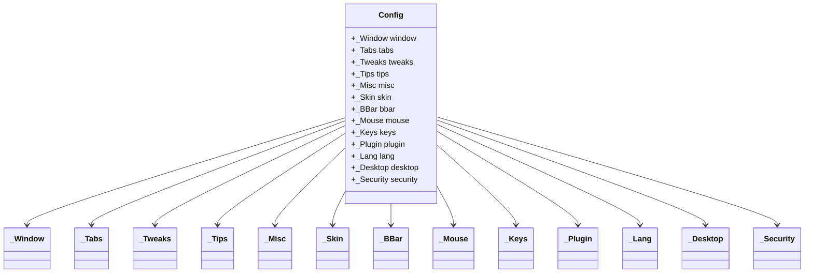
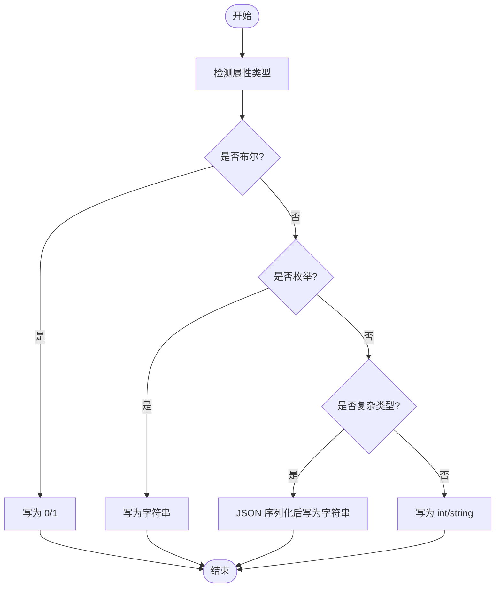
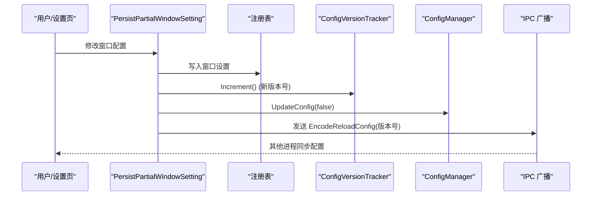
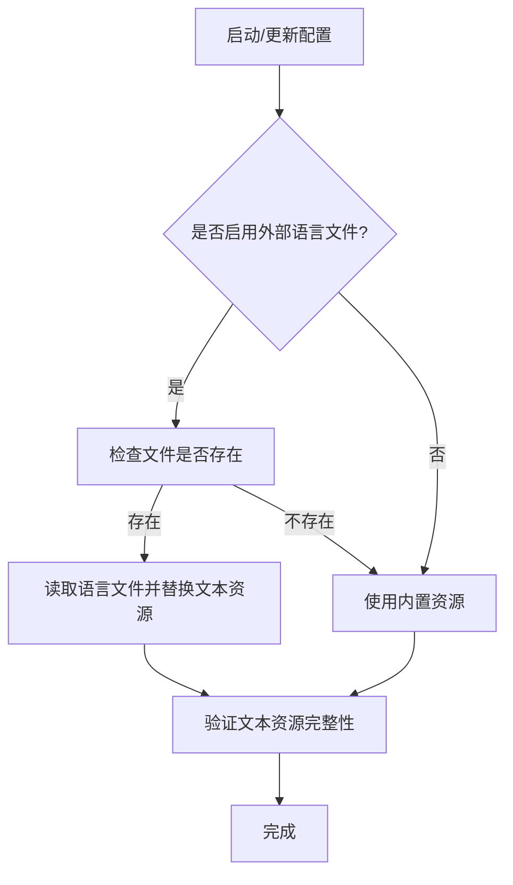
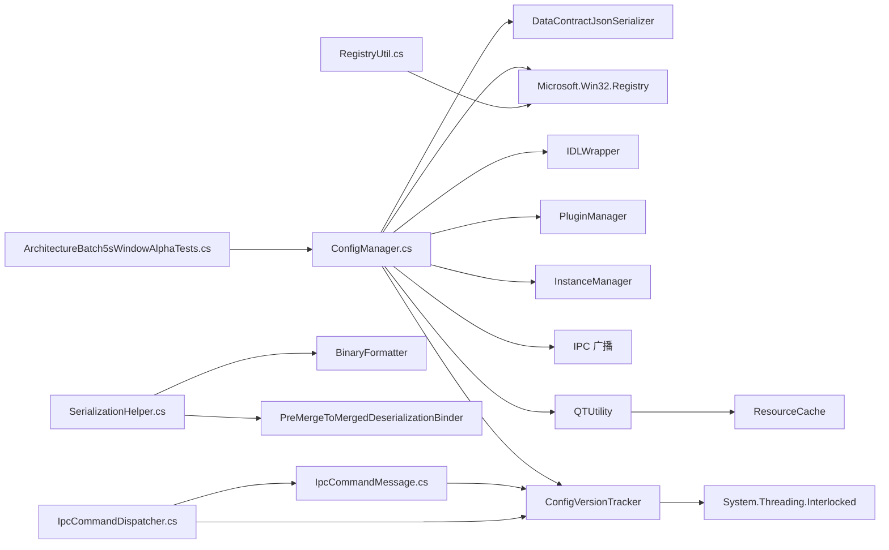

# 配置管理

<cite>
**本文引用的文件**   
- [ConfigManager.cs](file://QTTabBar/ConfigManager.cs)
- [ConfigManager.ReadConfig.cs](file://QTTabBar/ConfigManager.ReadConfig.cs)
- [SerializationHelper.cs](file://QTTabBar/SerializationHelper.cs)
- [RegistryUtil.cs](file://QTTabBar/RegistryUtil.cs)
- [ConfigVersionTracker.cs](file://QTTabBar/ConfigVersionTracker.cs)
- [IpcCommandMessage.cs](file://QTTabBar/IpcCommandMessage.cs)
- [IpcCommandDispatcher.cs](file://QTTabBar/IpcCommandDispatcher.cs)
- [Lng_QTTabBar_zh.xml](file://I18N/Lng_QTTabBar_zh.xml)
- [QTUtility.cs](file://QTTabBar/QTUtility.cs)
- [ResourceCache.cs](file://QTTabBar/ResourceCache.cs)
- [ArchitectureBatch5sWindowAlphaTests.cs](file://Tests/QTTtabBarTests/ArchitectureBatch5sWindowAlphaTests.cs)
</cite>

## 更新摘要
**所做更改**   
- **重大重构**：`ConfigManager.PersistWindowAlpha()` 方法现在使用 `PersistPartialWindowSetting()` 进行统一持久化和IPC广播，替代了直接的注册表写入
- **统一窗口设置持久化**：新增 `PersistPartialWindowSetting()` 方法作为窗口相关配置的单一持久化入口
- **增强IPC一致性**：所有窗口设置变更都通过统一的版本跟踪和IPC广播机制确保多进程一致性
- **简化调用方代码**：`PersistWindowAlpha()` 方法现在专注于业务逻辑，底层持久化由统一API处理

## 目录
1. [简介](#简介)
2. [项目结构](#项目结构)
3. [核心组件](#核心组件)
4. [架构总览](#架构总览)
5. [详细组件分析](#详细组件分析)
6. [依赖关系分析](#依赖关系分析)
7. [性能考虑](#性能考虑)
8. [故障排查指南](#故障排查指南)
9. [结论](#结论)
10. [附录](#附录)

## 简介
本文件面向 QTTabBar-Next 的配置管理系统，系统性阐述配置数据结构设计、序列化与持久化机制（注册表为主、二进制序列化为辅）、热重载与实时更新流程、多语言国际化支持方案、配置 API 使用方式、自定义配置项扩展方法、验证与默认值管理、以及备份恢复与版本兼容策略。**最新更新**：系统经过重大重构，`ConfigManager.PersistWindowAlpha()` 方法现在使用 `PersistPartialWindowSetting()` 进行统一持久化和IPC广播，确保了与IPC v0契约的一致性，并在所有进程中保持一致的行为。文档力求在保持技术深度的同时，提供清晰的图示与可操作的最佳实践，帮助开发者快速理解并安全地扩展配置体系。

## 项目结构
配置相关代码主要分布在以下位置：
- 配置管理器主类：QTTabBar/ConfigManager.cs
- 配置读取逻辑：QTTabBar/ConfigManager.ReadConfig.cs
- 配置版本跟踪器：QTTabBar/ConfigVersionTracker.cs
- IPC消息处理：QTTabBar/IpcCommandMessage.cs, QTTabBar/IpcCommandDispatcher.cs
- 二进制序列化辅助：QTTabBar/SerializationHelper.cs
- 注册表工具（会话级数据）：QTTabBar/RegistryUtil.cs
- 线程安全工具：QTTabBar/QTUtility.cs
- 资源缓存：QTTabBar/ResourceCache.cs
- 语言包资源：I18N/*.xml（以中文为例：Lng_QTTabBar_zh.xml）
- 架构测试：Tests/QTTtabBarTests/ArchitectureBatch5sWindowAlphaTests.cs



**图表来源**
- [ConfigManager.cs:76-87](file://QTTabBar/ConfigManager.cs#L76-L87)
- [ConfigManager.ReadConfig.cs:13-26](file://QTTabBar/ConfigManager.ReadConfig.cs#L13-L26)
- [ConfigVersionTracker.cs:19-82](file://QTTabBar/ConfigVersionTracker.cs#L19-L82)
- [IpcCommandMessage.cs:336-348](file://QTTabBar/IpcCommandMessage.cs#L336-L348)
- [IpcCommandDispatcher.cs:161-169](file://QTTabBar/IpcCommandDispatcher.cs#L161-L169)
- [ArchitectureBatch5sWindowAlphaTests.cs:62-69](file://Tests/QTTtabBarTests/ArchitectureBatch5sWindowAlphaTests.cs#L62-L69)

**章节来源**
- [ConfigManager.cs:76-87](file://QTTabBar/ConfigManager.cs#L76-L87)
- [ConfigManager.ReadConfig.cs:13-26](file://QTTabBar/ConfigManager.ReadConfig.cs#L13-L26)
- [ConfigVersionTracker.cs:19-82](file://QTTabBar/ConfigVersionTracker.cs#L19-L82)
- [IpcCommandMessage.cs:336-348](file://QTTabBar/IpcCommandMessage.cs#L336-L348)
- [IpcCommandDispatcher.cs:161-169](file://QTTabBar/IpcCommandDispatcher.cs#L161-L169)
- [ArchitectureBatch5sWindowAlphaTests.cs:62-69](file://Tests/QTTtabBarTests/ArchitectureBatch5sWindowAlphaTests.cs#L62-L69)

## 核心组件
- **统一配置管理器**
  - ConfigManager 负责加载、读取、写入配置，并通过新的 `PersistPartialWindowSetting()` 方法提供统一的窗口设置持久化入口，确保WriteConfig和UpdateConfig的顺序执行。
- **窗口设置统一持久化**
  - `PersistPartialWindowSetting()` 方法专门处理窗口相关配置的持久化，包括注册表写入、版本递增和IPC广播的完整流程。
- **配置版本跟踪器**
  - ConfigVersionTracker 提供基于UTC时间戳的单调递增版本号管理，确保多进程环境下配置更新的顺序性和一致性，防止陈旧或重复的配置更新。
- IPC消息处理器
  - IpcCommandMessage 提供带版本信息的IPC消息编码/解码功能；IpcCommandDispatcher 负责版本检查和命令分发。
- 序列化辅助
  - SerializationHelper 提供二进制序列化/反序列化能力，用于复杂对象的持久化（例如 IDL 字节数组）。
- 注册表工具
  - RegistryUtil 提供对当前用户注册表 Volatile 子键的读写封装，用于会话级临时数据。
- **线程安全工具**
  - QTUtility 提供全局同步原语 syncRoot，用于保护共享资源的并发访问；ResourceCache 提供线程安全的资源缓存机制。

**章节来源**
- [ConfigManager.cs:76-87](file://QTTabBar/ConfigManager.cs#L76-L87)
- [ConfigManager.cs:104-110](file://QTTabBar/ConfigManager.cs#L104-L110)
- [ConfigVersionTracker.cs:19-82](file://QTTabBar/ConfigVersionTracker.cs#L19-L82)
- [IpcCommandMessage.cs:336-348](file://QTTabBar/IpcCommandMessage.cs#L336-L348)
- [IpcCommandDispatcher.cs:161-169](file://QTTabBar/IpcCommandDispatcher.cs#L161-L169)
- [QTUtility.cs:97-114](file://QTTabBar/QTUtility.cs#L97-L114)

## 架构总览
配置系统采用"统一入口 + 模型 + 反射读写 + 注册表存储 + 版本跟踪 + 线程安全"的架构：
- **统一入口层**：`ConfigManager.PersistPartialWindowSetting()` 作为窗口设置的统一持久化入口，确保注册表写入、版本递增和IPC广播的顺序执行。
- **窗口设置专用路径**：`PersistWindowAlpha()` 等具体方法通过统一API进行持久化，避免直接注册表操作。
- 模型层：强类型配置类，定义所有选项及其默认值。
- 版本控制层：ConfigVersionTracker 维护基于UTC时间戳的单调递增版本号，确保多进程一致性。
- 线程安全层：QTUtility.syncRoot 提供全局锁保护，确保文本资源发布的原子性。
- 读写层：通过反射遍历配置对象树，将属性映射到注册表项；非基本类型使用 JSON 序列化存储为字符串。
- 持久化层：主配置存储在注册表 HKEY_CURRENT_USER\Software\QTTabBar\Config 下；会话级数据使用 Volatile 子键。
- IPC通信层：带版本信息的ReloadConfig消息，客户端根据版本号过滤陈旧或重复更新。
- 运行时：启动时读取配置，应用变更时触发 UI 与插件刷新广播，实现热重载。



**图表来源**
- [ConfigManager.cs:104-110](file://QTTabBar/ConfigManager.cs#L104-L110)
- [ConfigManager.cs:76-87](file://QTTabBar/ConfigManager.cs#L76-L87)
- [ConfigVersionTracker.cs:51-59](file://QTTabBar/ConfigVersionTracker.cs#L51-L59)
- [IpcCommandMessage.cs:336-338](file://QTTabBar/IpcCommandMessage.cs#L336-L338)
- [IpcCommandDispatcher.cs:161-169](file://QTTabBar/IpcCommandDispatcher.cs#L161-L169)

## 详细组件分析

### 窗口设置统一持久化（重大重构）
**ConfigManager.PersistPartialWindowSetting** 方法提供了窗口相关配置的统一持久化入口：

- **设计目标**
  - 统一窗口设置的持久化流程，避免各个方法直接操作注册表
  - 确保注册表写入、版本递增和IPC广播的顺序执行
  - 提供灵活的回调接口，支持不同的窗口设置场景

- **核心特性**
  - **回调模式**：接受 `Action<RegistryKey>` 委托，允许调用方自定义具体的注册表写入逻辑
  - **自动版本管理**：可选的版本递增参数，默认为true
  - **统一广播**：始终执行UpdateConfig(false)和IPC广播，确保配置同步

- **使用示例**
  ```csharp
  // 标准窗口设置持久化
  PersistPartialWindowSetting(key => {
      key.SetValue("WindowAlpha", alpha);
  });
  
  // 不递增版本的场景
  PersistPartialWindowSetting(key => {
      key.SetValue("SomeSetting", value);
  }, incrementVersion: false);
  ```

**更新** `ConfigManager.PersistWindowAlpha()` 方法现在完全基于 `PersistPartialWindowSetting()` 实现，移除了直接的注册表操作：

```csharp
public static void PersistWindowAlpha(byte alpha) {
    Config.Window.WindowAlpha = alpha;
    SessionState.WindowAlpha = alpha;
    PersistPartialWindowSetting(key => {
        key.SetValue("WindowAlpha", (int)alpha);
    });
}
```

**章节来源**
- [ConfigManager.cs:76-87](file://QTTabBar/ConfigManager.cs#L76-L87)
- [ConfigManager.cs:104-110](file://QTTabBar/ConfigManager.cs#L104-L110)
- [ArchitectureBatch5sWindowAlphaTests.cs:62-69](file://Tests/QTTtabBarTests/ArchitectureBatch5sWindowAlphaTests.cs#L62-L69)

### 增强的版本跟踪机制
**ConfigVersionTracker** 实现了基于UTC时间戳的跨进程单调递增版本管理：

- **核心设计原则**
  - 使用 `long` 类型的原子计数器，避免C#中不支持volatile long的限制
  - 基于UTC时间戳的版本生成，确保跨进程的单调递增性
  - 通过Interlocked操作提供完整的内存屏障，比volatile提供更强的线程安全保证

- **关键特性**
  - **Current属性**：返回当前配置版本，使用Interlocked.Read确保跨线程一致性
  - **Increment方法**：原子递增版本号，使用 `Max(currentVersion + 1, UtcNow.Ticks)` 确保单调递增
  - **ShouldApply方法**：判断是否应该应用接收到的配置更新，过滤陈旧或重复更新

- **跨进程一致性保证**
  - 每个进程维护独立的currentVersion和lastAppliedVersion
  - 版本号基于UTC时间戳，确保不同进程间的单调递增性
  - 版本号为0表示"未指定"（旧版本发送方），总是被接受以保持向后兼容



**图表来源**
- [ConfigVersionTracker.cs:68-81](file://QTTabBar/ConfigVersionTracker.cs#L68-L81)

**章节来源**
- [ConfigVersionTracker.cs:19-82](file://QTTabBar/ConfigVersionTracker.cs#L19-L82)

### 线程安全与文本资源发布
**Config.UpdateConfig** 方法实现了增强的线程安全机制，确保文本资源的安全发布：

- **安全发布模式**
  - 首先构建本地文本资源字典，避免部分初始化的状态暴露给其他线程
  - 使用 `QTUtility.ValidateTextResources(ref newTextResources)` 验证和修复文本资源
  - 通过 `lock(QTUtility.syncRoot)` 保护文本资源字典的原子发布
  - 最后调用 `QTUtility.ValidateTextResources()` 刷新全局引用

- **锁保护机制**
  - `QTUtility.syncRoot` 是全局同步原语，用于保护共享资源的并发访问
  - 文本资源字典的读写操作都在锁保护下进行，防止竞态条件
  - 锁粒度最小化，仅在必要的原子操作时使用

- **验证与修复**
  - `ValidateTextResources` 方法确保文本资源的完整性和一致性
  - 自动填充缺失的资源项，保持向后兼容性
  - 处理外部语言文件和内置资源的合并逻辑



**图表来源**
- [ConfigManager.cs:45-71](file://QTTabBar/ConfigManager.cs#L45-L71)
- [QTUtility.cs:702-722](file://QTTabBar/QTUtility.cs#L702-L722)

**章节来源**
- [ConfigManager.cs:45-71](file://QTTabBar/ConfigManager.cs#L45-L71)
- [QTUtility.cs:702-722](file://QTTabBar/QTUtility.cs#L702-L722)
- [QTUtility.cs:97-114](file://QTTabBar/QTUtility.cs#L97-L114)

### 配置数据结构与数据类型处理
- 布尔型：在注册表中以整型 0/1 存储，读取时转换为 bool。
- 整型：直接存储为整型。
- 字符串：直接存储为字符串。
- 颜色/字体/Padding 等复杂类型：
  - 字体使用专用可序列化包装 XmlSerializableFont，并通过 DataContractJsonSerializer 进行 JSON 序列化/反序列化。
  - 其他复杂类型同样采用 JSON 序列化存储为字符串。
- 枚举：按名称存储与解析。
- 集合与字典：
  - 数组与 List<string> 通过 JSON 序列化存储。
  - Dictionary<MouseChord, BindAction> 等字典通过 JSON 序列化存储。
- 特殊类型：
  - IDL 字节数组通过二进制序列化保存/还原（见后续"二进制序列化"小节）。



**图表来源**
- [ConfigManager.ReadConfig.cs:74-141](file://QTTabBar/ConfigManager.ReadConfig.cs#L74-L141)

**章节来源**
- [ConfigManager.ReadConfig.cs:74-141](file://QTTabBar/ConfigManager.ReadConfig.cs#L74-L141)

### 序列化机制与存储格式
- 注册表存储（主路径）
  - 路径：HKEY_CURRENT_USER\Software\QTTabBar\Config\<CategoryName>
  - 键名：对应属性名
  - 值类型：
    - bool -> REG_DWORD (0/1)
    - int/string -> REG_DWORD/REG_SZ
    - 枚举 -> 字符串
    - 复杂类型（含 Font、Padding、Color、集合、字典等）-> 经 JSON 序列化的字符串
- 二进制序列化（特定字段）
  - 用于 IDL 字节数组等二进制内容，通过 BinaryFormatter 进行序列化/反序列化，并附加反序列化绑定器以提升安全性。
- 会话级注册表（Volatile）
  - 路径：HKEY_CURRENT_USER\Software\QTTabBar\Volatile
  - 用途：临时或会话级数据，读后即删，避免长期污染注册表。



**图表来源**
- [ConfigManager.ReadConfig.cs:28-72](file://QTTabBar/ConfigManager.ReadConfig.cs#L28-L72)

**章节来源**
- [ConfigManager.ReadConfig.cs:28-72](file://QTTabBar/ConfigManager.ReadConfig.cs#L28-L72)
- [SerializationHelper.cs:29-61](file://QTTabBar/SerializationHelper.cs#L29-L61)
- [RegistryUtil.cs:35-56](file://QTTabBar/RegistryUtil.cs#L35-L56)

### IPC通信与版本编码
**IpcCommandMessage** 增强了版本信息传递功能：

- **版本编码**
  - `EncodeReloadConfig(long version)`：生成带8字节版本负载的ReloadConfig消息
  - 保持向后兼容：默认的`Encode(IpcCommand.ReloadConfig)`仍返回6字节头部
  - 版本信息以小端序的long类型存储在payload中

- **版本解码**
  - `DecodeConfigVersion(byte[] payload)`：从payload中提取版本号
  - 容错处理：null、空或短于8字节的payload返回0（表示未指定版本）

- **多进程一致性流程**
  ```mermaid
sequenceDiagram
participant Sender as "发送方进程"
participant Receiver as "接收方进程"
participant CVT as "版本跟踪器"
Sender->>CVT : Increment()
Sender->>Sender : EncodeReloadConfig(Current)
Sender->>Receiver : 发送带版本的消息
Receiver->>Receiver : DecodeConfigVersion(payload)
Receiver->>CVT : ShouldApply(version)
alt 版本有效
CVT-->>Receiver : true
Receiver->>Receiver : 应用配置更新
else 版本陈旧
CVT-->>Receiver : false
Receiver->>Receiver : 忽略更新
end
```

**图表来源**
- [IpcCommandMessage.cs:336-348](file://QTTabBar/IpcCommandMessage.cs#L336-L348)
- [IpcCommandDispatcher.cs:161-169](file://QTTabBar/IpcCommandDispatcher.cs#L161-L169)

**章节来源**
- [IpcCommandMessage.cs:336-348](file://QTTabBar/IpcCommandMessage.cs#L336-L348)
- [IpcCommandDispatcher.cs:161-169](file://QTTabBar/IpcCommandDispatcher.cs#L161-L169)

### 配置热重载与实时更新
- 触发点
  - 调用 `ConfigManager.PersistPartialWindowSetting()` 后，会执行以下动作：
    - **统一持久化**：通过回调函数写入窗口相关配置到注册表
    - **版本递增**：自动调用 ConfigVersionTracker.Increment() 生成新版本号
    - **内存更新**：调用 UpdateConfig(false) 更新内存中的配置
    - **IPC广播**：通过 IPC 广播带版本号的 ReloadConfig 命令，通知其他进程/实例同步配置
- 效果
  - 无需重启 Explorer，即可实时生效窗口相关配置变更。
  - **线程安全**：通过锁保护确保文本资源发布的原子性。
  - **多进程一致性**：通过版本号过滤，确保配置更新的顺序性和唯一性。



**图表来源**
- [ConfigManager.cs:76-87](file://QTTabBar/ConfigManager.cs#L76-L87)
- [ConfigManager.cs:45-71](file://QTTabBar/ConfigManager.cs#L45-L71)

**章节来源**
- [ConfigManager.cs:76-87](file://QTTabBar/ConfigManager.cs#L76-L87)
- [ConfigManager.cs:45-71](file://QTTabBar/ConfigManager.cs#L45-L71)

### 多语言国际化支持
- 语言包格式
  - XML 文件，根节点 root，包含 Author、Language、Country、Version_QTTabBar、DateModified 等元信息，以及大量分组键值对（如 ButtonBar_BtnName、Options_Page01_Window 等）。
- 动态语言切换
  - 当启用外部语言文件且文件存在时，UpdateConfig 会读取该文件并替换文本资源字典；否则回退到内置资源。
  - 语言选择由 _Lang 配置项控制，包括是否使用外部语言文件、文件路径、内置语言及索引。
- 最佳实践
  - 新增 UI 文案应优先放入语言包，避免硬编码字符串。
  - 保持键名稳定，便于跨版本迁移。
  - 对外部语言文件进行存在性与可读性检查，失败时回退到内置资源。



**图表来源**
- [ConfigManager.cs:30-39](file://QTTabBar/ConfigManager.cs#L30-L39)
- [Lng_QTTabBar_zh.xml:1-20](file://I18N/Lng_QTTabBar_zh.xml#L1-L20)

**章节来源**
- [ConfigManager.cs:30-39](file://QTTabBar/ConfigManager.cs#L30-L39)
- [Lng_QTTabBar_zh.xml:1-20](file://I18N/Lng_QTTabBar_zh.xml#L1-L20)

### 配置 API 使用示例与自定义配置项添加
- **统一配置保存API**
  - 初始化与读取：ConfigManager.Initialize()
  - **窗口设置持久化**：`ConfigManager.PersistPartialWindowSetting(Action<RegistryKey>, bool)`
  - **窗口透明度设置**：`ConfigManager.PersistWindowAlpha(byte)`
  - 便捷访问：通过 Config.Window、Config.Tabs、Config.Tweaks 等静态快捷属性访问具体分类配置。
- **使用示例**
  ```csharp
  // 窗口透明度设置（推荐）
  ConfigManager.PersistWindowAlpha(200);
  
  // 自定义窗口设置
  ConfigManager.PersistPartialWindowSetting(key => {
      key.SetValue("CustomSetting", customValue);
  });
  
  // 标准配置保存
  ConfigManager.PersistConfigChanges();
  ```
- 添加自定义配置项步骤
  1) 在对应分类子类中添加强类型属性（支持 bool/int/string/枚举/复杂类型）。
  2) 在构造函数中设置合理的默认值。
  3) 在 ReadConfig 末尾增加范围校验与兼容性修正逻辑。
  4) 在 UI 页面绑定该属性，并在保存时调用相应的持久化方法。
  5) 如需影响运行时行为，确保 UpdateConfig 中处理相应刷新逻辑。
- 示例路径（不展示代码内容）
  - 参考现有分类的属性定义与默认值初始化模式，例如外观、鼠标、键盘等。

**章节来源**
- [ConfigManager.cs:76-87](file://QTTabBar/ConfigManager.cs#L76-L87)
- [ConfigManager.cs:104-110](file://QTTabBar/ConfigManager.cs#L104-L110)
- [ConfigManager.cs:115-118](file://QTTabBar/ConfigManager.cs#L115-L118)
- [ArchitectureBatch5sWindowAlphaTests.cs:62-69](file://Tests/QTTtabBarTests/ArchitectureBatch5sWindowAlphaTests.cs#L62-L69)

### 配置验证、默认值管理与备份恢复
- 默认值管理
  - 所有配置项在各自子类的构造函数中提供默认值，保证首次运行或损坏时可恢复。
- 验证与边界约束
  - ReadConfig 中对多项数值进行最小/最大范围校验（如预览宽高、历史数量、网络超时、标签高度/宽度、边距等），并对无效路径进行清理。
  - 针对平台差异进行条件修正（如 XP/Win7 特性开关）。
- 备份与恢复
  - 当前实现未提供显式的导出/导入接口。建议：
    - 备份：复制 HKEY_CURRENT_USER\Software\QTTabBar 下的 Config 分支。
    - 恢复：将备份分支合并回注册表。
    - 注意：Volatile 分支为会话级数据，通常不需要备份。

**章节来源**
- [ConfigManager.ReadConfig.cs:74-141](file://QTTabBar/ConfigManager.ReadConfig.cs#L74-L141)

### 配置文件版本兼容性与升级策略
- 兼容性要点
  - 枚举顺序变更会破坏已有设置（注释中有明确警告），应避免重排。
  - 读取时对缺失项进行容错（跳过 null），对数组长度进行 Resize 补齐。
  - 对旧版可能存在的空字典项进行清理。
- 升级策略建议
  - 在 ReadConfig 末尾集中放置版本迁移逻辑，按版本号逐步迁移旧格式到新结构。
  - 对废弃字段进行降级处理（忽略或映射到新字段）。
  - 记录迁移日志，便于问题定位。
- **IPC版本兼容性**
  - 旧的无负载ReloadConfig消息（6字节）仍然被接受，确保向后兼容。
  - 新的带版本消息（14字节）包含8字节版本负载，旧接收方会忽略payload。
  - 版本号为0的特殊处理，允许旧发送方的消息被接受。

**章节来源**
- [ConfigManager.ReadConfig.cs:74-141](file://QTTabBar/ConfigManager.ReadConfig.cs#L74-L141)
- [IpcCommandMessage.cs:336-348](file://QTTabBar/IpcCommandMessage.cs#L336-L348)

### 二进制序列化与安全
- 用途
  - 用于 IDL 字节数组等二进制内容的持久化。
- 安全增强
  - 反序列化时使用自定义 Binder（PreMergeToMergedDeserializationBinder），仅允许白名单类型，降低反序列化攻击面。
- 异常处理
  - 捕获序列化异常并记录错误日志，返回空结果以保证健壮性。

**章节来源**
- [SerializationHelper.cs:29-61](file://QTTabBar/SerializationHelper.cs#L29-L61)

## 依赖关系分析
- 模块耦合
  - ConfigManager.cs 依赖 System.Runtime.Serialization.Json 进行 JSON 序列化；依赖 Microsoft.Win32.Registry 进行注册表读写；依赖 Shell 相关包装类（IDLWrapper）进行路径有效性校验。
  - ConfigVersionTracker.cs 依赖 System.Threading.Interlocked 进行原子操作。
  - IpcCommandMessage.cs 提供版本编码/解码功能，被Config和IpcCommandDispatcher使用。
  - IpcCommandDispatcher.cs 集成版本检查逻辑，协调配置更新的多进程一致性。
  - SerializationHelper.cs 依赖 BinaryFormatter 与自定义 Binder。
  - RegistryUtil.cs 提供轻量注册表工具，主要用于 Volatile 分支的会话数据。
  - **QTUtility.cs** 提供全局同步原语 syncRoot 和文本资源验证功能。
  - **ResourceCache.cs** 提供线程安全的资源缓存机制。
  - **ArchitectureBatch5sWindowAlphaTests.cs** 验证窗口透明度设置的统一API使用。
- 外部集成点
  - 插件管理器、实例管理器、IPC 广播在 UpdateConfig 中被调用，以实现配置变更的全局传播。



**图表来源**
- [ConfigManager.cs:76-87](file://QTTabBar/ConfigManager.cs#L76-L87)
- [ConfigVersionTracker.cs:19-82](file://QTTabBar/ConfigVersionTracker.cs#L19-L82)
- [IpcCommandMessage.cs:336-348](file://QTTabBar/IpcCommandMessage.cs#L336-L348)
- [IpcCommandDispatcher.cs:161-169](file://QTTabBar/IpcCommandDispatcher.cs#L161-L169)
- [SerializationHelper.cs:29-61](file://QTTabBar/SerializationHelper.cs#L29-L61)
- [RegistryUtil.cs:35-56](file://QTTabBar/RegistryUtil.cs#L35-L56)
- [QTUtility.cs:97-114](file://QTTabBar/QTUtility.cs#L97-L114)
- [ArchitectureBatch5sWindowAlphaTests.cs:62-69](file://Tests/QTTtabBarTests/ArchitectureBatch5sWindowAlphaTests.cs#L62-L69)

**章节来源**
- [ConfigManager.cs:76-87](file://QTTabBar/ConfigManager.cs#L76-L87)
- [ConfigVersionTracker.cs:19-82](file://QTTabBar/ConfigVersionTracker.cs#L19-L82)
- [IpcCommandMessage.cs:336-348](file://QTTabBar/IpcCommandMessage.cs#L336-L348)
- [IpcCommandDispatcher.cs:161-169](file://QTTabBar/IpcCommandDispatcher.cs#L161-L169)
- [SerializationHelper.cs:29-61](file://QTTabBar/SerializationHelper.cs#L29-L61)
- [RegistryUtil.cs:35-56](file://QTTabBar/RegistryUtil.cs#L35-L56)
- [QTUtility.cs:97-114](file://QTTabBar/QTUtility.cs#L97-L114)
- [ArchitectureBatch5sWindowAlphaTests.cs:62-69](file://Tests/QTTtabBarTests/ArchitectureBatch5sWindowAlphaTests.cs#L62-L69)

## 性能考虑
- 反射开销
  - 读写配置使用反射遍历属性，建议在批量写入时减少频繁调用，或在 UI 层做节流合并。
- JSON 序列化
  - 复杂类型较多时会引入额外 CPU 与内存开销，建议仅在必要时序列化大对象。
- 注册表 I/O
  - 注册表写入频率过高会影响性能，建议合并多次更改后一次性提交。
- 广播与刷新
  - UpdateConfig 中的广播与刷新应在后台线程完成后调度到 UI 线程执行，避免阻塞主循环。
- 版本跟踪性能
  - Interlocked操作具有极低的性能开销，对整体性能影响可忽略不计。
  - 版本检查使用原子比较交换，避免锁竞争，在高并发场景下表现良好。
- **线程安全性能**
  - 锁保护范围最小化，仅在必要的原子操作时使用，减少锁竞争。
  - 文本资源验证在锁外进行，提高并发性能。
  - 使用局部变量构建新资源，避免长时间持有锁。
- **统一入口点性能**
  - `PersistPartialWindowSetting` 方法本身开销极小，主要是顺序保证和参数传递。
  - 避免了调用方重复编写注册表操作和IPC广播的逻辑，减少了潜在的性能问题。

## 故障排查指南
- 常见问题
  - 配置未生效：确认是否调用了 `ConfigManager.PersistPartialWindowSetting()` 或 `ConfigManager.PersistWindowAlpha()`，并检查 IPC 广播是否成功。
  - 语言切换无效：检查外部语言文件路径是否正确、文件是否存在、文本资源校验是否通过。
  - 复杂类型丢失：查看 JSON 序列化是否抛出异常，确认类型是否可被 DataContractJsonSerializer 处理。
  - 二进制数据异常：检查反序列化 Binder 白名单是否包含目标类型，关注异常日志。
- 版本相关问题
  - 配置更新不同步：检查ConfigVersionTracker.ShouldApply是否正确工作，确认版本号是否单调递增。
  - 重复配置更新：验证版本检查逻辑，确保lastAppliedVersion正确更新。
  - 多进程冲突：监控Interlocked操作的性能，确认没有竞态条件。
- **线程安全问题**
  - 文本资源显示异常：检查QTUtility.syncRoot锁是否正确保护文本资源字典的访问。
  - 配置更新时的界面闪烁：确认ValidateTextResources的执行时机和锁的范围。
  - 多线程访问冲突：验证所有共享资源的访问是否都使用了适当的同步机制。
- **统一入口点问题**
  - 窗口设置不一致：确认所有窗口设置都使用 `ConfigManager.PersistPartialWindowSetting()` 而非直接注册表操作。
  - 版本递增失败：检查PersistPartialWindowSetting是否正确调用ConfigVersionTracker.Increment()。
  - 广播失效：验证IPC广播是否正常发送，检查客户端是否正确处理带版本的消息。
- 日志与诊断
  - 关键路径均包含 MakeErrorLog 调用，可通过日志定位失败原因。
  - 对于注册表权限问题，SafeGetRegistryValue 已做异常捕获与默认值回退。

**章节来源**
- [ConfigManager.cs:76-87](file://QTTabBar/ConfigManager.cs#L76-L87)
- [ConfigManager.cs:104-110](file://QTTabBar/ConfigManager.cs#L104-L110)
- [ConfigManager.ReadConfig.cs:74-141](file://QTTabBar/ConfigManager.ReadConfig.cs#L74-L141)
- [SerializationHelper.cs:42-49](file://QTTabBar/SerializationHelper.cs#L42-L49)
- [ConfigVersionTracker.cs:68-81](file://QTTabBar/ConfigVersionTracker.cs#L68-L81)
- [QTUtility.cs:702-722](file://QTTabBar/QTUtility.cs#L702-L722)
- [ArchitectureBatch5sWindowAlphaTests.cs:62-69](file://Tests/QTTtabBarTests/ArchitectureBatch5sWindowAlphaTests.cs#L62-L69)

## 结论
QTTabBar-Next 的配置管理系统以强类型模型为核心，结合反射读写与注册表持久化，实现了灵活、可扩展且具备热重载能力的配置框架。**最新重大重构**：通过引入 `ConfigManager.PersistPartialWindowSetting()` 统一窗口设置持久化入口，系统简化了窗口相关配置的保存流程并确保注册表写入、版本递增和IPC广播的顺序执行。`ConfigManager.PersistWindowAlpha()` 方法现在完全基于统一API实现，移除了直接的注册表操作，确保了与IPC v0契约的一致性和多进程行为的一致性。通过增强的ConfigVersionTracker版本跟踪机制，使用UTC时间戳确保跨进程的一致性，解决了重启后版本重复的问题。通过安全的文本资源发布模式和锁保护，防止了竞态条件和部分初始化的状态暴露。通过JSON与二进制混合序列化策略，兼顾了可读性与复杂对象支持；通过UpdateConfig的广播机制和版本检查，实现了配置变更的实时生效和多进程同步。IPC通信层的版本编码/解码功能提供了向后兼容性，确保新旧版本的平滑过渡。在多语言方面，XML语言包与动态切换机制提供了良好的国际化基础。建议在生产环境中完善备份/恢复与版本迁移逻辑，并持续优化反射与序列化带来的性能开销。

## 附录
- 术语
  - 配置分类：Config 的子对象类别，如 Window、Tabs、Tweaks 等。
  - 热重载：在不重启应用的情况下使配置变更立即生效。
  - 会话级数据：保存在 Volatile 分支的临时数据，随会话结束而失效。
  - 版本跟踪：通过单调递增的版本号确保配置更新的顺序性和一致性。
  - 多进程一致性：确保多个Explorer进程中配置状态的同步和唯一性。
  - **线程安全**：通过锁保护和原子操作确保多线程环境下的数据一致性。
  - **安全发布模式**：先构建本地副本再原子发布的编程模式，避免部分初始化的状态暴露。
  - **统一入口点**：通过单一API方法提供配置持久化功能，确保操作顺序和一致性。
  - **窗口设置统一持久化**：专门处理窗口相关配置的持久化，包括注册表写入、版本递增和IPC广播的完整流程。
- 参考路径
  - 配置管理器主类：[ConfigManager.cs](file://QTTabBar/ConfigManager.cs)
  - 配置读取逻辑：[ConfigManager.ReadConfig.cs](file://QTTabBar/ConfigManager.ReadConfig.cs)
  - 配置版本跟踪：[ConfigVersionTracker.cs](file://QTTabBar/ConfigVersionTracker.cs)
  - IPC版本通信：[IpcCommandMessage.cs](file://QTTabBar/IpcCommandMessage.cs), [IpcCommandDispatcher.cs](file://QTTabBar/IpcCommandDispatcher.cs)
  - 二进制序列化：[SerializationHelper.cs](file://QTTabBar/SerializationHelper.cs)
  - 注册表工具：[RegistryUtil.cs](file://QTTabBar/RegistryUtil.cs)
  - 线程安全工具：[QTUtility.cs](file://QTTabBar/QTUtility.cs)
  - 资源缓存：[ResourceCache.cs](file://QTTabBar/ResourceCache.cs)
  - 语言包示例：[Lng_QTTabBar_zh.xml](file://I18N/Lng_QTTabBar_zh.xml)
  - 架构测试：[ArchitectureBatch5sWindowAlphaTests.cs](file://Tests/QTTtabBarTests/ArchitectureBatch5sWindowAlphaTests.cs)