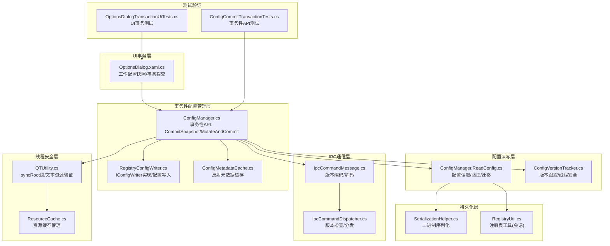
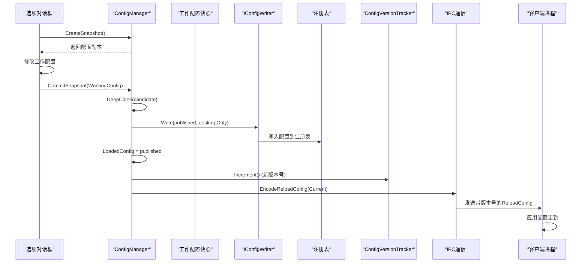
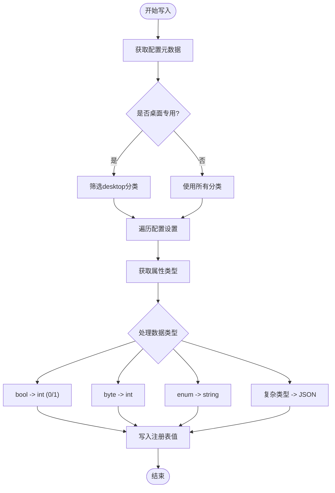
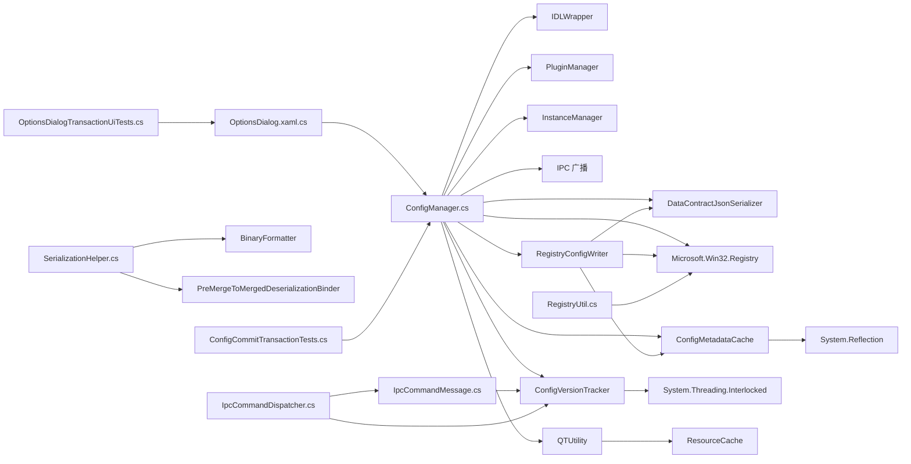

# 配置管理

<cite>
**本文引用的文件**   
- [ConfigManager.cs](file://QTTabBar/ConfigManager.cs)
- [RegistryConfigWriter.cs](file://QTTabBar/RegistryConfigWriter.cs)
- [ConfigMetadataCache.cs](file://QTTabBar/ConfigMetadataCache.cs)
- [ConfigManager.ReadConfig.cs](file://QTTabBar/ConfigManager.ReadConfig.cs)
- [SerializationHelper.cs](file://QTTabBar/SerializationHelper.cs)
- [RegistryUtil.cs](file://QTTabBar/RegistryUtil.cs)
- [ConfigVersionTracker.cs](file://QTTabBar/ConfigVersionTracker.cs)
- [IpcCommandMessage.cs](file://QTTabBar/IpcCommandMessage.cs)
- [IpcCommandDispatcher.cs](file://QTTabBar/IpcCommandDispatcher.cs)
- [Lng_QTTabBar_zh.xml](file://I18N/Lng_QTTabBar_zh.xml)
- [QTUtility.cs](file://QTTabBar/QTUtility.cs)
- [ResourceCache.cs](file://QTTabBar/ResourceCache.cs)
- [OptionsDialog.xaml.cs](file://QTTabBar/OptionsDialog/OptionsDialog.xaml.cs)
- [ConfigCommitTransactionTests.cs](file://Tests/QTTtabBarTests/ConfigCommitTransactionTests.cs)
- [ConfigTestScope.cs](file://Tests/QTTtabBarTests/ConfigTestScope.cs)
- [OptionsDialogTransactionUiTests.cs](file://Tests/QTTtabBarTests/OptionsDialogTransactionUiTests.cs)
</cite>

## 更新摘要
**所做更改**   
- **重大架构重构**：引入事务性配置API，移除直接WriteConfig()和PersistConfigChanges()方法引用，所有配置持久化现在通过新的事务性API进行
- **新增事务性提交机制**：实现CommitSnapshot()和MutateAndCommit()方法，提供原子性的配置变更和持久化
- **统一配置写入接口**：通过IConfigWriter接口抽象配置写入逻辑，支持桌面专用模式
- **增强测试覆盖**：添加完整的单元测试验证事务性API的正确性和一致性
- **简化窗口设置持久化**：继续维护PersistPartialWindowSetting()作为窗口设置的专用入口

## 目录
1. [简介](#简介)
2. [项目结构](#项目结构)
3. [核心组件](#核心组件)
4. [架构总览](#架构总览)
5. [详细组件分析](#详细组件分析)
6. [依赖关系分析](#依赖关系分析)
7. [性能考虑](#性能考虑)
8. [故障排查指南](#故障排查指南)
9. [结论](#结论)
10. [附录](#附录)

## 简介
本文件面向 QTTabBar-Next 的配置管理系统，系统性阐述配置数据结构设计、序列化与持久化机制（注册表为主、二进制序列化为辅）、热重载与实时更新流程、多语言国际化支持方案、配置 API 使用方式、自定义配置项扩展方法、验证与默认值管理、以及备份恢复与版本兼容策略。**最新更新**：系统经过重大架构重构，引入了完整的事务性配置API体系，包括CommitSnapshot()和MutateAndCommit()方法，替代了直接的WriteConfig()和PersistConfigChanges()调用。新的API提供了原子性的配置变更和持久化保证，确保配置状态的一致性和可靠性。文档力求在保持技术深度的同时，提供清晰的图示与可操作的最佳实践，帮助开发者快速理解并安全地扩展配置体系。

## 项目结构
配置相关代码主要分布在以下位置：
- 配置管理器主类：QTTabBar/ConfigManager.cs
- 事务性配置写入器：QTTabBar/RegistryConfigWriter.cs
- 配置元数据缓存：QTTabBar/ConfigMetadataCache.cs
- 配置读取逻辑：QTTabBar/ConfigManager.ReadConfig.cs
- 配置版本跟踪器：QTTabBar/ConfigVersionTracker.cs
- IPC消息处理：QTTabBar/IpcCommandMessage.cs, QTTabBar/IpcCommandDispatcher.cs
- 二进制序列化辅助：QTTabBar/SerializationHelper.cs
- 注册表工具（会话级数据）：QTTabBar/RegistryUtil.cs
- 线程安全工具：QTTabBar/QTUtility.cs
- 资源缓存：QTTabBar/ResourceCache.cs
- 选项对话框：QTTabBar/OptionsDialog/OptionsDialog.xaml.cs
- 语言包资源：I18N/*.xml（以中文为例：Lng_QTTabBar_zh.xml）
- 架构测试：Tests/QTTtabBarTests/ConfigCommitTransactionTests.cs, Tests/QTTtabBarTests/OptionsDialogTransactionUiTests.cs



**图表来源**
- [ConfigManager.cs:36-63](file://QTTabBar/ConfigManager.cs#L36-L63)
- [RegistryConfigWriter.cs:17-62](file://QTTabBar/RegistryConfigWriter.cs#L17-L62)
- [ConfigMetadataCache.cs:24-38](file://QTTabBar/ConfigMetadataCache.cs#L24-L38)
- [OptionsDialog.xaml.cs:364-371](file://QTTabBar/OptionsDialog/OptionsDialog.xaml.cs#L364-L371)
- [ConfigCommitTransactionTests.cs:12-29](file://Tests/QTTtabBarTests/ConfigCommitTransactionTests.cs#L12-L29)

**章节来源**
- [ConfigManager.cs:36-63](file://QTTabBar/ConfigManager.cs#L36-L63)
- [RegistryConfigWriter.cs:17-62](file://QTTabBar/RegistryConfigWriter.cs#L17-L62)
- [ConfigMetadataCache.cs:24-38](file://QTTabBar/ConfigMetadataCache.cs#L24-L38)
- [OptionsDialog.xaml.cs:364-371](file://QTTabBar/OptionsDialog/OptionsDialog.xaml.cs#L364-L371)
- [ConfigCommitTransactionTests.cs:12-29](file://Tests/QTTtabBarTests/ConfigCommitTransactionTests.cs#L12-L29)

## 核心组件
- **事务性配置管理器**
  - ConfigManager 负责加载、读取、写入配置，并通过新的 `CommitSnapshot()` 和 `MutateAndCommit()` 方法提供事务性配置变更能力，确保配置的原子性持久化。
- **配置写入器接口**
  - IConfigWriter 接口抽象配置写入逻辑，`RegistryConfigWriter` 实现具体的注册表写入功能，支持桌面专用模式。
- **配置元数据缓存**
  - ConfigMetadataCache 通过反射构建配置类的元数据信息，提供高效的配置属性遍历和类型检测。
- **工作配置快照机制**
  - OptionsDialog 使用 `CreateSnapshot()` 创建工作配置副本，允许用户在对话框中进行多次修改而不影响实际配置。
- **窗口设置统一持久化**
  - `PersistPartialWindowSetting()` 方法专门处理窗口相关配置的持久化，包括注册表写入、版本递增和IPC广播的完整流程。
- **配置版本跟踪器**
  - ConfigVersionTracker 提供基于UTC时间戳的单调递增版本号管理，确保多进程环境下配置更新的顺序性和一致性。
- IPC消息处理器
  - IpcCommandMessage 提供带版本信息的IPC消息编码/解码功能；IpcCommandDispatcher 负责版本检查和命令分发。
- 序列化辅助
  - SerializationHelper 提供二进制序列化/反序列化能力，用于复杂对象的持久化（例如 IDL 字节数组）。
- 注册表工具
  - RegistryUtil 提供对当前用户注册表 Volatile 子键的读写封装，用于会话级临时数据。
- **线程安全工具**
  - QTUtility 提供全局同步原语 syncRoot，用于保护共享资源的并发访问；ResourceCache 提供线程安全的资源缓存机制。

**章节来源**
- [ConfigManager.cs:36-63](file://QTTabBar/ConfigManager.cs#L36-L63)
- [RegistryConfigWriter.cs:13-15](file://QTTabBar/RegistryConfigWriter.cs#L13-L15)
- [ConfigMetadataCache.cs:6-18](file://QTTabBar/ConfigMetadataCache.cs#L6-L18)
- [OptionsDialog.xaml.cs:214-221](file://QTTabBar/OptionsDialog/OptionsDialog.xaml.cs#L214-L221)
- [ConfigManager.cs:111-122](file://QTTabBar/ConfigManager.cs#L111-L122)
- [ConfigVersionTracker.cs:19-82](file://QTTabBar/ConfigVersionTracker.cs#L19-L82)

## 架构总览
配置系统采用"事务性API + 快照机制 + 模型 + 反射读写 + 注册表存储 + 版本跟踪 + 线程安全"的架构：
- **事务性API层**：`CommitSnapshot()` 和 `MutateAndCommit()` 提供原子性的配置变更和持久化，确保配置状态的一致性。
- **工作配置快照**：`CreateSnapshot()` 创建配置副本，允许用户在对话框中进行多次修改而不立即影响实际配置。
- 模型层：强类型配置类，定义所有选项及其默认值。
- 元数据缓存层：ConfigMetadataCache 通过反射构建配置属性元数据，提供高效的配置遍历。
- 版本控制层：ConfigVersionTracker 维护基于UTC时间戳的单调递增版本号，确保多进程一致性。
- 线程安全层：QTUtility.syncRoot 提供全局锁保护，确保文本资源发布的原子性。
- 读写层：通过反射遍历配置对象树，将属性映射到注册表项；非基本类型使用 JSON 序列化存储为字符串。
- 持久化层：主配置存储在注册表 HKEY_CURRENT_USER\Software\QTTabBar\Config 下；会话级数据使用 Volatile 子键。
- IPC通信层：带版本信息的ReloadConfig消息，客户端根据版本号过滤陈旧或重复更新。
- 运行时：启动时读取配置，应用变更时触发 UI 与插件刷新广播，实现热重载。



**图表来源**
- [ConfigManager.cs:36-53](file://QTTabBar/ConfigManager.cs#L36-L53)
- [RegistryConfigWriter.cs:18-62](file://QTTabBar/RegistryConfigWriter.cs#L18-L62)
- [OptionsDialog.xaml.cs:364-371](file://QTTabBar/OptionsDialog/OptionsDialog.xaml.cs#L364-L371)

## 详细组件分析

### 事务性配置API（重大架构重构）
**ConfigManager.CommitSnapshot** 和 **ConfigManager.MutateAndCommit** 方法提供了事务性的配置变更和持久化能力：

- **设计目标**
  - 提供原子性的配置变更和持久化，确保配置状态的一致性
  - 支持配置快照机制，允许用户在对话框中进行多次修改
  - 通过深拷贝防止外部修改影响已提交的配置

- **核心特性**
  - **原子性保证**：配置变更、持久化和内存更新在一个事务中完成
  - **深拷贝机制**：使用 `SerializationHelper.DeepClone()` 创建配置的深层副本
  - **范围控制**：支持 `ConfigCommitScope.All` 和 `ConfigCommitScope.DesktopOnly` 两种提交范围
  - **广播控制**：可选的广播参数，控制是否向其他进程发送配置更新通知

- **使用示例**
  ```csharp
  // 直接提交配置快照
  var snapshot = ConfigManager.CreateSnapshot();
  snapshot.tabs.ActivateNewTab = true;
  ConfigManager.CommitSnapshot(snapshot);
  
  // 使用变异函数提交配置
  ConfigManager.MutateAndCommit(config => {
      config.misc.FileHistoryCount = 50;
      config.skin.ThemeName = "FluentDark";
  });
  ```

**更新** 选项对话框现在完全基于事务性API进行配置管理：

```csharp
// 创建工作配置快照
WorkingConfig = ConfigManager.CreateSnapshot();

// 用户修改工作配置...

// 提交配置变更
ConfigManager.CommitSnapshot(WorkingConfig);
```

**章节来源**
- [ConfigManager.cs:36-63](file://QTTabBar/ConfigManager.cs#L36-L63)
- [OptionsDialog.xaml.cs:214-221](file://QTTabBar/OptionsDialog/OptionsDialog.xaml.cs#L214-L221)
- [OptionsDialog.xaml.cs:364-371](file://QTTabBar/OptionsDialog/OptionsDialog.xaml.cs#L364-L371)

### 配置写入器接口和实现
**IConfigWriter** 接口和 **RegistryConfigWriter** 实现提供了统一的配置写入抽象：

- **接口设计**
  - `Write(Config config, bool desktopOnly)`：统一的配置写入接口
  - 支持桌面专用模式，仅写入desktop分类的配置

- **实现特性**
  - **元数据驱动**：使用 ConfigMetadataCache 获取配置属性元数据
  - **类型处理**：自动处理bool、byte、枚举、Font等类型的转换
  - **JSON序列化**：复杂类型通过 DataContractJsonSerializer 进行JSON序列化
  - **异常处理**：捕获序列化异常并记录错误日志

- **桌面专用模式**
  - 当 `desktopOnly=true` 时，仅写入desktop分类的配置
  - 用于特定场景下的部分配置更新



**图表来源**
- [RegistryConfigWriter.cs:18-62](file://QTTabBar/RegistryConfigWriter.cs#L18-L62)
- [ConfigMetadataCache.cs:31-38](file://QTTabBar/ConfigMetadataCache.cs#L31-L38)

**章节来源**
- [RegistryConfigWriter.cs:13-62](file://QTTabBar/RegistryConfigWriter.cs#L13-L62)
- [ConfigMetadataCache.cs:31-38](file://QTTabBar/ConfigMetadataCache.cs#L31-L38)

### 配置元数据缓存机制
**ConfigMetadataCache** 通过反射构建配置类的元数据信息，提供高效的配置属性遍历：

- **缓存设计**
  - 使用双重检查锁定确保线程安全的懒加载
  - 缓存配置分类和设置的元数据信息
  - 提供扁平化的设置列表，便于批量处理

- **关键特性**
  - **反射扫描**：自动发现Config类的所有属性和子类别
  - **路径生成**：自动生成注册表路径和属性名称映射
  - **类型信息**：保留属性的原始类型信息，支持类型特定的处理逻辑
  - **测试支持**：提供ResetForTests()方法用于测试环境清理

- **性能优化**
  - 元数据构建只在首次访问时执行
  - 使用静态缓存避免重复反射开销
  - 提供GetWriteSettings()方法支持不同的写入场景

**章节来源**
- [ConfigMetadataCache.cs:20-70](file://QTTabBar/ConfigMetadataCache.cs#L20-L70)

### 增强的版本跟踪机制
**ConfigVersionTracker** 实现了基于UTC时间戳的跨进程单调递增版本管理：

- **核心设计原则**
  - 使用 `long` 类型的原子计数器，避免C#中不支持volatile long的限制
  - 基于UTC时间戳的版本生成，确保跨进程的单调递增性
  - 通过Interlocked操作提供完整的内存屏障，比volatile提供更强的线程安全保证

- **关键特性**
  - **Current属性**：返回当前配置版本，使用Interlocked.Read确保跨线程一致性
  - **Increment方法**：原子递增版本号，使用 `Max(currentVersion + 1, UtcNow.Ticks)` 确保单调递增
  - **ShouldApply方法**：判断是否应该应用接收到的配置更新，过滤陈旧或重复更新

- **跨进程一致性保证**
  - 每个进程维护独立的currentVersion和lastAppliedVersion
  - 版本号基于UTC时间戳，确保不同进程间的单调递增性
  - 版本号为0表示"未指定"（旧版本发送方），总是被接受以保持向后兼容

**章节来源**
- [ConfigVersionTracker.cs:19-82](file://QTTabBar/ConfigVersionTracker.cs#L19-L82)

### 线程安全与文本资源发布
**Config.UpdateConfig** 方法实现了增强的线程安全机制，确保文本资源的安全发布：

- **安全发布模式**
  - 首先构建本地文本资源字典，避免部分初始化的状态暴露给其他线程
  - 使用 `QTUtility.ValidateTextResources(ref newTextResources)` 验证和修复文本资源
  - 通过 `lock(QTUtility.syncRoot)` 保护文本资源字典的原子发布
  - 最后调用 `QTUtility.ValidateTextResources()` 刷新全局引用

- **锁保护机制**
  - `QTUtility.syncRoot` 是全局同步原语，用于保护共享资源的并发访问
  - 文本资源字典的读写操作都在锁保护下进行，防止竞态条件
  - 锁粒度最小化，仅在必要的原子操作时使用

- **验证与修复**
  - `ValidateTextResources` 方法确保文本资源的完整性和一致性
  - 自动填充缺失的资源项，保持向后兼容性
  - 处理外部语言文件和内置资源的合并逻辑

**章节来源**
- [ConfigManager.cs:65-74](file://QTTabBar/ConfigManager.cs#L65-L74)
- [ConfigManager.cs:80-106](file://QTTabBar/ConfigManager.cs#L80-L106)

### 窗口设置统一持久化
**ConfigManager.PersistPartialWindowSetting** 方法提供了窗口相关配置的统一持久化入口：

- **设计目标**
  - 统一窗口设置的持久化流程，避免各个方法直接操作注册表
  - 确保注册表写入、版本递增和IPC广播的顺序执行
  - 提供灵活的回调接口，支持不同的窗口设置场景

- **核心特性**
  - **回调模式**：接受 `Action<RegistryKey>` 委托，允许调用方自定义具体的注册表写入逻辑
  - **自动版本管理**：可选的版本递增参数，默认为true
  - **统一广播**：始终执行UpdateConfig(false)和IPC广播，确保配置同步

- **使用示例**
  ```csharp
  // 标准窗口设置持久化
  PersistPartialWindowSetting(key => {
      key.SetValue("WindowAlpha", alpha);
  });
  
  // 不递增版本的场景
  PersistPartialWindowSetting(key => {
      key.SetValue("SomeSetting", value);
  }, incrementVersion: false);
  ```

**章节来源**
- [ConfigManager.cs:111-122](file://QTTabBar/ConfigManager.cs#L111-L122)
- [ConfigManager.cs:139-145](file://QTTabBar/ConfigManager.cs#L139-L145)

### 配置数据结构与数据类型处理
- 布尔型：在注册表中以整型 0/1 存储，读取时转换为 bool。
- 整型：直接存储为整型。
- 字符串：直接存储为字符串。
- 颜色/字体/Padding 等复杂类型：
  - 字体使用专用可序列化包装 XmlSerializableFont，并通过 DataContractJsonSerializer 进行 JSON 序列化/反序列化。
  - 其他复杂类型同样采用 JSON 序列化存储为字符串。
- 枚举：按名称存储与解析。
- 集合与字典：
  - 数组与 List<string> 通过 JSON 序列化存储。
  - Dictionary<MouseChord, BindAction> 等字典通过 JSON 序列化存储。
- 特殊类型：
  - IDL 字节数组通过二进制序列化保存/还原（见后续"二进制序列化"小节）。

**章节来源**
- [ConfigManager.ReadConfig.cs:74-141](file://QTTabBar/ConfigManager.ReadConfig.cs#L74-L141)

### 序列化机制与存储格式
- 注册表存储（主路径）
  - 路径：HKEY_CURRENT_USER\Software\QTTabBar\Config\<CategoryName>
  - 键名：对应属性名
  - 值类型：
    - bool -> REG_DWORD (0/1)
    - int/string -> REG_DWORD/REG_SZ
    - 枚举 -> 字符串
    - 复杂类型（含 Font、Padding、Color、集合、字典等）-> 经 JSON 序列化的字符串
- 二进制序列化（特定字段）
  - 用于 IDL 字节数组等二进制内容，通过 BinaryFormatter 进行序列化/反序列化，并附加反序列化绑定器以提升安全性。
- 会话级注册表（Volatile）
  - 路径：HKEY_CURRENT_USER\Software\QTTabBar\Volatile
  - 用途：临时或会话级数据，读后即删，避免长期污染注册表。

**章节来源**
- [ConfigManager.ReadConfig.cs:28-72](file://QTTabBar/ConfigManager.ReadConfig.cs#L28-L72)
- [SerializationHelper.cs:29-61](file://QTTabBar/SerializationHelper.cs#L29-L61)
- [RegistryUtil.cs:35-56](file://QTTabBar/RegistryUtil.cs#L35-L56)

### IPC通信与版本编码
**IpcCommandMessage** 增强了版本信息传递功能：

- **版本编码**
  - `EncodeReloadConfig(long version)`：生成带8字节版本负载的ReloadConfig消息
  - 保持向后兼容：默认的`Encode(IpcCommand.ReloadConfig)`仍返回6字节头部
  - 版本信息以小端序的long类型存储在payload中

- **版本解码**
  - `DecodeConfigVersion(byte[] payload)`：从payload中提取版本号
  - 容错处理：null、空或短于8字节的payload返回0（表示未指定版本）

- **多进程一致性流程**
  - 发送方进程递增版本号并编码消息
  - 接收方进程检查版本号决定是否应用更新
  - 通过原子比较交换确保版本检查的线程安全

**章节来源**
- [IpcCommandMessage.cs:336-348](file://QTTabBar/IpcCommandMessage.cs#L336-L348)
- [IpcCommandDispatcher.cs:161-169](file://QTTabBar/IpcCommandDispatcher.cs#L161-L169)

### 配置热重载与实时更新
- 触发点
  - 调用 `ConfigManager.CommitSnapshot()` 后，会执行以下动作：
    - **配置克隆**：使用深拷贝创建配置的不可变副本
    - **持久化写入**：通过 IConfigWriter 接口写入配置到注册表
    - **内存更新**：更新 LoadedConfig 引用指向新配置
    - **版本递增**：自动调用 ConfigVersionTracker.Increment() 生成新版本号
    - **IPC广播**：通过 IPC 广播带版本号的 ReloadConfig 命令，通知其他进程/实例同步配置
  - 调用 `ConfigManager.PersistPartialWindowSetting()` 后，执行窗口设置的专用持久化流程
- 效果
  - 无需重启 Explorer，即可实时生效配置变更。
  - **线程安全**：通过锁保护确保文本资源发布的原子性。
  - **多进程一致性**：通过版本号过滤，确保配置更新的顺序性和唯一性。

**章节来源**
- [ConfigManager.cs:44-53](file://QTTabBar/ConfigManager.cs#L44-L53)
- [ConfigManager.cs:111-122](file://QTTabBar/ConfigManager.cs#L111-L122)
- [ConfigManager.cs:80-106](file://QTTabBar/ConfigManager.cs#L80-L106)

### 多语言国际化支持
- 语言包格式
  - XML 文件，根节点 root，包含 Author、Language、Country、Version_QTTabBar、DateModified 等元信息，以及大量分组键值对（如 ButtonBar_BtnName、Options_Page01_Window 等）。
- 动态语言切换
  - 当启用外部语言文件且文件存在时，UpdateConfig 会读取该文件并替换文本资源字典；否则回退到内置资源。
  - 语言选择由 _Lang 配置项控制，包括是否使用外部语言文件、文件路径、内置语言及索引。
- 最佳实践
  - 新增 UI 文案应优先放入语言包，避免硬编码字符串。
  - 保持键名稳定，便于跨版本迁移。
  - 对外部语言文件进行存在性与可读性检查，失败时回退到内置资源。

**章节来源**
- [ConfigManager.cs:65-74](file://QTTabBar/ConfigManager.cs#L65-L74)
- [Lng_QTTabBar_zh.xml:1-20](file://I18N/Lng_QTTabBar_zh.xml#L1-L20)

### 配置 API 使用示例与自定义配置项添加
- **事务性配置保存API**
  - 初始化与读取：ConfigManager.Initialize()
  - **事务性提交**：`ConfigManager.CommitSnapshot(Config, ConfigCommitScope, bool)`
  - **变异提交**：`ConfigManager.MutateAndCommit(Action<Config>, ConfigCommitScope, bool)`
  - **快照创建**：`ConfigManager.CreateSnapshot()`
  - **窗口设置持久化**：`ConfigManager.PersistPartialWindowSetting(Action<RegistryKey>, bool)`
  - **窗口透明度设置**：`ConfigManager.PersistWindowAlpha(byte)`
  - 便捷访问：通过 Config.Window、Config.Tabs、Config.Tweaks 等静态快捷属性访问具体分类配置。
- **使用示例**
  ```csharp
  // 事务性配置提交（推荐）
  ConfigManager.MutateAndCommit(config => {
      config.tabs.ActivateNewTab = true;
      config.misc.FileHistoryCount = 50;
  });
  
  // 窗口透明度设置
  ConfigManager.PersistWindowAlpha(200);
  
  // 自定义窗口设置
  ConfigManager.PersistPartialWindowSetting(key => {
      key.SetValue("CustomSetting", customValue);
  });
  ```
- 添加自定义配置项步骤
  1) 在对应分类子类中添加强类型属性（支持 bool/int/string/枚举/复杂类型）。
  2) 在构造函数中设置合理的默认值。
  3) 在 ReadConfig 末尾增加范围校验与兼容性修正逻辑。
  4) 在 UI 页面绑定该属性，并在保存时调用相应的持久化方法。
  5) 如需影响运行时行为，确保 UpdateConfig 中处理相应刷新逻辑。

**章节来源**
- [ConfigManager.cs:36-63](file://QTTabBar/ConfigManager.cs#L36-L63)
- [ConfigManager.cs:111-145](file://QTTabBar/ConfigManager.cs#L111-L145)
- [OptionsDialog.xaml.cs:364-371](file://QTTabBar/OptionsDialog/OptionsDialog.xaml.cs#L364-L371)

### 配置验证、默认值管理与备份恢复
- 默认值管理
  - 所有配置项在各自子类的构造函数中提供默认值，保证首次运行或损坏时可恢复。
- 验证与边界约束
  - ReadConfig 中对多项数值进行最小/最大范围校验（如预览宽高、历史数量、网络超时、标签高度/宽度、边距等），并对无效路径进行清理。
  - 针对平台差异进行条件修正（如 XP/Win7 特性开关）。
- 备份与恢复
  - 当前实现未提供显式的导出/导入接口。建议：
    - 备份：复制 HKEY_CURRENT_USER\Software\QTTabBar 下的 Config 分支。
    - 恢复：将备份分支合并回注册表。
    - 注意：Volatile 分支为会话级数据，通常不需要备份。

**章节来源**
- [ConfigManager.ReadConfig.cs:74-141](file://QTTabBar/ConfigManager.ReadConfig.cs#L74-L141)

### 配置文件版本兼容性与升级策略
- 兼容性要点
  - 枚举顺序变更会破坏已有设置（注释中有明确警告），应避免重排。
  - 读取时对缺失项进行容错（跳过 null），对数组长度进行 Resize 补齐。
  - 对旧版可能存在的空字典项进行清理。
- 升级策略建议
  - 在 ReadConfig 末尾集中放置版本迁移逻辑，按版本号逐步迁移旧格式到新结构。
  - 对废弃字段进行降级处理（忽略或映射到新字段）。
  - 记录迁移日志，便于问题定位。
- **IPC版本兼容性**
  - 旧的无负载ReloadConfig消息（6字节）仍然被接受，确保向后兼容。
  - 新的带版本消息（14字节）包含8字节版本负载，旧接收方会忽略payload。
  - 版本号为0的特殊处理，允许旧发送方的消息被接受。

**章节来源**
- [ConfigManager.ReadConfig.cs:74-141](file://QTTabBar/ConfigManager.ReadConfig.cs#L74-L141)
- [IpcCommandMessage.cs:336-348](file://QTTabBar/IpcCommandMessage.cs#L336-L348)

### 二进制序列化与安全
- 用途
  - 用于 IDL 字节数组等二进制内容的持久化。
- 安全增强
  - 反序列化时使用自定义 Binder（PreMergeToMergedDeserializationBinder），仅允许白名单类型，降低反序列化攻击面。
- 异常处理
  - 捕获序列化异常并记录错误日志，返回空结果以保证健壮性。

**章节来源**
- [SerializationHelper.cs:29-61](file://QTTabBar/SerializationHelper.cs#L29-L61)

## 依赖关系分析
- 模块耦合
  - ConfigManager.cs 依赖 System.Runtime.Serialization.Json 进行 JSON 序列化；依赖 Microsoft.Win32.Registry 进行注册表读写；依赖 Shell 相关包装类（IDLWrapper）进行路径有效性校验。
  - RegistryConfigWriter.cs 实现 IConfigWriter 接口，依赖 ConfigMetadataCache 获取配置元数据。
  - ConfigMetadataCache.cs 依赖 System.Reflection 进行反射扫描，构建配置类元数据。
  - ConfigVersionTracker.cs 依赖 System.Threading.Interlocked 进行原子操作。
  - IpcCommandMessage.cs 提供版本编码/解码功能，被Config和IpcCommandDispatcher使用。
  - IpcCommandDispatcher.cs 集成版本检查逻辑，协调配置更新的多进程一致性。
  - SerializationHelper.cs 依赖 BinaryFormatter 与自定义 Binder。
  - RegistryUtil.cs 提供轻量注册表工具，主要用于 Volatile 分支的会话数据。
  - **QTUtility.cs** 提供全局同步原语 syncRoot 和文本资源验证功能。
  - **ResourceCache.cs** 提供线程安全的资源缓存机制。
  - **OptionsDialog.xaml.cs** 使用事务性API进行配置管理，通过 CreateSnapshot 和 CommitSnapshot 实现工作配置模式。
  - **ConfigCommitTransactionTests.cs** 验证事务性API的正确性和一致性。
- 外部集成点
  - 插件管理器、实例管理器、IPC 广播在 UpdateConfig 中被调用，以实现配置变更的全局传播。



**图表来源**
- [ConfigManager.cs:36-63](file://QTTabBar/ConfigManager.cs#L36-L63)
- [RegistryConfigWriter.cs:17-62](file://QTTabBar/RegistryConfigWriter.cs#L17-L62)
- [ConfigMetadataCache.cs:40-70](file://QTTabBar/ConfigMetadataCache.cs#L40-L70)
- [OptionsDialog.xaml.cs:364-371](file://QTTabBar/OptionsDialog/OptionsDialog.xaml.cs#L364-L371)
- [ConfigCommitTransactionTests.cs:12-29](file://Tests/QTTtabBarTests/ConfigCommitTransactionTests.cs#L12-L29)

**章节来源**
- [ConfigManager.cs:36-63](file://QTTabBar/ConfigManager.cs#L36-L63)
- [RegistryConfigWriter.cs:17-62](file://QTTabBar/RegistryConfigWriter.cs#L17-L62)
- [ConfigMetadataCache.cs:40-70](file://QTTabBar/ConfigMetadataCache.cs#L40-L70)
- [OptionsDialog.xaml.cs:364-371](file://QTTabBar/OptionsDialog/OptionsDialog.xaml.cs#L364-L371)
- [ConfigCommitTransactionTests.cs:12-29](file://Tests/QTTtabBarTests/ConfigCommitTransactionTests.cs#L12-L29)

## 性能考虑
- 反射开销
  - 读写配置使用反射遍历属性，建议在批量写入时减少频繁调用，或在 UI 层做节流合并。
  - ConfigMetadataCache 通过缓存反射结果，显著减少了重复反射的性能开销。
- JSON 序列化
  - 复杂类型较多时会引入额外 CPU 与内存开销，建议仅在必要时序列化大对象。
- 注册表 I/O
  - 注册表写入频率过高会影响性能，建议合并多次更改后一次性提交。
  - 事务性API确保每次提交只进行一次注册表写入，避免了重复写入的性能问题。
- 广播与刷新
  - UpdateConfig 中的广播与刷新应在后台线程完成后调度到 UI 线程执行，避免阻塞主循环。
- 版本跟踪性能
  - Interlocked操作具有极低的性能开销，对整体性能影响可忽略不计。
  - 版本检查使用原子比较交换，避免锁竞争，在高并发场景下表现良好。
- **线程安全性能**
  - 锁保护范围最小化，仅在必要的原子操作时使用，减少锁竞争。
  - 文本资源验证在锁外进行，提高并发性能。
  - 使用局部变量构建新资源，避免长时间持有锁。
- **事务性API性能**
  - CommitSnapshot 和 MutateAndCommit 方法通过深拷贝确保原子性，但会增加内存开销。
  - 对于大型配置对象，建议使用 MutateAndCommit 的变异函数模式，避免不必要的深拷贝。
  - 配置元数据缓存显著提升了配置遍历的性能。
- **统一入口点性能**
  - `PersistPartialWindowSetting` 方法本身开销极小，主要是顺序保证和参数传递。
  - 避免了调用方重复编写注册表操作和IPC广播的逻辑，减少了潜在的性能问题。

## 故障排查指南
- 常见问题
  - 配置未生效：确认是否调用了 `ConfigManager.CommitSnapshot()` 或 `ConfigManager.PersistPartialWindowSetting()`，并检查 IPC 广播是否成功。
  - 语言切换无效：检查外部语言文件路径是否正确、文件是否存在、文本资源校验是否通过。
  - 复杂类型丢失：查看 JSON 序列化是否抛出异常，确认类型是否可被 DataContractJsonSerializer 处理。
  - 二进制数据异常：检查反序列化 Binder 白名单是否包含目标类型，关注异常日志。
- 版本相关问题
  - 配置更新不同步：检查ConfigVersionTracker.ShouldApply是否正确工作，确认版本号是否单调递增。
  - 重复配置更新：验证版本检查逻辑，确保lastAppliedVersion正确更新。
  - 多进程冲突：监控Interlocked操作的性能，确认没有竞态条件。
- **线程安全问题**
  - 文本资源显示异常：检查QTUtility.syncRoot锁是否正确保护文本资源字典的访问。
  - 配置更新时的界面闪烁：确认ValidateTextResources的执行时机和锁的范围。
  - 多线程访问冲突：验证所有共享资源的访问是否都使用了适当的同步机制。
- **事务性问题**
  - 配置提交不一致：检查CommitSnapshot是否正确执行深拷贝和原子提交。
  - 工作配置未生效：确认OptionsDialog是否正确创建和使用工作配置快照。
  - 事务回滚失败：验证MutateAndCommit的变异函数是否正确执行。
- **统一入口点问题**
  - 窗口设置不一致：确认所有窗口设置都使用 `ConfigManager.PersistPartialWindowSetting()` 而非直接注册表操作。
  - 版本递增失败：检查PersistPartialWindowSetting是否正确调用ConfigVersionTracker.Increment()。
  - 广播失效：验证IPC广播是否正常发送，检查客户端是否正确处理带版本的消息。
- 日志与诊断
  - 关键路径均包含 MakeErrorLog 调用，可通过日志定位失败原因。
  - 对于注册表权限问题，SafeGetRegistryValue 已做异常捕获与默认值回退。
  - 事务性API的测试用例提供了详细的断言和验证逻辑。

**章节来源**
- [ConfigManager.cs:36-63](file://QTTabBar/ConfigManager.cs#L36-L63)
- [ConfigManager.cs:111-145](file://QTTabBar/ConfigManager.cs#L111-L145)
- [ConfigManager.ReadConfig.cs:74-141](file://QTTabBar/ConfigManager.ReadConfig.cs#L74-L141)
- [SerializationHelper.cs:42-49](file://QTTabBar/SerializationHelper.cs#L42-L49)
- [ConfigVersionTracker.cs:68-81](file://QTTabBar/ConfigVersionTracker.cs#L68-L81)
- [ConfigCommitTransactionTests.cs:12-29](file://Tests/QTTtabBarTests/ConfigCommitTransactionTests.cs#L12-L29)

## 结论
QTTabBar-Next 的配置管理系统以强类型模型为核心，结合反射读写与注册表持久化，实现了灵活、可扩展且具备热重载能力的配置框架。**最新重大架构重构**：通过引入事务性配置API体系，包括 `ConfigManager.CommitSnapshot()` 和 `ConfigManager.MutateAndCommit()` 方法，系统提供了原子性的配置变更和持久化保证。新的IConfigWriter接口抽象了配置写入逻辑，支持桌面专用模式和更灵活的持久化策略。ConfigMetadataCache通过反射元数据缓存显著提升了配置遍历性能。OptionsDialog完全基于事务性API进行配置管理，通过工作配置快照机制确保用户操作的原子性和一致性。通过增强的ConfigVersionTracker版本跟踪机制，使用UTC时间戳确保跨进程的一致性。通过安全的文本资源发布模式和锁保护，防止了竞态条件和部分初始化的状态暴露。通过JSON与二进制混合序列化策略，兼顾了可读性与复杂对象支持；通过UpdateConfig的广播机制和版本检查，实现了配置变更的实时生效和多进程同步。IPC通信层的版本编码/解码功能提供了向后兼容性，确保新旧版本的平滑过渡。在多语言方面，XML语言包与动态切换机制提供了良好的国际化基础。新增的完整测试套件确保了事务性API的正确性和可靠性。建议在生产环境中完善备份/恢复与版本迁移逻辑，并持续优化反射与序列化带来的性能开销。

## 附录
- 术语
  - 配置分类：Config 的子对象类别，如 Window、Tabs、Tweaks 等。
  - 热重载：在不重启应用的情况下使配置变更立即生效。
  - 会话级数据：保存在 Volatile 分支的临时数据，随会话结束而失效。
  - 版本跟踪：通过单调递增的版本号确保配置更新的顺序性和一致性。
  - 多进程一致性：确保多个Explorer进程中配置状态的同步和唯一性。
  - **线程安全**：通过锁保护和原子操作确保多线程环境下的数据一致性。
  - **安全发布模式**：先构建本地副本再原子发布的编程模式，避免部分初始化的状态暴露。
  - **事务性API**：提供原子性配置变更和持久化的编程接口，确保配置状态的一致性。
  - **工作配置快照**：在对话框中使用的配置副本，允许用户进行多次修改而不影响实际配置。
  - **配置写入器接口**：抽象配置写入逻辑的接口，支持多种持久化策略的实现。
  - **配置元数据缓存**：通过反射构建的配置属性元数据缓存，提升配置遍历性能。
  - **窗口设置统一持久化**：专门处理窗口相关配置的持久化，包括注册表写入、版本递增和IPC广播的完整流程。
- 参考路径
  - 配置管理器主类：[ConfigManager.cs](file://QTTabBar/ConfigManager.cs)
  - 事务性配置写入器：[RegistryConfigWriter.cs](file://QTTabBar/RegistryConfigWriter.cs)
  - 配置元数据缓存：[ConfigMetadataCache.cs](file://QTTabBar/ConfigMetadataCache.cs)
  - 配置读取逻辑：[ConfigManager.ReadConfig.cs](file://QTTabBar/ConfigManager.ReadConfig.cs)
  - 配置版本跟踪：[ConfigVersionTracker.cs](file://QTTabBar/ConfigVersionTracker.cs)
  - IPC版本通信：[IpcCommandMessage.cs](file://QTTabBar/IpcCommandMessage.cs), [IpcCommandDispatcher.cs](file://QTTabBar/IpcCommandDispatcher.cs)
  - 二进制序列化：[SerializationHelper.cs](file://QTTabBar/SerializationHelper.cs)
  - 注册表工具：[RegistryUtil.cs](file://QTTabBar/RegistryUtil.cs)
  - 线程安全工具：[QTUtility.cs](file://QTTabBar/QTUtility.cs)
  - 资源缓存：[ResourceCache.cs](file://QTTabBar/ResourceCache.cs)
  - 选项对话框：[OptionsDialog.xaml.cs](file://QTTabBar/OptionsDialog/OptionsDialog.xaml.cs)
  - 语言包示例：[Lng_QTTabBar_zh.xml](file://I18N/Lng_QTTabBar_zh.xml)
  - 事务性API测试：[ConfigCommitTransactionTests.cs](file://Tests/QTTtabBarTests/ConfigCommitTransactionTests.cs)
  - UI事务测试：[OptionsDialogTransactionUiTests.cs](file://Tests/QTTtabBarTests/OptionsDialogTransactionUiTests.cs)
  - 测试作用域：[ConfigTestScope.cs](file://Tests/QTTtabBarTests/ConfigTestScope.cs)