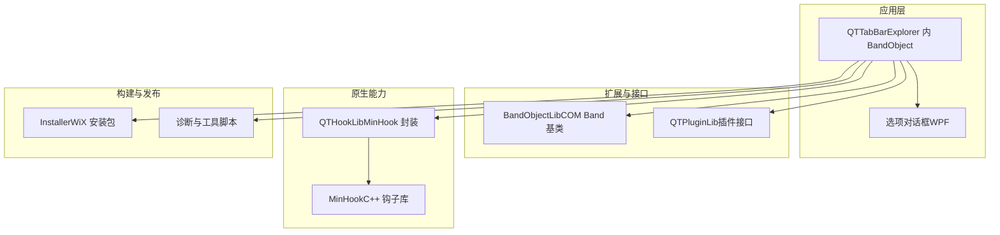

# 附录

<cite>
**本文引用的文件**   
- [README.md](file://README.md)
- [README_zh.md](file://README_zh.md)
- [LICENSE.txt](file://LICENSE.txt)
- [SECURITY.md](file://SECURITY.md)
- [CONTRIBUTING.md](file://CONTRIBUTING.md)
- [Installer/release_v1.5.5-beta.9.md](file://Installer/release_v1.5.5-beta.9.md)
- [docs/design/winui3-ui-upgrade-plan.md](file://docs/design/winui3-ui-upgrade-plan.md)
- [docs/superpowers/plans/2026-07-06-register-vm-compat.md](file://docs/superpowers/plans/2026-07-06-register-vm-compat.md)
- [docs/superpowers/specs/2026-07-06-register-vm-compat-design.md](file://docs/superpowers/specs/2026-07-06-register-vm-compat-design.md)
- [docs/superpowers/plans/2026-07-06-win11-probe-session.md](file://docs/superpowers/plans/2026-07-06-win11-probe-session.md)
- [docs/superpowers/specs/2026-07-06-win11-probe-session-design.md](file://docs/superpowers/specs/2026-07-06-win11-probe-session-design.md)
</cite>

## 目录
1. [简介](#简介)
2. [项目结构](#项目结构)
3. [核心组件](#核心组件)
4. [架构总览](#架构总览)
5. [详细组件分析](#详细组件分析)
6. [依赖关系分析](#依赖关系分析)
7. [性能与兼容性考量](#性能与兼容性考量)
8. [故障排查指南](#故障排查指南)
9. [术语表](#术语表)
10. [版本历史与升级指南](#版本历史与升级指南)
11. [许可证与使用条款](#许可证与使用条款)
12. [相关资源与链接](#相关资源与链接)
13. [路线图与未来规划](#路线图与未来规划)
14. [致谢与贡献者](#致谢与贡献者)
15. [反馈与支持渠道](#反馈与支持渠道)
16. [结论](#结论)

## 简介
本附录为 QTTabBar-Next 的参考资料，聚焦于专业术语、版本历史、许可证信息、相关资源、路线图、致谢与反馈渠道等，帮助读者快速定位关键信息并理解项目的技术背景与演进方向。

## 项目结构
仓库采用多模块组织方式：主程序、BandObject 基类库、插件接口库、原生 Hook 库、安装器与测试工具等分层清晰，便于扩展与维护。



[此图为概念性结构示意，不直接映射具体源码文件，故无“图示来源”]

## 核心组件
- 主程序与 COM 集成：作为 Explorer 的 BandObject 运行，提供标签页、预览与工具栏等功能。
- 插件体系：通过 QTPluginLib 暴露统一接口，支持第三方扩展。
- 原生 Hook：基于 MinHook 实现 Shell 钩子，用于增强 IShellBrowser 行为。
- 选项界面：WPF 实现的设置窗口，后续计划向 Fluent 风格迁移。
- 诊断工具：Win11 诊断会话脚本，辅助定位 BHO/BrowserBar/IShellBrowser/Hook 阶段问题。

章节来源
- [README.md:1-60](file://README.md#L1-L60)
- [README_zh.md:1-60](file://README_zh.md#L1-L60)
- [CONTRIBUTING.md:64-75](file://CONTRIBUTING.md#L64-L75)

## 架构总览
下图展示 Explorer 进程内加载的 COM BandObject 与 WPF 选项对话框、IPC 通信以及 Win11 诊断流程的关系。

```mermaid
sequenceDiagram
participant Exp as "Explorer.exe"
participant BO as "QTTabBar(BandObject)"
participant Srv as "服务器进程(STA)"
participant Opt as "OptionsDialog(WPF)"
participant Diag as "Win11ProbeSession.ps1"
Exp->>BO : 加载 COM BandObject
BO->>Srv : IPC 打开选项
Srv-->>Opt : 启动 WPF 选项窗口
Note over BO,Opt : 选项变更通过 IPC 同步到配置
Diag->>Exp : 引导用户复现一次问题
Diag->>Diag : 读取日志并解析阶段
Diag-->>User : 输出诊断与建议
```

[此图为概念性流程图，不直接映射具体源码文件，故无“图示来源”]

## 详细组件分析

### 安全策略与加固项（5.1.x）
- 受支持版本矩阵与漏洞上报流程见安全策略文档。
- 可选加固项包括阻止不受信插件、限制原生 Hook DLL 路径等。
- IPC 反序列化使用受限 Binder，仅白名单类型可绑定；命名管道消息上限 4MB。
- 插件签名信任支持强名称与 Authenticode 校验（离线吊销检查）。

章节来源
- [SECURITY.md:1-51](file://SECURITY.md#L1-L51)

### WinUI 3 风格 UI 升级设计（草案）
- 目标：选项对话框与现代 Fluent 视觉对齐，保留现有皮肤与插件 ABI。
- 阶段划分：先完成 14 个选项页的 WPF Fluent 化，再考虑 Band 绘制层的 Fluent 路径。
- 风险与缓解：WPF-UI 与 net48 兼容性、回归面控制、DPI 缩放、旧皮肤兼容等。

章节来源
- [docs/design/winui3-ui-upgrade-plan.md:1-285](file://docs/design/winui3-ui-upgrade-plan.md#L1-L285)

### Register 脚本 VM 兼容性设计与实施计划
- 目标：替换硬编码 VS2010 路径，增加多级环境探测，保持注册体不变。
- 层级顺序：当前 shell → 现代 VS/Build Tools → VS2010 回退 → 明确失败提示。
- 验证：静态回归测试 + 只读模式冒烟测试，确保不产生副作用。

章节来源
- [docs/superpowers/specs/2026-07-06-register-vm-compat-design.md:1-201](file://docs/superpowers/specs/2026-07-06-register-vm-compat-design.md#L1-L201)
- [docs/superpowers/plans/2026-07-06-register-vm-compat.md:1-395](file://docs/superpowers/plans/2026-07-06-register-vm-compat.md#L1-L395)

### Win11 诊断会话设计与实施计划
- 目标：将分散的 Win11Probe 标记标准化为阶段模型，输出可读诊断与建议。
- 数据源：默认仅使用托管日志，可选合并 native OutputDebugString 证据。
- 阶段模型：BHO 进入 → BrowserBar 请求 → Attach 流程 → IShellBrowser 查询 → Native Hook 请求/结果 → Post-hook 继续。
- 退出码：0/1/2/3/4/5 对应不同诊断结论。

章节来源
- [docs/superpowers/specs/2026-07-06-win11-probe-session-design.md:1-276](file://docs/superpowers/specs/2026-07-06-win11-probe-session-design.md#L1-L276)
- [docs/superpowers/plans/2026-07-06-win11-probe-session.md:1-614](file://docs/superpowers/plans/2026-07-06-win11-probe-session.md#L1-L614)

## 依赖关系分析
- 运行时依赖：.NET Framework 4.8。
- 构建依赖：Visual Studio 2019+ 或 JetBrains Rider；安装包构建需要 WiX Toolset v3.11。
- 外部集成：Windows Shell COM 接口、Taskbar/Rebar/DWM 等系统 API。

章节来源
- [README.md:26-47](file://README.md#L26-L47)
- [README_zh.md:26-47](file://README_zh.md#L26-L47)

## 性能与兼容性考量
- 在 Win11 上优先使用轻量绘制路径，避免不必要的重绘与跨进程开销。
- 对 DPI 感知进行适配，保证高分屏下布局稳定。
- 插件加载遵循安全策略，减少不可信代码带来的不稳定因素。

[本节为通用指导，不直接分析具体文件，故无“章节来源”]

## 故障排查指南
- 查看异常日志位置与启用方法，参考 README 中的说明。
- 使用 Win11 诊断会话脚本，按提示复现问题后获取阶段化诊断与建议。
- 若涉及原生 Hook 失败，结合 native trace 文本文件进行交叉验证。

章节来源
- [README.md:17-24](file://README.md#L17-L24)
- [README_zh.md:17-24](file://README_zh.md#L17-L24)
- [docs/superpowers/plans/2026-07-06-win11-probe-session.md:1-614](file://docs/superpowers/plans/2026-07-06-win11-probe-session.md#L1-L614)

## 术语表
- Shell 扩展：以 COM 形式嵌入 Windows Shell（如 Explorer）的功能组件，常见形态包括上下文菜单、工具栏、预览处理器等。
- COM 接口：组件对象模型（Component Object Model）定义的跨进程/跨语言二进制接口契约，是 Windows 平台扩展生态的基础。
- Band Object：一种特殊的 COM 组件，允许将自定义 UI 控件（如工具栏、标签栏）嵌入 Explorer 的 Rebar 区域。
- IShellBrowser/IShellView：Shell 内部浏览视图的核心接口，用于导航、枚举与操作文件夹内容。
- MinHook：轻量级 x86/x64 API 钩子库，常用于拦截系统函数调用以实现功能增强或调试。
- Fluent Design：微软面向 Windows 11 的设计语言，强调圆角、层次、Accent 色与深色模式一致性。
- Authenticode：微软的数字签名方案，用于验证可执行文件的发布者与完整性。
- Strong Name：.NET 程序集签名机制，通过公钥令牌标识程序集身份。

[本节为概念性说明，不直接分析具体文件，故无“章节来源”]

## 版本历史与升级指南
- 近期更新摘要（示例）：v1.5.5-beta.9 修复了捕获选中、快捷插件配置窗口、日志写入、重名标签后缀、图片设置、网络文件夹预览开关、最近关闭工具栏默认加载、预览文本编码支持、SetHome 插件 PATH 环境变量失效等问题。
- 升级建议：
  - 确认 .NET Framework 4.8 已安装。
  - 在 Windows 10/11 中通过“查看→选项”启用 QTTabBar & Buttons。
  - 遇到兼容性问题时，优先尝试最新稳定版，并参考安全策略中的加固项。

章节来源
- [Installer/release_v1.5.5-beta.9.md:1-21](file://Installer/release_v1.5.5-beta.9.md#L1-L21)
- [README.md:17-24](file://README.md#L17-L24)
- [README_zh.md:17-24](file://README_zh.md#L17-L24)

## 许可证与使用条款
- 本项目采用 GNU General Public License v3.0（GPL-3.0）。
- 主要要点：
  - 允许自由复制、分发与修改，但需保留版权声明与许可文本。
  - 衍生作品必须以相同许可协议发布，并提供相应源代码。
  - 不提供任何明示或暗示担保，使用者自行承担风险。
- 合规建议：
  - 二次分发时需附带完整源码或提供获取源码的方式。
  - 不得附加进一步限制条款。
  - 商业集成需谨慎评估 GPL 的传染性要求。

章节来源
- [LICENSE.txt:1-675](file://LICENSE.txt#L1-L675)
- [README.md:57-60](file://README.md#L57-L60)
- [README_zh.md:57-60](file://README_zh.md#L57-L60)

## 相关资源与链接
- 上游与原始项目：
  - 本仓库：https://github.com/rainiva/QTTabBar-Next
  - 上游 fork：https://github.com/indiff/qttabbar
  - 原始项目（SourceForge）：https://sourceforge.net/projects/qttabbar/
  - 原作者（Quizo）：https://twitter.com/QTTabBar
  - SF 维护者：https://sourceforge.net/u/masamunexgp/profile
- 官方文档与 Wiki：
  - Windows 11 工具栏设置（Wiki）：https://github.com/indiff/qttabbar/wiki/Windows11%E6%98%BE%E7%A4%BA%E5%B7%A5%E5%85%B7%E6%A0%8F%E7%9A%84%E6%96%B9%E6%B3%95
- 安全策略与漏洞报告：
  - 安全策略：参见 SECURITY.md
  - 私有安全公告：通过 GitHub 私有安全公告或直接邮件联系维护者

章节来源
- [README.md:9-15](file://README.md#L9-L15)
- [README_zh.md:9-15](file://README_zh.md#L9-L15)
- [SECURITY.md:13-21](file://SECURITY.md#L13-L21)

## 路线图与未来规划
- 短期目标：
  - 完成选项对话框的 WPF Fluent 化（阶段 1），提升整体视觉一致性与可用性。
  - 完善 Win11 诊断会话，形成稳定的阶段模型与报告格式。
- 中期目标：
  - 在 Band 层引入 Fluent 绘制路径（阶段 2），在 Win11 上呈现更现代的标签与工具栏外观。
  - 持续优化注册脚本的环境探测，提升在不同 VM 与开发环境下的可用性。
- 长期愿景：
  - 探索独立 WinUI 3 设置应用的可行性（非第一阶段），复用 IPC 与配置模型。
  - 强化插件生态的安全与稳定性，提供更完善的签名与沙箱策略。

章节来源
- [docs/design/winui3-ui-upgrade-plan.md:1-285](file://docs/design/winui3-ui-upgrade-plan.md#L1-L285)
- [docs/superpowers/plans/2026-07-06-register-vm-compat.md:1-395](file://docs/superpowers/plans/2026-07-06-register-vm-compat.md#L1-L395)
- [docs/superpowers/plans/2026-07-06-win11-probe-session.md:1-614](file://docs/superpowers/plans/2026-07-06-win11-probe-session.md#L1-L614)

## 致谢与贡献者
- 感谢所有贡献者与社区成员对项目的持续支持与改进。
- 贡献指南与提交规范请参考 CONTRIBUTING.md。

章节来源
- [CONTRIBUTING.md:1-81](file://CONTRIBUTING.md#L1-L81)

## 反馈与支持渠道
- 问题反馈：
  - 通过 GitHub Issues 提交问题（安全问题请使用私有安全公告）。
  - 参考安全策略中的漏洞上报流程。
- 社区交流：
  - 上游仓库与 Wiki 提供大量使用技巧与排障经验。
- 构建与诊断：
  - 使用内置的诊断脚本与 README 中的命令进行 Win11 相关问题定位。

章节来源
- [SECURITY.md:13-21](file://SECURITY.md#L13-L21)
- [README.md:49-55](file://README.md#L49-L55)
- [README_zh.md:49-55](file://README_zh.md#L49-L55)

## 结论
本附录汇总了 QTTabBar-Next 的关键术语、版本与升级要点、许可证与合规要求、相关资源与路线图，以及反馈与支持渠道。希望读者能据此高效开展使用、开发与协作工作。