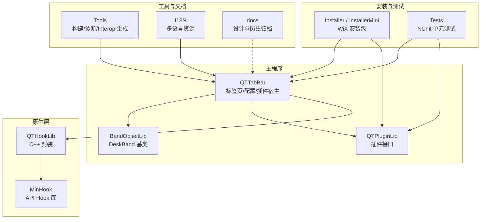
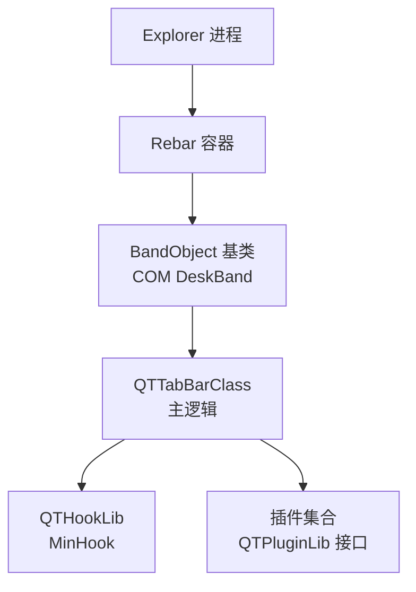
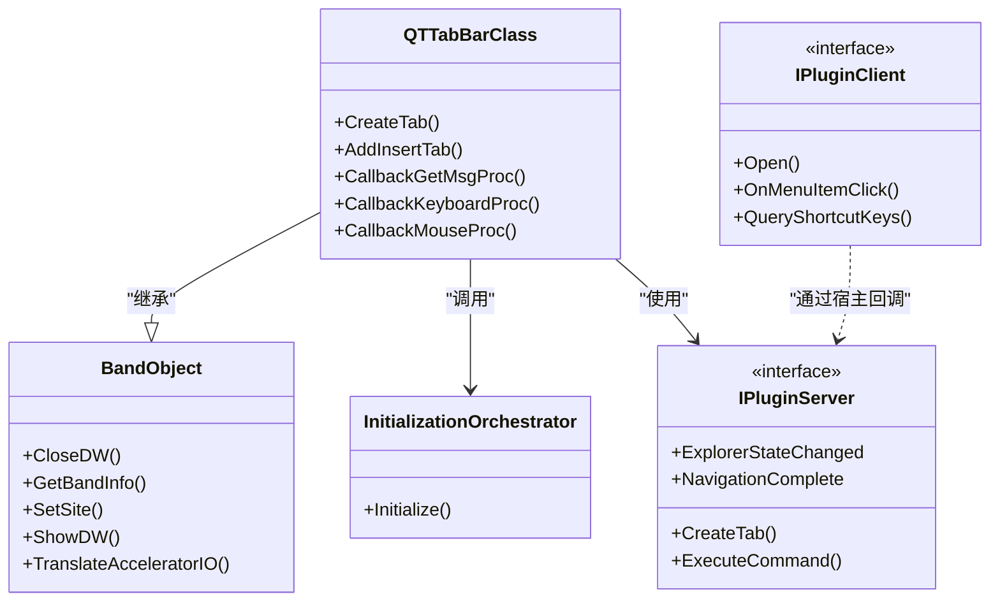
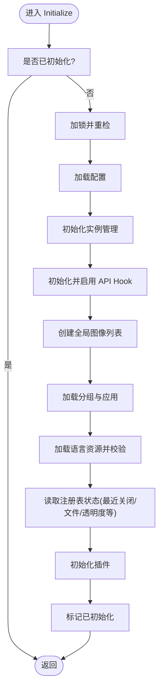
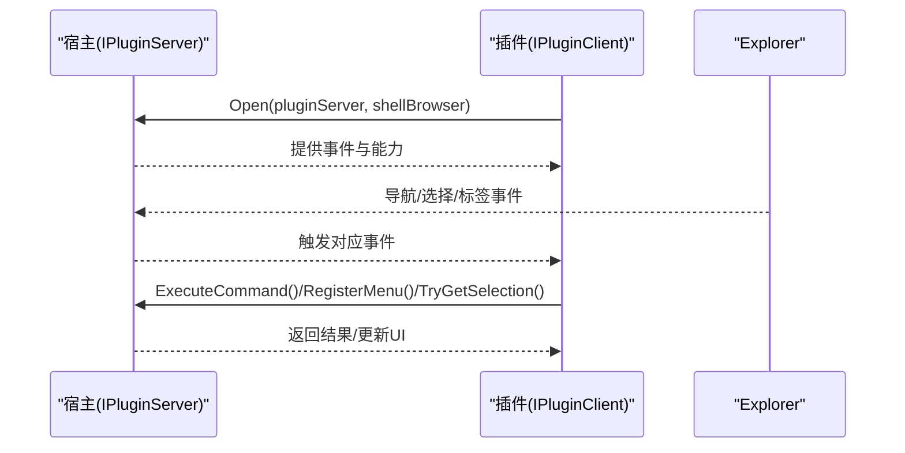
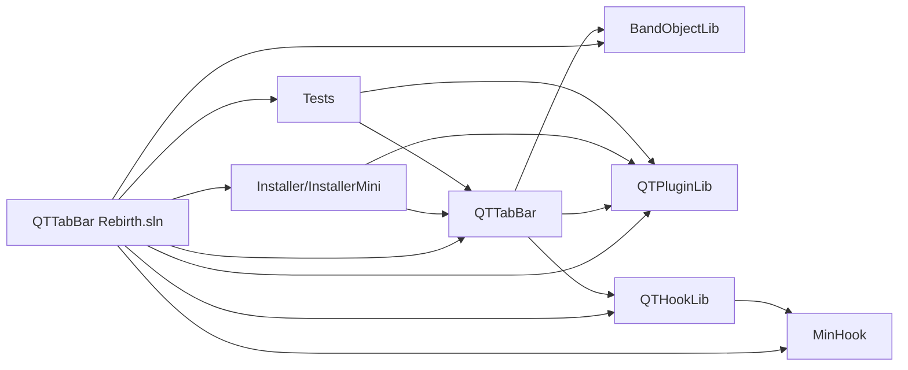

# 项目概述

<cite>
**本文引用的文件**   
- [README.md](file://README.md)
- [README_zh.md](file://README_zh.md)
- [LICENSE.txt](file://LICENSE.txt)
- [CONTRIBUTING.md](file://CONTRIBUTING.md)
- [BUILD.txt](file://BUILD.txt)
- [QTTabBar Rebirth.sln](file://QTTabBar Rebirth.sln)
- [BandObjectLib/BandObject.cs](file://BandObjectLib/BandObject.cs)
- [QTTabBar/QTTabBarClass.cs](file://QTTabBar/QTTabBarClass.cs)
- [QTTabBar/InitializationOrchestrator.cs](file://QTTabBar/InitializationOrchestrator.cs)
- [QTPluginLib/IPluginServer.cs](file://QTPluginLib/IPluginServer.cs)
- [QTPluginLib/IPluginClient.cs](file://QTPluginLib/IPluginClient.cs)
</cite>

## 目录
1. [简介](#简介)
2. [项目结构](#项目结构)
3. [核心组件](#核心组件)
4. [架构总览](#架构总览)
5. [详细组件分析](#详细组件分析)
6. [依赖关系分析](#依赖关系分析)
7. [性能与兼容性考虑](#性能与兼容性考虑)
8. [故障排查指南](#故障排查指南)
9. [结论](#结论)
10. [附录](#附录)

## 简介
QTTabBar-Next 是一个 Windows Shell 扩展插件，为资源管理器（Explorer）提供多标签页浏览、文件夹预览以及可选的插件生态（如文件工具、树形视图等）。该项目在 indiff/qttabbar 分支基础上继续维护，并向上追溯至 SourceForge 原始代码。

- 目标平台：Windows（支持 Win7 及更新版本，Win10/11 有专门说明）
- 技术栈：.NET Framework 4.8、C#、WinForms/WPF（选项对话框使用 WPF）、COM Interop、MinHook（原生 API Hook）
- 许可证：GPL-3.0
- 上游关系：本仓库 → indiff/qttabbar → SourceForge 原版

本节为概念性介绍，不直接分析具体源文件。

## 项目结构
仓库采用“功能域 + 分层”的组织方式：
- 主程序库：QTTabBar（Shell BandObject 实现、标签页逻辑、UI、配置、插件宿主等）
- 基础库：BandObjectLib（DeskBand 基类与 Rebar 子类等）
- 插件接口：QTPluginLib（IPluginServer/IPluginClient 等）
- 原生 Hook：QTHookLib、MinHook（用于系统级钩子）
- 安装器：Installer / InstallerMini（WiX）
- 测试：Tests/QTTtabBarTests（NUnit）
- 工具与脚本：Tools/*（构建、诊断、Interop 生成）
- 国际化：I18N/*.xml
- 文档与设计：docs/*

图表来源
- [QTTabBar Rebirth.sln:1-120](file://QTTabBar Rebirth.sln#L1-L120)
- [CONTRIBUTING.md:64-74](file://CONTRIBUTING.md#L64-L74)

章节来源
- [CONTRIBUTING.md:64-74](file://CONTRIBUTING.md#L64-L74)
- [QTTabBar Rebirth.sln:1-120](file://QTTabBar Rebirth.sln#L1-L120)

## 核心组件
- 主类 QTTabBarClass：作为 COM 可见的 DeskBand 对象，承载标签页 UI、导航、键盘/鼠标钩子、上下文菜单、拖放、组与启动项恢复等核心业务。
- BandObject 基类：实现 IDeskBand/IDockingWindow/IInputObject/IObjectWithSite/IOleWindow/IPersistStream 等接口，负责与 Explorer Rebar 容器交互、窗口生命周期、焦点与 DPI 缩放等。
- 初始化编排 InitializationOrchestrator：统一入口，按顺序加载配置、实例管理、API Hook、全局图标列表、分组与应用、语言资源、注册表状态、插件等，确保幂等执行。
- 插件接口：IPluginServer（宿主对外暴露能力）与 IPluginClient（插件实现），定义事件、命令、选择集操作、菜单注册、本地化字符串获取等。

章节来源
- [QTTabBar/QTTabBarClass.cs:57-120](file://QTTabBar/QTTabBarClass.cs#L57-L120)
- [BandObjectLib/BandObject.cs:35-44](file://BandObjectLib/BandObject.cs#L35-L44)
- [QTTabBar/InitializationOrchestrator.cs:35-60](file://QTTabBar/InitializationOrchestrator.cs#L35-L60)
- [QTPluginLib/IPluginServer.cs:24-76](file://QTPluginLib/IPluginServer.cs#L24-L76)
- [QTPluginLib/IPluginClient.cs:21-31](file://QTPluginLib/IPluginClient.cs#L21-L31)

## 架构总览
整体采用“Shell 扩展 + .NET 托管 + 原生 Hook”的分层架构：
- 宿主进程：explorer.exe
- 托管模块：通过 COM 注册为 DeskBand，由 BandObject 基类接入 Rebar 容器
- 原生层：QTHookLib 基于 MinHook 注入系统消息/输入钩子，增强交互能力
- 插件体系：通过 QTPluginLib 暴露稳定接口，允许第三方扩展功能

图表来源
- [BandObjectLib/BandObject.cs:35-44](file://BandObjectLib/BandObject.cs#L35-L44)
- [QTTabBar/QTTabBarClass.cs:57-120](file://QTTabBar/QTTabBarClass.cs#L57-L120)
- [QTPluginLib/IPluginServer.cs:24-76](file://QTPluginLib/IPluginServer.cs#L24-L76)

## 详细组件分析

### 组件 A：Shell 扩展与标签页宿主（QTTabBarClass）
- 角色：COM 可见的 DeskBand 实现，继承自 TabBarBase（位于主库），承载标签页 UI、导航、快捷键、拖拽、右键菜单、组与会话恢复等。
- 关键职责：
  - 与 Explorer 通信（IShellBrowser/IShellView 等 COM 接口）
  - 消息钩子处理（GetMsg/Keyboard/Mouse）
  - 标签页生命周期（创建、切换、关闭、锁定）
  - 与配置、分组、应用、插件协作
- 典型流程：构造时触发统一初始化编排；随后进入消息循环与 UI 渲染。

图表来源
- [BandObjectLib/BandObject.cs:35-44](file://BandObjectLib/BandObject.cs#L35-L44)
- [QTTabBar/QTTabBarClass.cs:57-120](file://QTTabBar/QTTabBarClass.cs#L57-L120)
- [QTTabBar/InitializationOrchestrator.cs:35-60](file://QTTabBar/InitializationOrchestrator.cs#L35-L60)
- [QTPluginLib/IPluginServer.cs:24-76](file://QTPluginLib/IPluginServer.cs#L24-L76)
- [QTPluginLib/IPluginClient.cs:21-31](file://QTPluginLib/IPluginClient.cs#L21-L31)

章节来源
- [QTTabBar/QTTabBarClass.cs:57-120](file://QTTabBar/QTTabBarClass.cs#L57-L120)
- [BandObjectLib/BandObject.cs:35-44](file://BandObjectLib/BandObject.cs#L35-L44)
- [QTPluginLib/IPluginServer.cs:24-76](file://QTPluginLib/IPluginServer.cs#L24-L76)
- [QTPluginLib/IPluginClient.cs:21-31](file://QTPluginLib/IPluginClient.cs#L21-L31)

### 组件 B：初始化编排（InitializationOrchestrator）
- 作用：收敛多个潜在重复的初始化入口，保证仅执行一次，并按固定顺序完成：
  - 加载配置（ConfigManager）
  - 初始化实例管理（InstanceManager）
  - 启用 API Hook（HookLibManager）
  - 创建全局图像列表
  - 加载分组与应用
  - 加载语言资源与校验
  - 读取注册表中的最近关闭/最近文件/透明度等
  - 初始化插件（PluginManager）
- 幂等保护：双重检查锁，避免重入导致副作用。

图表来源
- [QTTabBar/InitializationOrchestrator.cs:40-160](file://QTTabBar/InitializationOrchestrator.cs#L40-L160)

章节来源
- [QTTabBar/InitializationOrchestrator.cs:40-160](file://QTTabBar/InitializationOrchestrator.cs#L40-L160)

### 组件 C：插件接口（IPluginServer / IPluginClient）
- IPluginServer（宿主侧）：向插件暴露 Explorer 句柄、当前标签页、选择集、命令执行、菜单注册、本地化字符串、错误日志等能力，并提供一系列事件（如导航完成、选择变化、标签变更等）。
- IPluginClient（插件侧）：插件实现该接口，接收宿主提供的服务，响应菜单点击、快捷键、打开/关闭等生命周期。

图表来源
- [QTPluginLib/IPluginServer.cs:24-76](file://QTPluginLib/IPluginServer.cs#L24-L76)
- [QTPluginLib/IPluginClient.cs:21-31](file://QTPluginLib/IPluginClient.cs#L21-L31)

章节来源
- [QTPluginLib/IPluginServer.cs:24-76](file://QTPluginLib/IPluginServer.cs#L24-L76)
- [QTPluginLib/IPluginClient.cs:21-31](file://QTPluginLib/IPluginClient.cs#L21-L31)

## 依赖关系分析
- 解决方案包含多个项目：主库、基础库、插件接口、原生 Hook、安装器、测试等，通过 VS 解决方案进行组织与依赖声明。
- 主要依赖：
  - 运行时：.NET Framework 4.8
  - 原生：Windows SDK（编译 Hook DLL）、WiX Toolset（安装包）
  - 开发工具：Visual Studio 2019+ 或 JetBrains Rider
  - 插件生态：遵循 QTPluginLib 接口约定

图表来源
- [QTTabBar Rebirth.sln:1-120](file://QTTabBar Rebirth.sln#L1-L120)

章节来源
- [QTTabBar Rebirth.sln:1-120](file://QTTabBar Rebirth.sln#L1-L120)

## 性能与兼容性考虑
- 运行环境：需安装 .NET Framework 4.8；首次激活会记录安装日期与激活日期以辅助行为控制。
- 高 DPI：BandObject 提供 Dpi/Scaling 属性，便于控件按比例缩放。
- 消息与钩子：通过 GetMsg/Keyboard/Mouse 钩子提升交互体验，需注意异常捕获与性能开销。
- 插件加载：在统一初始化阶段加载，避免重复初始化导致的性能问题。
- 兼容性：针对 Win7/Win10/Win11 有不同启用步骤与提示，Win11 提供诊断脚本辅助定位问题。

本节为通用指导，不直接分析具体源文件。

## 故障排查指南
- 异常日志位置：%AppData%\QTTabBar\QTTabBarException.log（用户态异常）
- 带对象异常日志：BandObject 内部将异常写入 %AppData%\QTTabBar\QTTabBarBandObjectException.log
- 构建与注册：
  - 需要管理员权限运行 Visual Studio 以成功注册 COM 组件
  - 构建 Debug/Release 配置会在成功后自动执行注册脚本
- Win11 诊断：提供 PowerShell 脚本用于探测与合并原生输出调试信息

章节来源
- [README_zh.md:17-24](file://README_zh.md#L17-L24)
- [BandObjectLib/BandObject.cs:719-770](file://BandObjectLib/BandObject.cs#L719-L770)
- [BUILD.txt:6-13](file://BUILD.txt#L6-L13)
- [README_zh.md:49-55](file://README_zh.md#L49-L55)

## 结论
QTTabBar-Next 在保留经典标签页浏览能力的同时，通过统一的初始化编排、稳定的插件接口与原生 Hook 增强，形成了可扩展、可维护的 Shell 扩展方案。其清晰的模块化结构与完善的测试/安装/诊断工具链，有助于社区持续演进与二次开发。

本节为总结性内容，不直接分析具体源文件。

## 附录
- 许可证：GPL-3.0（详见 LICENSE.txt）
- 贡献指南：遵循贡献规范、代码风格、提交信息与测试要求（详见 CONTRIBUTING.md）
- 构建前置条件：Windows SDK、WiX Toolset v3.11+、.NET Framework 4.8 Developer Pack（详见 BUILD.txt）
- 使用方法与系统要求：.NET Framework 4.8，Win7/Win10/Win11 启用步骤（详见 README_zh.md）

章节来源
- [LICENSE.txt:1-675](file://LICENSE.txt#L1-L675)
- [CONTRIBUTING.md:23-55](file://CONTRIBUTING.md#L23-L55)
- [BUILD.txt:1-16](file://BUILD.txt#L1-L16)
- [README_zh.md:17-33](file://README_zh.md#L17-L33)