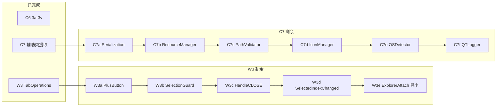
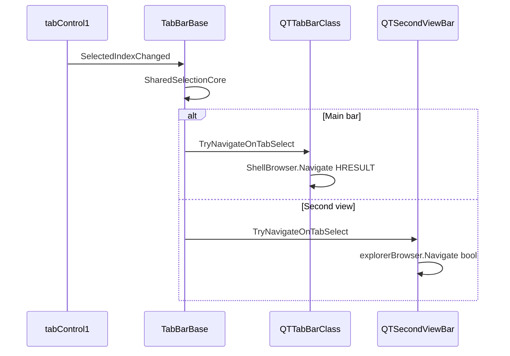

# W3 / C7 详细执行路线图

> 在 C6（3q–3v）完成后编写。每批遵循 AGENTS.md TDD：RED → GREEN → 全量测试 → commit。

## 背景与当前基线

| 项 | 状态 | 基线数据 |
|----|------|---------|
| **C6** | ✅ 已完成 | 主 partial ~842 行，26 controller，**563** 测试绿 |
| **W3** | ⬜ 部分完成 | [`TabBarBase.TabOperations.cs`](../QTTabBar/TabBarBase.TabOperations.cs) 已上提 CRUD；[`QTSecondViewBar.cs`](../QTTabBar/QTSecondViewBar.cs) **1,882 行**（原 2,214）；[`ArchitectureBatch3W3Tests.cs`](../Tests/QTTtabBarTests/ArchitectureBatch3W3Tests.cs) 6 项结构测试 |
| **C7** | ⬜ 部分完成 | [`QTUtility.cs`](../QTTabBar/QTUtility.cs) **812 行**；5 个 PathValidator façade 已删；**18** 个转发方法 + 10 个 OSDetector 字段 forward 仍存；[`ArchitectureBatch3C7*Tests.cs`](../Tests/QTTtabBarTests/) 8 项 |



---

## 每批固定工作流

1. 写/扩展 `ArchitectureBatch3W3xTests.cs` 或 `ArchitectureBatch3C7xTests.cs` → MSBuild → **确认 RED**
2. 实现迁移（上提 TabBarBase / 改调用方为直接 helper）
3. MSBuild + `dotnet test --no-build` → **贴通过输出**
4. 更新 [`architecture-review-fix-plan.md`](architecture-review-fix-plan.md) 对应行
5. `git commit -m "refactor(arch-batch3w3x): ..."` 或 `refactor(arch-batch3c7x): ...`

**构建命令**（与 C6 相同）：

```powershell
& "D:\Apps\Visual Studio\MSBuild\Current\Bin\MSBuild.exe" "Tests\QTTtabBarTests\QTTtabBarTests.csproj" /p:Configuration=Debug
dotnet test "Tests\QTTtabBarTests\QTTtabBarTests.csproj" --no-build
```

---

# Part A — W3：QTSecondViewBar 去重

## 已完成（W3-0，勿重复）

[`TabBarBase.TabOperations.cs`](../QTTabBar/TabBarBase.TabOperations.cs) 已拥有：

- `AddInsertTab` / `CreateNewTab` / `OpenNewTab`（string + IDLWrapper）
- `CloseTab` / `CloseTabs` / `CancelFailedTabChanging`

[`TabManager`](../QTTabBar/QTTabBarClass.TabManager.cs) 已薄委托；[`QTSecondViewBar`](../QTTabBar/QTSecondViewBar.cs) 已删除对应 private 副本。

## 剩余重复热点（按风险从低到高）

| 簇 | TabManager 位置 | QTSecondViewBar 位置 | 估行/侧 | 风险 |
|----|----------------|---------------------|--------|------|
| Plus 按钮 | TabManager ~991–1064 | ~1784–1877 | ~70–90 | 低 |
| 选择守卫 | TabManager ~545–576 | ~1744–1779 | ~30 | 低 |
| 关闭窗口 | HookInputController ~489–547 + TabManager | ~1180–1263 | ~80 | 中 |
| **标签切换** | TabManager ~461–543 | ~1649–1738 | ~85 | **高** |
| Explorer 附着 | ExplorerControllerModule | ~1475–1564 | 结构不同 | 高（仅最小提取） |

### 关键架构差异（W3d 必读）

- **QTTabBarClass**：`ShellBrowser.Navigate(idlw) != 0` 表失败
- **QTSecondViewBar**：`explorerBrowser.Navigate(idlw.Path)` 返回 **bool**（语义相反）
- SecondViewBar 的 `ShellBrowser` 可能为 null（注释 ~1714）

**策略**：上提共享骨架到 `TabBarBase`，用 `protected virtual bool TryNavigateOnTabSelect(IDLWrapper idlw, string currentPath)` 让子类实现导航差异。

---

### W3a — Plus 按钮簇（下一批建议）

| 项 | 内容 |
|----|------|
| **新建** | [`TabBarBase.PlusButton.cs`](../QTTabBar/TabBarBase.PlusButton.cs)（或扩展现有 TabOperations partial） |
| **迁移** | `tabControl1_PlusButtonClicked` + `openDefault` |
| **来源** | [`TabManager`](../QTTabBar/QTTabBarClass.TabManager.cs) + [`QTSecondViewBar`](../QTTabBar/QTSecondViewBar.cs) |
| **行为决策** | SecondViewBar 中注释掉的 `openDefault()` 错误路径：与 TabManager **对齐**（恢复调用）或显式文档化差异 |
| **测试** | `ArchitectureBatch3W3aTests.cs`（3 项）：TabBarBase 拥有方法；两子类无 private 副本；事件仍挂到基类方法 |
| **行数** | QTSecondViewBar **~1,790**；TabManager **~1,290** |
| **测试基线** | **566/566** |

---

### W3b — 选择守卫簇

| 项 | 内容 |
|----|------|
| **迁移** | `tabControl1_Deselecting`、`SaveSelectedItems`、`tabControl1_Selecting` |
| **目标** | `TabBarBase` 或 `TabBarBase.Selection.cs` |
| **注意** | `SaveSelectedItems` 用 `ShellBrowser.TryGetSelection` — 确认 SecondViewBar 在调用时机 ShellBrowser 可用 |
| **测试** | `ArchitectureBatch3W3bTests.cs`（3 项） |
| **行数** | QTSecondViewBar **~1,760** |
| **测试基线** | **569/569** |

---

### W3c — 关闭窗口簇

| 项 | 内容 |
|----|------|
| **迁移** | `CloseAllTabsExcept` → TabBarBase；`HandleCLOSE` → TabBarBase 或共享 helper |
| **来源** | [`HookInputController`](../QTTabBar/QTTabBarClass.HookInputController.cs) + TabManager + QTSecondViewBar |
| **行为决策** | Ctrl+Shift 全关时 TabManager 调 `AddToHistory`，SecondViewBar **注释掉了** — 迁移前用测试锁定期望行为 |
| **测试** | `ArchitectureBatch3W3cTests.cs`（3 项）+ 可选 `CloseTabBehaviorTests` |
| **行数** | QTSecondViewBar **~1,680** |
| **测试基线** | **572/572** |

---

### W3d — `tabControl1_SelectedIndexChanged`（最高价值 / 最高风险）

| 项 | 内容 |
|----|------|
| **新建** | `TabBarBase.TabSelection.cs` |
| **共享骨架** | special-folder 分支 → activated-tabs → plugin `OnTabChanged` → IDL 解析 → navigate/sync |
| **虚方法** | `protected virtual bool TryNavigateOnTabSelect(IDLWrapper idlw, string currentPath)` |
| **QTTabBarClass 实现** | HRESULT 语义（现有 TabManager 逻辑） |
| **QTSecondViewBar 实现** | `explorerBrowser.Navigate` bool 语义 |
| **TabManager 变更** | `tabControl1_SelectedIndexChanged` 变为一行委托基类 protected 方法 |
| **测试** | `ArchitectureBatch3W3dTests.cs`（4 项）+ **必须**新增行为测试（特殊文件夹 / 普通路径 / 导航失败 rollback） |
| **行数** | QTSecondViewBar **~1,600** |
| **测试基线** | **576/576** |



---

### W3e — Explorer 附着（最小范围，可选）

| 项 | 内容 |
|----|------|
| **仅提取** | 公共尾部：`fProcessingStartups = false; Activate(); base.OnExplorerAttached()` |
| **禁止** | 合并 `ExplorerControllerModule.OnExplorerAttachedCore` 与 SecondViewBar 的 ExplorerBrowser 模型 |
| **测试** | 沿用 [`ExplorerControllerTests.cs`](../Tests/QTTtabBarTests/ExplorerControllerTests.cs)；SecondViewBar 加 1 项 attach smoke |
| **行数** | QTSecondViewBar **~1,580** |
| **测试基线** | **577/577** |

---

### W3f — TabManager 薄包装清理（可选）

删除 TabManager 中对已上提 TabBarBase 方法的纯转发（~30 处调用改 `_owner`），更新 [`TabManagerTests.cs`](../Tests/QTTtabBarTests/TabManagerTests.cs) 断言。

---

## W3 完成验收标准

- [`QTSecondViewBar.cs`](../QTTabBar/QTSecondViewBar.cs) **≤ ~1,600 行**（较 2,214 基线 **−28%**）
- 与 TabManager 重复的 tab 选择 / plus / close 逻辑 **0 处** private 副本
- `tabControl1_SelectedIndexChanged` 仅一份共享实现 + 子类导航 hook
- 全量测试绿；[`ArchitectureBatch3W3Tests.cs`](../Tests/QTTtabBarTests/ArchitectureBatch3W3Tests.cs) 扩展至 W3a–W3d
- 计划文档 W3 行标记 **✅ 已修复**

---

# Part B — C7：QTUtility façade 清理

## 已完成（C7-0）

- 辅助类：[`OSDetector`](../QTTabBar/OSDetector.cs)、[`QTLogger`](../QTTabBar/QTLogger.cs)、[`RegistryHelper`](../QTTabBar/RegistryHelper.cs)、[`PathValidator`](../QTTabBar/PathValidator.cs)、[`IconManager`](../QTTabBar/IconManager.cs)、[`SerializationHelper`](../QTTabBar/SerializationHelper.cs)
- PathValidator 5 个 façade 已删（`IsEmptyStr` 等）
- [`Config.cs`](../QTTabBar/Config.cs) 已直接调 `QTResourceManager.ReadLanguageFile`

## 剩余 façade 清单（附录已过时，以此为准）

### QTUtility 方法转发（18 项）

| 目标 | 方法 | 生产调用文件数 |
|------|------|-------------|
| **SerializationHelper** | `ByteArrayToObject`, `ObjectToByteArray` | 1 |
| **QTResourceManager** | `ReadLanguageFile`, `ValidateTextResources` ×2 | 3 |
| **PathValidator** | `IsNetworkRootFolder`（仅 QTUtility 内部） | 0 外部 |
| **IconManager** | `ExtHasIcon`, `GetIcon`×2, `GetImageKey`, `LoadReservedImage`, `SetImageKey`, `AddImageToGlobal`×2, `ImageGlobalContainsKey`, `GetImageFromGlobal` | **15** |
| **OSDetector** | `CheckIsWin10` | 少量 |
| **S2** | `Initialize()` 空壳 | 5 入口点 |

### QTUtility 字段转发

- **OSDetector** 10 项（`IsXP`/`IsWin7`/…/`PATH_*`）→ **~28 生产文件**
- **ResourceCache / SessionState** 6 项 property forward（后续批次，本路线图暂不展开）

### QTUtility2 转发

- **Registry** 4 个 façade：**零外部调用**，可直接删除（C7g）
- **Log** façades：`QTUtility2.log` / `MakeErrorLog` → **~80 文件**（C7f）

---

### C7a — SerializationHelper（最低风险，建议先做）

| 项 | 内容 |
|----|------|
| **迁移** | [`InstanceManager.cs`](../QTTabBar/InstanceManager.cs) → `SerializationHelper` |
| **删除 façade** | `QTUtility.cs` L192–194, L347–349 |
| **测试** | `ArchitectureBatch3C7aTests.cs`（2 项）+ [`SecurityTests.cs`](../Tests/QTTtabBarTests/SecurityTests.cs) |
| **文件数** | **1** 生产 + 1 测试 |
| **测试基线** | **565/565** |

---

### C7b — QTResourceManager 剩余 façade

| 项 | 内容 |
|----|------|
| **迁移** | [`PluginServer.cs`](../QTTabBar/PluginServer.cs)、[`InitializationOrchestrator.cs`](../QTTabBar/InitializationOrchestrator.cs) |
| **删除 façade** | `ReadLanguageFile`, `ValidateTextResources` ×2 |
| **测试** | 扩展 [`ArchitectureBatch3C7FacadeCleanupTests.cs`](../Tests/QTTtabBarTests/ArchitectureBatch3C7FacadeCleanupTests.cs) |
| **测试基线** | **567/567** |

---

### C7c — PathValidator 最后一项

| 项 | 内容 |
|----|------|
| **动作** | `ReserveImageKey` 内联 `PathValidator.IsNetworkRootFolder`；删 façade |
| **测试** | 扩展 `ArchitectureBatch3C7Tests` |
| **测试基线** | **568/568** |

---

### C7d — IconManager（拆两批）

**C7d1 — Options/UI 层（~6 文件）**

`Options09_Groups.xaml.cs`, `Options10_Apps.xaml.cs`, `Options04_Tooltips.xaml.cs`, `FileFolderEntryBox.xaml.cs`, `FileHashComputerForm.cs`, `TrayIcon.cs`

**C7d2 — Tab/Shell 核心（~9 文件）**

`SubDirTipForm.cs`, `QTTabBarClass.ExplorerController.cs`, `DropDownMenuBase.cs`, `MenuUtility.cs`, `TabSwitchForm.cs`, `InitializationOrchestrator.cs`, `QTabControl.cs`, `QMenuItem.cs`, `QTTabBarClass.MenuController.cs`

| 项 | 内容 |
|----|------|
| **测试** | `ArchitectureBatch3C7dTests.cs`（3 项） |
| **测试基线** | C7d1 **571** → C7d2 **574** |

---

### C7e — OSDetector 字段/方法迁移

分 3 子批：Config/初始化（~8）→ Explorer 控制器（~10）→ UI 其余（~10）

| 项 | 内容 |
|----|------|
| **删除** | `QTUtility` L57–76 字段 forward + `CheckIsWin10` |
| **测试基线** | 最终 **583/583** |

---

### C7f — QTUtility2 日志 façade

机械替换 `QTUtility2.log` → `QTLogger.log`；4–5 子批，每批 ≤20 文件。

---

### C7g — QTUtility2 Registry 死 façade

删除 4 个无调用 façade；可合并任意 C7 批次末尾。

---

### C7h — S2 `Initialize()`（独立决策）

5 入口点仍调 `QTUtility.Initialize()`。建议 C7 façade 全部删完后再决定保留/替换。

---

## C7 完成验收标准

- `QTUtility` **无** PathValidator / IconManager / SerializationHelper / QTResourceManager **方法 façade**
- OSDetector 字段 forward 删除
- `QTUtility2` registry façades 删除；日志 façades 删除或仅剩极少数兼容层
- [`FacadeEquivalenceTests.cs`](../Tests/QTTtabBarTests/FacadeEquivalenceTests.cs) 全绿
- 附录 façade 清单 **同步更新**
- `QTUtility.cs` 目标 **≤ ~500 行**

---

# 执行顺序建议

## 推荐路径（低风险先行）

```
C7a → C7b → C7c → W3a → W3b → C7d1 → C7d2 → W3c → W3d → W3e → C7e → C7f → C7g → C7h
```

## 若优先完成 W3

```
W3a → W3b → W3c → W3d → W3e → C7a → C7b → C7c → C7d → C7e → C7f
```

## 并行约束

- W3 与 C7 **可交错**，但同一文件不要两批同时改
- `InitializationOrchestrator`：先 C7b，再 C7d2
- W3d 前应确保 **563 测试全绿**

---

# 行数 / 测试预测总表

| 批次 | 主要内容 | QTSecondViewBar 行数（估） | 累计测试（估） |
|------|---------|---------------------------|--------------|
| 基线 | C6 完成 | 1,882 | 563 |
| **W3a** | Plus 按钮 | ~1,790 | 566 |
| **W3b** | 选择守卫 | ~1,760 | 569 |
| **W3c** | HandleCLOSE | ~1,680 | 572 |
| **W3d** | SelectedIndexChanged | ~1,600 | 576 |
| **W3e** | Explorer attach 最小 | ~1,580 | 577 |
| **C7a** | SerializationHelper | — | 565 |
| **C7b** | QTResourceManager | — | 567 |
| **C7c** | PathValidator 末项 | — | 568 |
| **C7d** | IconManager | — | 574 |
| **C7e** | OSDetector | — | 583 |
| **C7f** | QTLogger | — | 590+ |

---

# 如何开始

| 指令 | 动作 |
|------|------|
| **「执行 W3a」** / **「继续 W3」** | 仅 W3a TDD 全流程 + commit |
| **「执行 C7a」** / **「继续 C7」** | 仅 C7a TDD 全流程 + commit |
| **「连续执行 W3a–W3d」** | 按表逐批 commit |
| **「连续执行 C7a–C7d」** | 按表逐批 commit |
| **「调整路线图」** | 仅改本文档，不写代码 |
